# Lab 01: On-Premises Core Infrastructure

**Author:** Philippe Truong  
**Copyright:** © 2026 Philippe Truong. All rights reserved.  
**Domain:** Windows Server Infrastructure (AD DS/DNS/GPO) & L3 routing and switching.

**Status:** 🟡 In Progress  

---

## 1. Executive Summary & Objective

This lab designs and deploys a resilient on-premises enterprise core network infrastructure. It simulates a corporate headquarters hosting dual Microsoft Windows Server 2022 Domain Controllers (`CORP-DC01` and `CORP-DC02`), an Active Directory-Integrated DNS infrastructure with multi-master replication, and a Cisco Layer 3 switching core handling Inter-VLAN routing and stateful DHCP leasing.

### Core Architectural Goals:
1. **Network Segmentation:** Implement Layer 3 stateless separation between the Server tier (VLAN 10) and Client tier (VLAN 20) via SVI on switch. network between router and switch is on 10.10.9.0.
2. **Decoupled L3 and DHCP Architecture:** Offload DHCP leasing and vlans to the Cisco Core Switch SVI to ensure workstations acquire IP configuration independent of Windows Server boot cycles and rapid communication between vlans via SVI
3. **High-Availability Identity & DNS:** Deploy dual Windows Server 2022 Domain Controllers (`corp.local`) with active-active AD-integrated DNS replication and SRV locator records.
4. **Resilient Edge NAT Gateway:** Route all internal subnets through a dedicated Cisco Edge router performing PAT (NAT Overload) to simulate secure internet egress without exposing internal topologies.

---

## 2. Network Topology Diagram

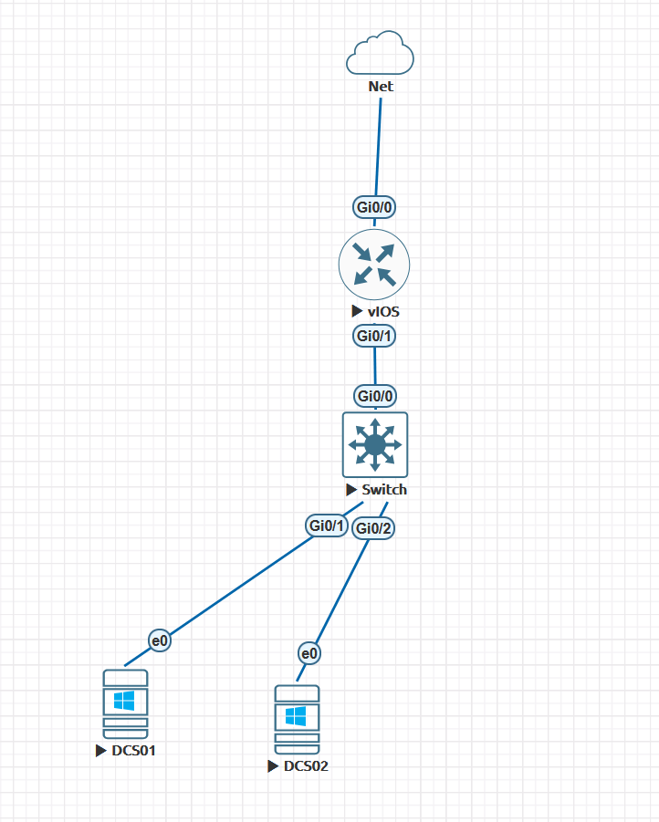

---

## 3. IP Addressing & VLAN Allocation

| Device / Interface | Role | Subnet | IP Address | Gateway | Credentials / DNS |
| :--- | :--- | :--- | :--- | :--- | :--- |
| **`EDGE-RTR01` Gi0/0** | Outside WAN (Cloud0) | `192.168.3.0/24` | `192.168.3.13` (DHCP) | `192.168.3.1` | Assigned by ISP/LAN |
| **`EDGE-RTR01` Gi0/1** | Inside Transit Gateway | `10.10.9.0/24` | `10.10.9.1/24` | N/A | Local Transit Gateway |
| **`CORE-SW01` Gi0/0** | Routed Uplink | `10.10.9.0/24` | `10.10.9.2/24` | `10.10.9.1` | Local Routed Uplink |
| **`CORE-SW01` Vlan10** | Server SVI Default Gateway | `10.10.10.0/24` | `10.10.10.1/24` | Local SVI | Local SVI |
| **`CORE-SW01` Vlan20** | Client SVI Default Gateway | `10.10.20.0/24` | `10.10.20.1/24` | Local SVI | Local SVI |
| **`CORP-DC01` (DCS01)** | Primary Domain Controller | `10.10.10.0/24` | `10.10.10.10/24` | `10.10.10.1` | Admin: `Cisco1` <br/> DSRM: `Cisco1Restore` |
| **`CORP-DC02` (DCS02)** | Replica Domain Controller | `10.10.10.0/24` | `10.10.10.11/24` | `10.10.10.1` | Admin: `Cisco1` <br/> DSRM: `Cisco1Restore` |
| **`CLIENT-PC01`** | Domain Workstation | `10.10.20.0/24` | Dynamic (DHCP) | `10.10.20.1` | DNS: `10.10.10.10`, `10.10.10.11` |

---

## 4. Cisco Network Configuration Artifacts

### 4.1. Edge Router (`EDGE-RTR01`)
```cisco
hostname EDGE-RTR01
!
ip domain-name corp.local
!
interface GigabitEthernet0/0
 description WAN-to-Internet-Cloud0
 ip address dhcp
 ip nat outside
 no shutdown
!
interface GigabitEthernet0/1
 description Transit-Gateway-to-CORE-SW01
 ip address 10.10.9.1 255.255.255.0
 ip nat inside
 no shutdown
!
ip access-list standard NAT-PERMIT
 permit 10.10.0.0 0.0.255.255
!
ip nat inside source list NAT-PERMIT interface GigabitEthernet0/0 overload
!
ip route 10.10.10.0 255.255.255.0 10.10.9.2
ip route 10.10.20.0 255.255.255.0 10.10.9.2
```

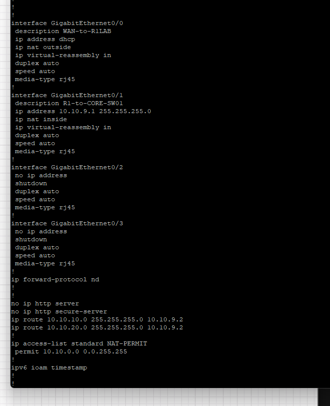

### 4.2. Layer 3 Core Switch (`CORE-SW01`)
```cisco
hostname CORE-SW01
!
ip routing
ip domain-name corp.local
!
interface GigabitEthernet0/0
 no switchport
 description Uplink-to-EDGE-RTR01
 ip address 10.10.9.2 255.255.255.0
 no shutdown
!
ip route 0.0.0.0 0.0.0.0 10.10.9.1
!
vlan 10
 name Servers-DCs
vlan 20
 name Clients-Workstations
!
interface Vlan10
 description Server-Gateway
 ip address 10.10.10.1 255.255.255.0
 no shutdown
!
interface Vlan20
 description Client-Gateway
 ip address 10.10.20.1 255.255.255.0
 no shutdown
!
interface GigabitEthernet0/1
 description Access-to-CORP-DC01
 switchport mode access
 switchport access vlan 10
 spanning-tree portfast edge
 no shutdown
!
interface GigabitEthernet0/2
 description Access-to-CORP-DC02
 switchport mode access
 switchport access vlan 10
 spanning-tree portfast edge
 no shutdown
!
interface GigabitEthernet1/1
 description Access-to-Clients-VLAN20
 switchport mode access
 switchport access vlan 20
 spanning-tree portfast edge
 no shutdown
!
ip dhcp excluded-address 10.10.20.1 10.10.20.50
!
ip dhcp pool CLIENT-POOL
 network 10.10.20.0 255.255.255.0
 default-router 10.10.20.1
 dns-server 10.10.10.10 10.10.10.11
 domain-name corp.local
 lease 1
```

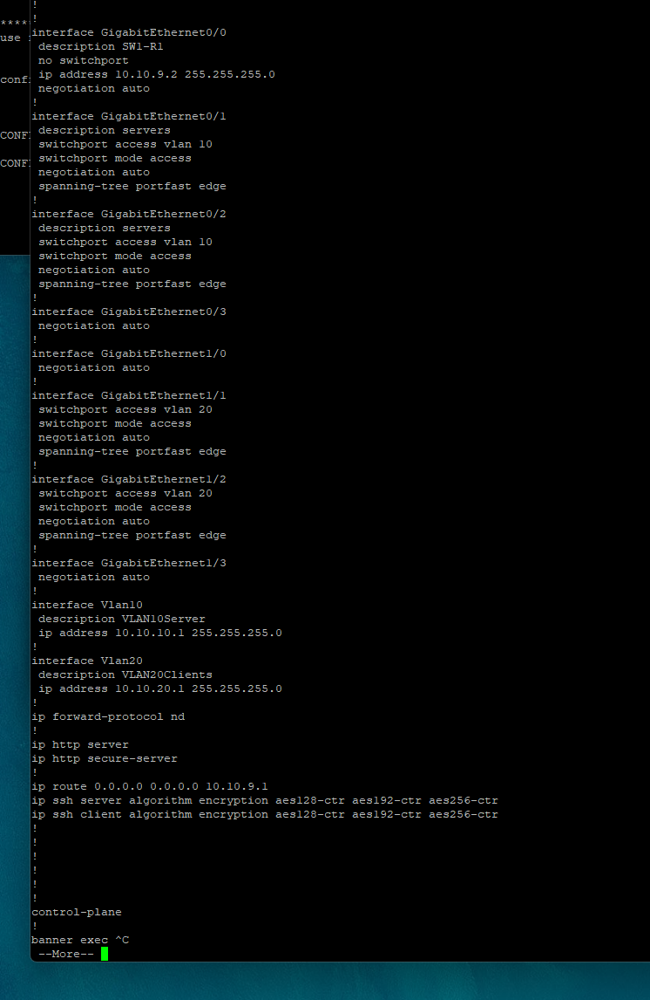

---

## 5. Active Directory & Windows Server Deployment

### 5.1. Static IP & Network Interface Configuration
Before promoting the server, static IP addressing and local loopback DNS resolution are assigned to ensure seamless AD DS service binding.

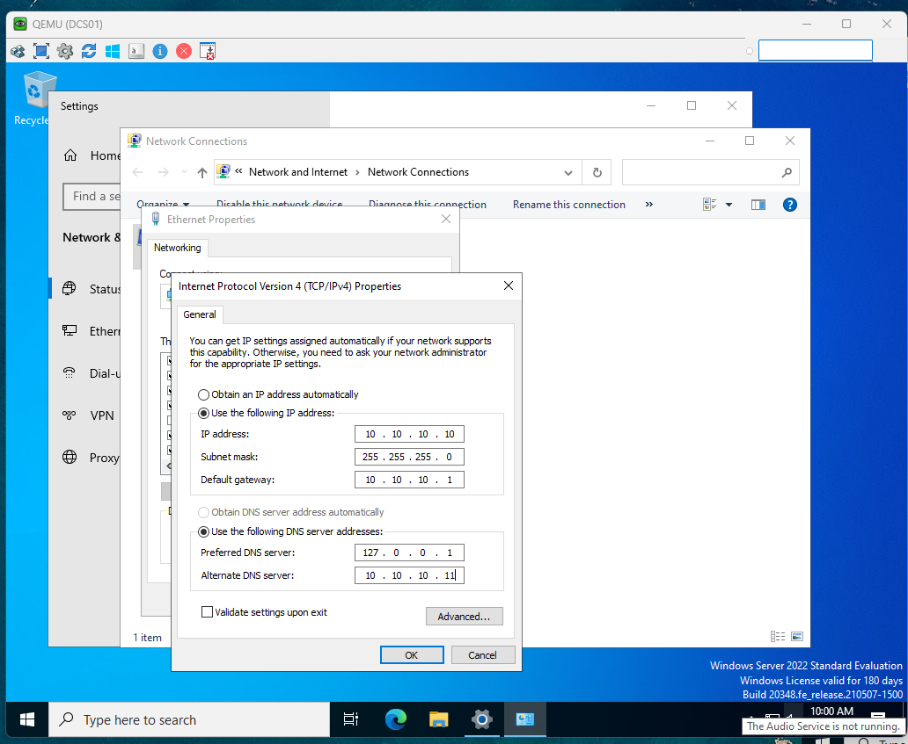

### 5.2. `CORP-DC01` Primary Domain Controller Promotion

#### Active Directory Domain Services Forest Configuration
* **Forest Root Domain:** `corp.local`
* **NetBIOS Domain Name:** `CORP`
* **Forest & Domain Functional Level:** Windows Server 2016
* **Capabilities:** Domain Name System (DNS) Server, Global Catalog (GC)

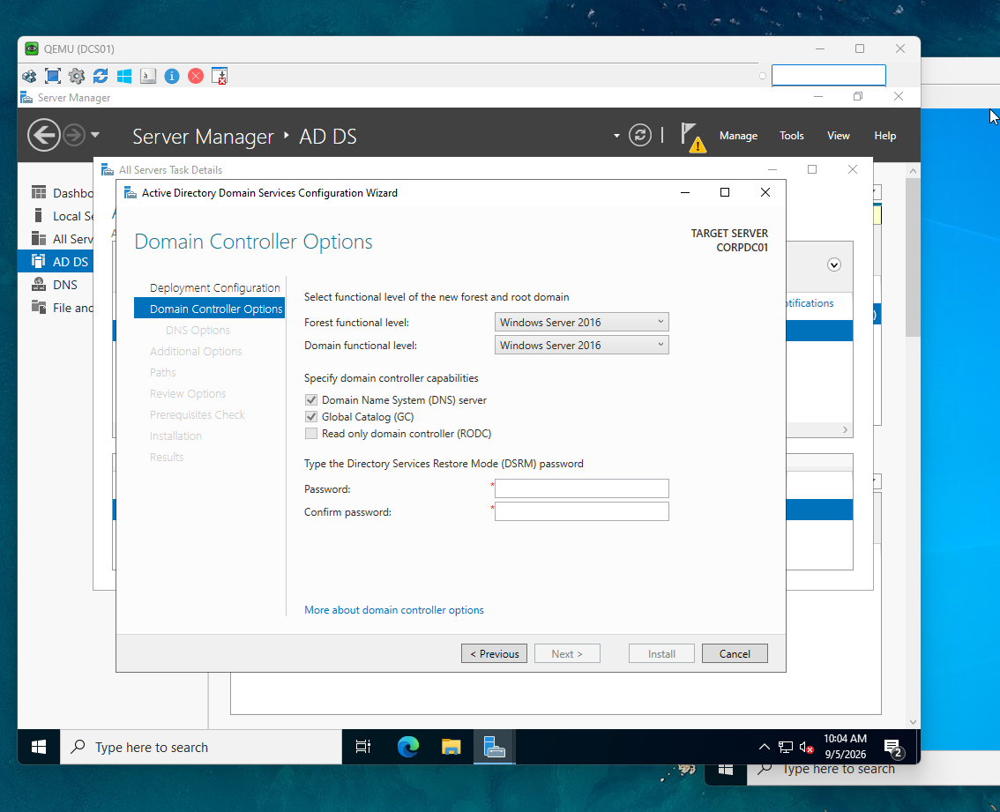

#### Prerequisites Validation Check
All prerequisite validation checks passed, verifying connectivity, administrative permissions, and cryptographic capabilities.

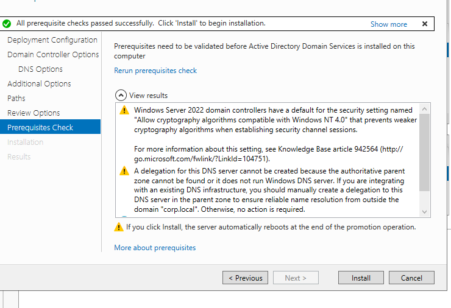

#### PowerShell Promotion Deployment Automation
```powershell
# Windows PowerShell Script for AD DS Forest Deployment
Import-Module ADDSDeployment
Install-ADDSForest `
    -CreateDnsDelegation:$false `
    -DatabasePath "C:\Windows\NTDS" `
    -DomainMode "WinThreshold" `
    -DomainName "corp.local" `
    -DomainNetbiosName "CORP" `
    -ForestMode "WinThreshold" `
    -InstallDns:$true `
    -LogPath "C:\Windows\NTDS" `
    -NoRebootOnCompletion:$false `
    -SysvolPath "C:\Windows\SYSVOL" `
    -Force:$true
```

### 5.3. `CORP-DC02` Replica Domain Controller Promotion

#### Prerequisites Validation Check
Prerequisite validation check successfully passed, verifying RPC, LDAP, and Kerberos connectivity to `CORPDC01.corp.local`.

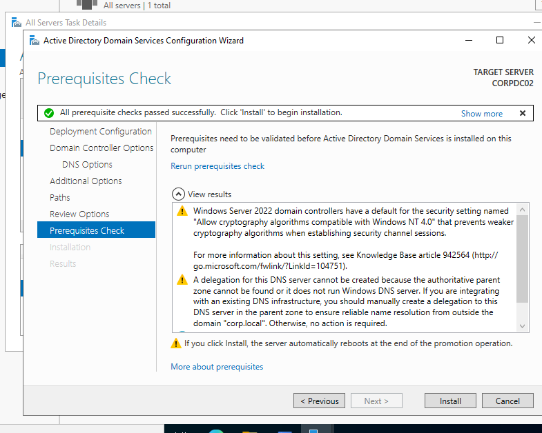

#### PowerShell Promotion Deployment Script
```powershell
# Windows PowerShell Script for AD DS Replica Domain Controller Deployment
Import-Module ADDSDeployment
Install-ADDSDomainController `
    -NoGlobalCatalog:$false `
    -CreateDnsDelegation:$false `
    -Credential (Get-Credential) `
    -CriticalReplicationOnly:$false `
    -DatabasePath "C:\Windows\NTDS" `
    -DomainName "corp.local" `
    -InstallDns:$true `
    -LogPath "C:\Windows\NTDS" `
    -NoRebootOnCompletion:$false `
    -SiteName "Default-First-Site-Name" `
    -SysvolPath "C:\Windows\SYSVOL" `
    -Force:$true
```

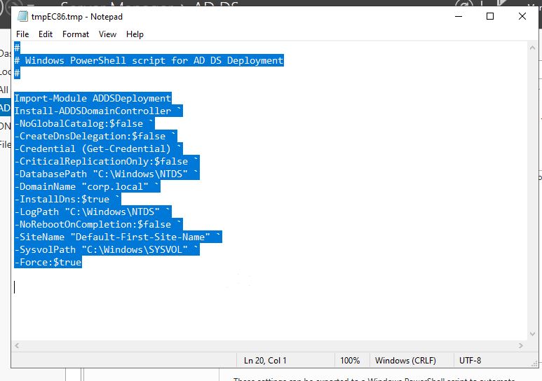


---

## 6. Verification & Proof of Competence

### 6.1. Network Connectivity & Routing Verification
Direct ICMP verification from the Cisco Layer 3 switch confirming inter-subnet gateway reachability to `EDGE-RTR01` (`10.10.9.1`) and external WAN egress to the public internet (`8.8.8.8`).

```text
CORE-SW01# ping 10.10.9.1
Type escape sequence to abort.
Sending 5, 100-byte ICMP Echos to 10.10.9.1, timeout is 2 seconds:
!!!!!
Success rate is 100 percent (5/5), round-trip min/avg/max = 2/3/4 ms

CORE-SW01# ping 8.8.8.8
Type escape sequence to abort.
Sending 5, 100-byte ICMP Echos to 8.8.8.8, timeout is 2 seconds:
!!!!!
Success rate is 100 percent (5/5), round-trip min/avg/max = 8/9/12 ms
```

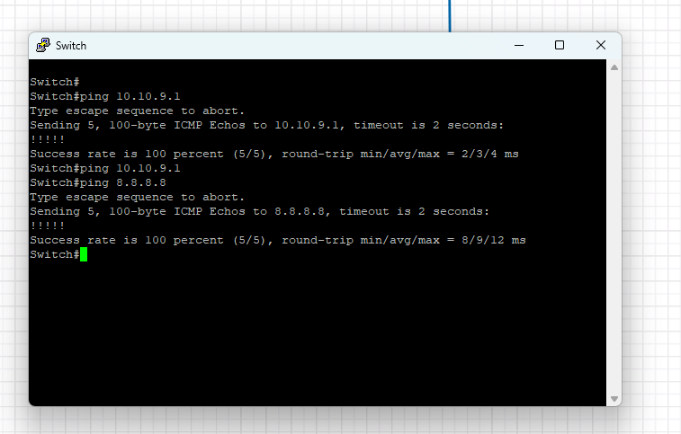

### 6.2. Active Directory Multi-Master Replication Health
Active Directory multi-master replication was validated between `CORPDC01` and `CORPDC02` across all five directory partitions (Configuration, Schema, Domain `corp.local`, Forest DNS Zones, and Domain DNS Zones) using `repadmin /replsummary`. Both domain controllers achieved 100% replication success with **0 fails / 0 errors**.

```text
PS C:\Users\Administrator> repadmin /replsummary
Replication Summary Start Time: 2026-09-05 14:20:15

Beginning data collection for replication summary, this may take a while:
  .....

Source DSA          largest delta    fails/total %%   error
 CORPDC01                  04m:15s    0 /   5    0
 CORPDC02                  03m:19s    0 /   5    0

Destination DSA     largest delta    fails/total %%   error
 CORPDC01                  03m:19s    0 /   5    0
 CORPDC02                  04m:15s    0 /   5    0
```

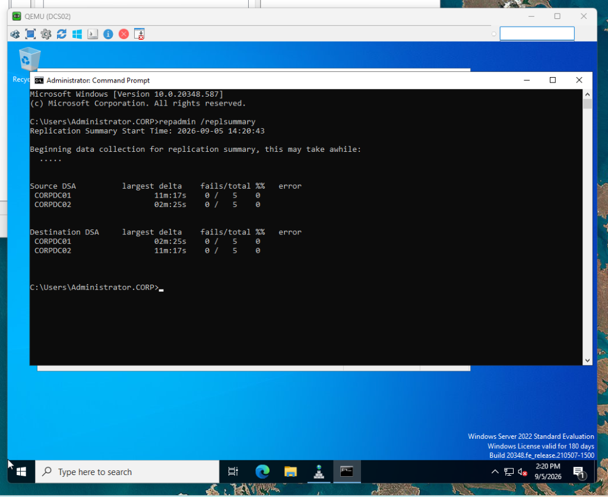

---

## 7. Hypervisor & Emulation Engineering (EVE-NG / QEMU / ZFS)

A critical component of this laboratory deployment was engineering the hypervisor emulation layer to host enterprise-grade modern guest operating systems (Windows 11 Enterprise) within an EVE-NG Bare-Metal/KVM environment.

### 7.1. Media Ingestion & Staging
To stage the installation media on the EVE-NG virtualization host (`192.168.3.103`), OpenSSH `scp` was used to transfer the Windows 11 ISO and VirtIO drivers directly into the QEMU image library:

```powershell
# Transfer Windows 11 Enterprise ISO and VirtIO drivers to EVE-NG
scp .\26200.6584.250915-1905.25h2_ge_release_svc_refresh_CLIENTENTERPRISEEVAL_OEMRET_x64FRE_en-us.iso root@192.168.3.103:/opt/unetlab/addons/qemu/win-11-pro/cdrom.iso
scp .\virtio-win-0.1.302.iso root@192.168.3.103:/opt/unetlab/addons/qemu/win-11-pro/cdrom2.iso
```

### 7.2. QEMU Image Structure & Thin-Provisioned Storage
Within the Linux virtualization host, the guest environment was structured according to EVE-NG QEMU naming standards (`/opt/unetlab/addons/qemu/win-11-pro/`):

1. **Thin-Provisioned System Disk:** A 60 GB thin-provisioned QCOW2 virtual disk was provisioned, initializing with a minimal metadata footprint of only 193 KB:
   ```bash
   /opt/qemu/bin/qemu-img create -f qcow2 virtioa.qcow2 60G
   ```
2. **Dual Optical Media Mounting:**
   * `cdrom.iso` (6.7 GB): Windows 11 Enterprise Evaluation (Build 26200.6584).
   * `cdrom2.iso` (837 MB): Red Hat VirtIO paravirtualized drivers (`virtio-win-0.1.302`).
3. **Permissions Remediation:** EVE-NG's permission wrapper was executed to grant correct UID/GID execution privileges across QEMU unprivileged hypervisor processes and the web daemon:
   ```bash
   /opt/unetlab/wrappers/unl_wrapper -a fixpermissions
   ```

```text
root@eora:/opt/unetlab/addons/qemu/win-11-pro# ls -lh /opt/unetlab/addons/qemu/win-11-pro/
total 7.5G
-rw-r--r-- 1 root root 837M Sep  5 19:58 cdrom2.iso
-rw-r--r-- 1 root root 6.7G Sep  5 19:56 cdrom.iso
-rw-r--r-- 1 root root 193K Sep  5 19:54 virtioa.qcow2
root@eora:/opt/unetlab/addons/qemu/win-11-pro# /opt/unetlab/wrappers/unl_wrapper -a fixpermissions
```

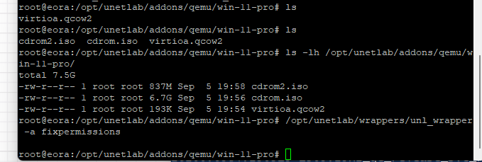

### 7.3. QEMU Windows 11 TPM & Storage Driver Optimization
Standard Windows 11 installers enforce strict TPM 2.0 and Secure Boot checks that halt deployment in virtualized KVM/QEMU nodes. To streamline lab provisioning without overhead:
* **Pre-Installation Registry Bypass:** During setup initialization, `Shift + F10` was triggered to inject `LabConfig` registry parameters:
  * `BypassTPMCheck` = `1`
  * `BypassSecureBootCheck` = `1`
  * `BypassRAMCheck` = `1`
* **VirtIO SCSI Storage Drivers:** Storage drivers were paravirtualized via Red Hat `viostor` (`w11/amd64`) from `cdrom2.iso`, maximizing disk I/O throughput compared to legacy IDE or SATA emulation.

---

## 8. Author & Copyright Notice

Authored and copyrighted © 2026 Philippe Truong. All rights reserved.  
All topology designs, configuration templates, and implementation documentation are the intellectual property of Philippe Truong.