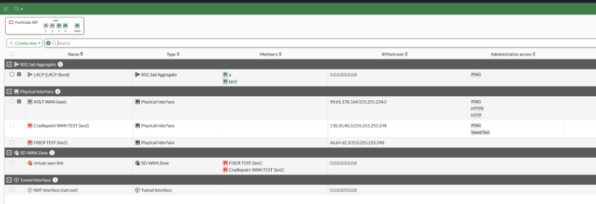
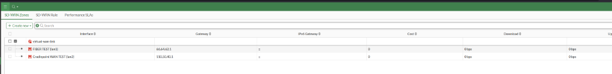
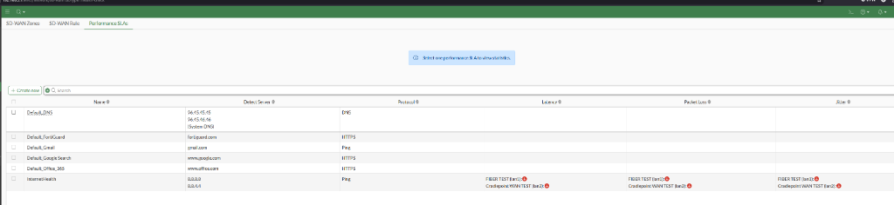
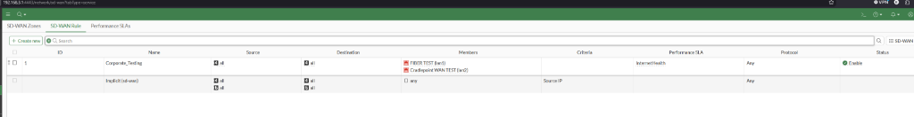
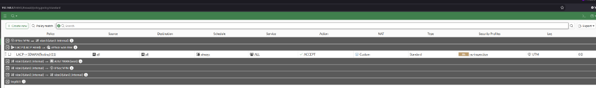

# Lab 02: Enterprise FortiGate SD-WAN & Dual-WAN Redundancy

**Author:** Philippe Truong  
**Copyright:** © 2026 Philippe Truong. All rights reserved.  
**Platform:** Fortinet FortiGate 40F (FortiOS v7.x)  
**Focus Areas:** Software-Defined WAN (SD-WAN), Performance SLA Monitoring, Multi-WAN Traffic Steering, 802.3ad Link Aggregation (LACP), Stateful Firewall Policy & NAT.

---

## 1. Executive Summary & Topology Architecture

This lab implements an enterprise-grade Software-Defined WAN (SD-WAN) solution on a physical **Fortinet FortiGate 40F** firewall. The architecture simulates a high-availability branch or corporate edge environment utilizing dual upstream WAN uplinks: an unmetered, high-speed primary **Fiber circuit**, and a metered, secondary **Cradlepoint Cellular (LTE/5G) gateway**.

```
                           +------------------------+
                           |  Public Internet / DNS |
                           |  (8.8.8.8 / 8.8.4.4)   |
                           +-----------+------------+
                                       ^
                     +-----------------+-----------------+
                     |                                   |
         [ Primary: FIBER TEST ]             [ Backup: CRADLEPOINT ]
         Port: lan1 (66.64.62.3/29)          Port: lan2 (110.50.40.3/29)
         Gateway: 66.64.62.1                 Gateway: 110.50.40.1
                     |                                   |
                     +-----------------+-----------------+
                                       |
                     +-----------------v-----------------+
                     |     FortiGate 40F Edge Firewall   |
                     |  - SD-WAN Zone: virtual-wan-link  |
                     |  - SLA Probe: InternetHealth      |
                     |  - Rule: Corporate_Testing (SLA)  |
                     +-----------------+-----------------+
                                       |
                         [ 802.3ad LACP Aggregate ]
                         Interface: LACP-Bond (Ports a + lan3)
                                       |
                                       v
                         [ Corporate Internal LAN ]
```

### Production-Safe Staging & Change Control Strategy
The FortiGate 40F appliance currently manages active production traffic via its physical `wan` port (`AT&T WAN`, `99.61.178.164`). To demonstrate full SD-WAN deployment capabilities without introducing network downtime or disrupting active services:
* Dedicated test interfaces (`lan1` and `lan2`) were staged as virtual WAN links.
* An isolated SD-WAN zone (`virtual-wan-link`) and independent routing policies were established.
* Full system backups were taken prior to configuration to uphold strict change control discipline.

---

## 2. Interface & Link Aggregation (LACP) Configuration

Due to physical port density constraints on compact edge hardware (FortiGate 40F has 5 physical Ethernet ports), an **802.3ad LACP Link Aggregation Group (LAG)** was engineered on the LAN side (`LACP-Bond`) combining ports `a` and `lan3`. This provides redundant LAN switching bandwidth while preserving dedicated physical ports (`lan1` and `lan2`) for dual-WAN ingestion.

### FortiOS CLI Interface Configuration:
```fortios
# Primary Fiber WAN Interface
config system interface
    edit "lan1"
        set vdom "root"
        set ip 66.64.62.3 255.255.255.248
        set type physical
        set alias "FIBER TEST"
        set snmp-index 2
    next
end

# Secondary Cradlepoint Cellular WAN Interface
config system interface
    edit "lan2"
        set vdom "root"
        set ip 110.50.40.3 255.255.255.248
        set allowaccess ping speed-test
        set type physical
        set alias "Cradlepoint WAN TEST"
        set snmp-index 3
    next
end

# LAN Side 802.3ad Link Aggregation Group (LACP)
config system interface
    edit "LACP-Bond"
        set vdom "root"
        set allowaccess ping
        set type aggregate
        set member "a" "lan3"
        set description "LACP bond"
        set alias "LACP"
        set device-identification enable
        set lldp-transmission enable
        set role lan
        set snmp-index 11
    next
end
```

[](assets/04-fortigate-interface-configuration.png)

---

## 3. SD-WAN Virtual Zone & Member Architecture

The two physical uplinks were abstracted into a single logical SD-WAN zone (`virtual-wan-link`). This decouples firewall policies from physical ports and allows unified routing across multiple internet providers.

### FortiOS CLI SD-WAN Member Configuration:
```fortios
config system sdwan
    set status enable
    config zone
        edit "virtual-wan-link"
        next
    end
    config members
        edit 1
            set interface "lan1"
            set gateway 66.64.62.1
        next
        edit 2
            set interface "lan2"
            set gateway 110.50.40.1
        next
    end
end
```

### Static Routing Integration:
A single static default route (`0.0.0.0/0.0.0.0`) is directed to the `virtual-wan-link` SD-WAN zone rather than pointing to individual interfaces. FortiOS dynamically determines which member interface to forward packets out based on active SLA health checks.

```fortios
config router static
    edit 3
        set distance 1
        set comment "for testing, wan route out"
        set sdwan-zone "virtual-wan-link"
    next
end
```

> [!NOTE]
> Static Route `edit 2` on the FortiGate points `10.10.10.0/24` to `192.168.3.13` (`vlan3_internal`), establishing inter-lab connectivity directly back to the on-premises Active Directory Domain Controller (`CORPDC01`) deployed in [Lab 01](../01.\)WinServOnprem/).

[](assets/01-fortigate-sdwan-members-gateways.png)

---

## 4. Performance SLA Monitoring (`InternetHealth`)

To prevent "black hole" routing when an upstream ISP degrades or experiences brownouts without dropping physical carrier signal, an active Performance SLA health-check probe (`InternetHealth`) was configured.

The FortiGate continuously transmits ICMP echo requests to Google Public DNS (`8.8.8.8` and `8.8.4.4`) across both member paths simultaneously.

### FortiOS CLI Health-Check Configuration:
```fortios
config system sdwan
    config health-check
        edit "InternetHealth"
            set server "8.8.8.8" "8.8.4.4"
            set members 1 2
            config sla
                edit 1
                    set link-cost-factor latency jitter packet-loss
                    set latency-threshold 100
                    set jitter-threshold 20
                    set packetloss-threshold 2
                next
            end
        next
    end
end
```

* **Probe Targets:** `8.8.8.8`, `8.8.4.4`
* **Latency Threshold:** <= 100 ms
* **Jitter Threshold:** <= 20 ms
* **Packet Loss Threshold:** <= 2%
* **Evaluation Criteria:** Combined cost factor measuring latency, jitter, and packet loss. If a link exceeds these bounds, FortiOS immediately flags the member as out-of-SLA and withdraws its route.

[](assets/03-fortigate-sdwan-performance-sla.png)

---

## 5. Policy-Based Traffic Steering (`Corporate_Testing`)

With health checks tracking link quality, an SD-WAN steering rule (`Corporate_Testing`) dictates how outbound user traffic is allocated across the two providers.

An **Active / Passive (Lowest Cost / SLA)** strategy was selected to optimize performance while eliminating data overage costs on the cellular link:
* **Priority 1 (Primary):** `FIBER TEST` (`lan1`) — Carries 100% of corporate outbound traffic under normal conditions.
* **Priority 2 (Secondary):** `Cradlepoint WAN TEST` (`lan2`) — Remains in warm standby. Traffic is diverted to Cradlepoint only if Fiber violates SLA thresholds or drops carrier.

### FortiOS CLI SD-WAN Rule Configuration:
```fortios
config system sdwan
    config service
        edit 1
            set name "Corporate_Testing"
            set mode sla
            set dst "all"
            set src "all"
            config sla
                edit "InternetHealth"
                    set id 1
                next
            end
            set priority-members 1 2
            set comment "demo purposes"
        next
    end
end
```

[](assets/02-fortigate-sdwan-rules-corporate-testing.png)

---

## 6. Stateful Firewall & NAT Policy Inspection

Under FortiOS SD-WAN architecture, firewall rules are created once using the virtual SD-WAN zone as the destination interface, rather than duplicating policies for each individual ISP link.

Firewall Policy #11 (`LACP -> SDWAN(Testing)`) inspects and NATs traffic traversing from the internal LACP trunk out to the SD-WAN bundle.

### FortiOS CLI Firewall Policy:
```fortios
config firewall policy
    edit 11
        set name "LACP -> SDWAN(Testing)"
        set uuid 1fe80b32-ab94-51f1-59ce-debe0dadaa6f
        set srcintf "LACP-Bond"
        set dstintf "virtual-wan-link"
        set action accept
        set srcaddr "all"
        set dstaddr "all"
        set schedule "always"
        set service "ALL"
    next
end
```

[](assets/05-fortigate-firewall-policy-sdwan.png)

---

## 7. Author & Copyright Notice

Authored and copyrighted © 2026 Philippe Truong. All rights reserved.  
All architecture topologies, design documentation, and implementation guides are the property of Philippe Truong.
