# Lab 03: Microsoft Entra ID Hybrid Identity & Entra Hybrid Join

**Author:** Philippe Truong  
**Copyright:** © 2026 Philippe Truong. All rights reserved.  
**Domain:** Hybrid Cloud Identity, Directory Synchronization, Microsoft Entra Hybrid Join, Seamless Single Sign-On (SSO)  

**Status:** 🟢 Completed  

---

## 1. Executive Summary & Objective

This lab designs, implements, and validates an enterprise hybrid identity infrastructure integrating an on-premises Microsoft Active Directory Domain Services forest (`corp.local`) with **Microsoft Entra ID** (cloud tenant `Binhiemihotmail.onmicrosoft.com`).

The deployment delivers enterprise directory synchronization, single-pane identity governance, cryptographic endpoint trust, and frictionless Single Sign-On across all corporate workloads.

### Core Engineering Objectives:
1. **Hybrid Identity Synchronization:** Deploy **Microsoft Entra Connect** on Windows Server 2022 (`CORPDC01`) with **Password Hash Synchronization (PHS)**, **Password Writeback**, and **Scoped OU Filtering** (`OU=Houston,DC=corp,DC=local`).
2. **Tier-0 Security Boundary Enforcement:** Confine Domain Controllers and root Domain Admins (`CORP\Administrator`) strictly to the on-premises directory, mitigating hybrid privilege escalation vectors.
3. **Active Directory Service Connection Point (SCP):** Provision the enterprise SCP directly into the Active Directory Configuration partition (`CN=Services,CN=Configuration,DC=corp,DC=local`) to enable automated tenant discovery for corporate workstations.
4. **Non-Routable Domain (`.local`) Resolution:** Mitigate the unroutable top-level domain limitation by registering `Binhiemihotmail.onmicrosoft.com` as an **Alternative UPN Suffix** in Active Directory Domains and Trusts, aligning client authentication with cloud tenant namespaces.
5. **Microsoft Entra Hybrid Join Execution:** Register an enterprise Windows 11 Enterprise workstation (`CORPPC01`) as a dual-identity device, binding it cryptographically to both on-prem AD DS and Entra ID Device Registration Service (DRS).
6. **Seamless SSO & Primary Refresh Token (PRT):** Validate automated Kerberos-to-Cloud authentication via `AZUREADSSOACC`, acquiring a 14-day rolling **Primary Refresh Token (PRT)** and Cloud Ticket Granting Ticket (`CloudTgt`) for verified end users.

---

## 2. Hybrid Identity Architecture Topology

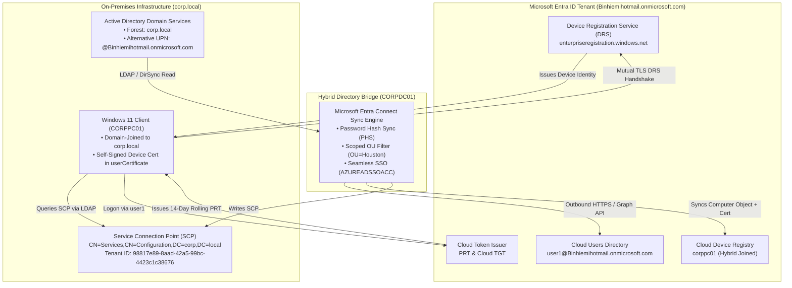
```mermaid
flowchart TD
    subgraph Cloud ["Microsoft Entra ID Tenant (Binhiemihotmail.onmicrosoft.com)"]
        EntraUsers["Cloud Users Directory<br/>user1@Binhiemihotmail.onmicrosoft.com"]
        EntraDevices["Cloud Device Registry<br/>corppc01 (Hybrid Joined)"]
        DRS["Device Registration Service (DRS)<br/>enterpriseregistration.windows.net"]
        CloudTokens["Cloud Token Issuer<br/>PRT & Cloud TGT"]
    end

    subgraph SyncEngine ["Hybrid Directory Bridge (CORPDC01)"]
        AADC["Microsoft Entra Connect Sync Engine<br/>• Password Hash Sync (PHS)<br/>• Scoped OU Filter (OU=Houston)<br/>• Seamless SSO (AZUREADSSOACC)"]
    end

    subgraph OnPrem ["On-Premises Infrastructure (corp.local)"]
        ADDS["Active Directory Domain Services<br/>• Forest: corp.local<br/>• Alternative UPN: @Binhiemihotmail.onmicrosoft.com"]
        SCP["Service Connection Point (SCP)<br/>CN=Services,CN=Configuration,DC=corp,DC=local<br/>Tenant ID: 98817e89-8aad-42a5-99bc-4423c1c38676"]
        PC["Windows 11 Client (CORPPC01)<br/>• Domain-Joined to corp.local<br/>• Self-Signed Device Cert in userCertificate"]
    end

    ADDS -->|LDAP / DirSync Read| AADC
    AADC -->|Outbound HTTPS / Graph API| EntraUsers
    AADC -->|Syncs Computer Object + Cert| EntraDevices
    AADC -->|Writes SCP| SCP
    PC -->|Queries SCP via LDAP| SCP
    PC -->|Mutual TLS DRS Handshake| DRS
    DRS -->|Issues Device Identity| PC
    PC -->|Logon via user1| CloudTokens
    CloudTokens -->|Issues 14-Day Rolling PRT| PC
```

---

## 3. Enterprise Identity & Scope Directory Matrix

| Parameter | On-Premises Environment (`AD DS`) | Cloud Environment (`Entra ID`) |
| :--- | :--- | :--- |
| **Directory Authority** | Active Directory Domain Services (Multi-Master) | Microsoft Entra ID (Global Multi-Tenant Cloud) |
| **Forest / Primary Namespace**| `corp.local` | `Binhiemihotmail.onmicrosoft.com` |
| **Tenant ID** | N/A | `98817e89-8aad-42a5-99bc-4423c1c38676` |
| **Sync Server** | `CORPDC01` (10.10.10.10) — Windows Server 2022 | Microsoft Entra Connect Agent |
| **Credential Sync Mechanism** | NTLM / Kerberos v5 Hashes | Password Hash Synchronization (PHS) + SSPR Writeback |
| **Single Sign-On Architecture**| Kerberos Service Ticket (`AZUREADSSOACC`) | Seamless SSO / Primary Refresh Token (PRT) |
| **Synchronized Scope** | `OU=Houston,DC=corp,DC=local` (Users & Computers) | Direct Ingestion into Tenant Root |
| **Security Exclusions** | Tier-0 Domain Admins (`CORP\Administrator`), Domain Controllers | Excluded from Directory Synchronization |
| **Endpoint Workstation** | `corppc01.corp.local` (Windows 11 Build 26100) | `corppc01` — **Microsoft Entra hybrid joined** |

---

## 4. End-to-End Implementation Workflow

### 4.1. Phase 1: Microsoft Entra Connect Deployment & Initial Sync

Microsoft Entra Connect was installed on primary domain controller `CORPDC01`. The deployment was configured with:
* **Password Hash Synchronization (PHS):** Offloads authentication verification to Entra ID, ensuring uptime during on-premises WAN outages.
* **Password Writeback:** Enforces bidirectional password synchronization for Self-Service Password Reset (SSPR).
* **Scoped OU Filtering:** Restricted directory synchronization strictly to `OU=Houston,DC=corp,DC=local`. Tier-0 accounts (`CN=Users`, `CN=Computers`, `OU=Domain Controllers`) are explicitly excluded to adhere to the Microsoft Enterprise Access security model.
* **Seamless SSO:** Provisioned the dedicated computer account `AZUREADSSOACC` in Active Directory with automated Kerberos service principal names (`adrs/enterpriseregistration.windows.net`).

Upon execution, the initial Full Import, Full Synchronization, and Export completed with **0 errors** across both connectors.

[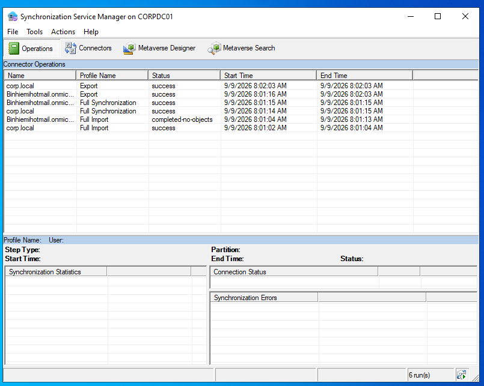](assets/01-aadconnect-miisclient-sync-success.png)

Cloud directory validation in the Microsoft Entra Admin Center confirmed the immediate ingestion of the synchronized user object `user1@Binhiemihotmail.onmicrosoft.com`:

[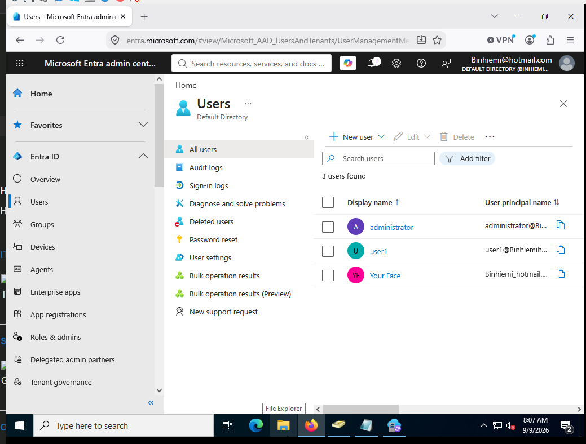](assets/02-entra-admin-center-synced-users.png)

---

### 4.2. Phase 2: Service Connection Point (SCP) & Hybrid Discovery Configuration

Prior to device registration, running `dsregcmd /status` on workstation `CORPPC01` demonstrated a standard on-premises domain join with no cloud identity awareness:

[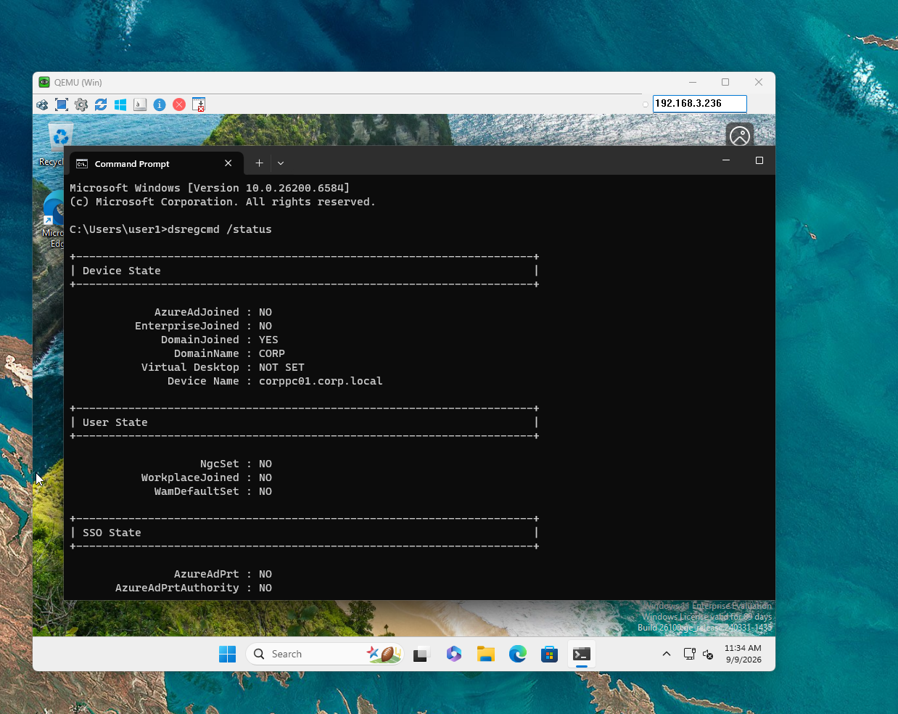](assets/03-corppc01-baseline-pre-hybrid-join.png)

Initiating manual join execution (`dsregcmd /join`) triggered prerequisite check failures:
* **Diagnostic Code:** `AD Configuration Test : FAIL [0x80070002]`
* **Client Error Code:** `0x801c001d` (`DSREG_E_DISCOVERY_FAILED`)
* **Provisioning State:** `PreReqResult : WillNotProvision`

[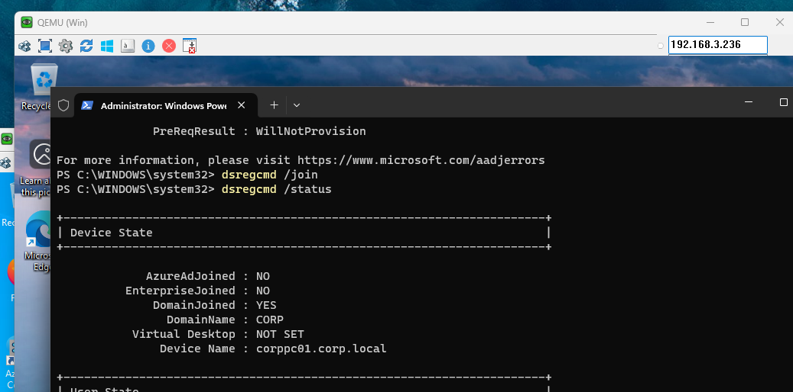](assets/04-corppc01-join-error-scp-missing.png)

#### Root Cause Analysis:
Windows 10/11 domain-joined devices rely on LDAP queries to locate the **Service Connection Point (SCP)** in the Configuration naming context of Active Directory (`CN=Services,CN=Configuration,DC=corp,DC=local`). Because the initial Entra Connect wizard only syncs directory objects and does not write device options by default, the SCP was absent.

#### Resolution Procedure on `CORPDC01`:
1. Opened **Microsoft Entra Connect** $\rightarrow$ **Configure** $\rightarrow$ selected **Configure device options**.

[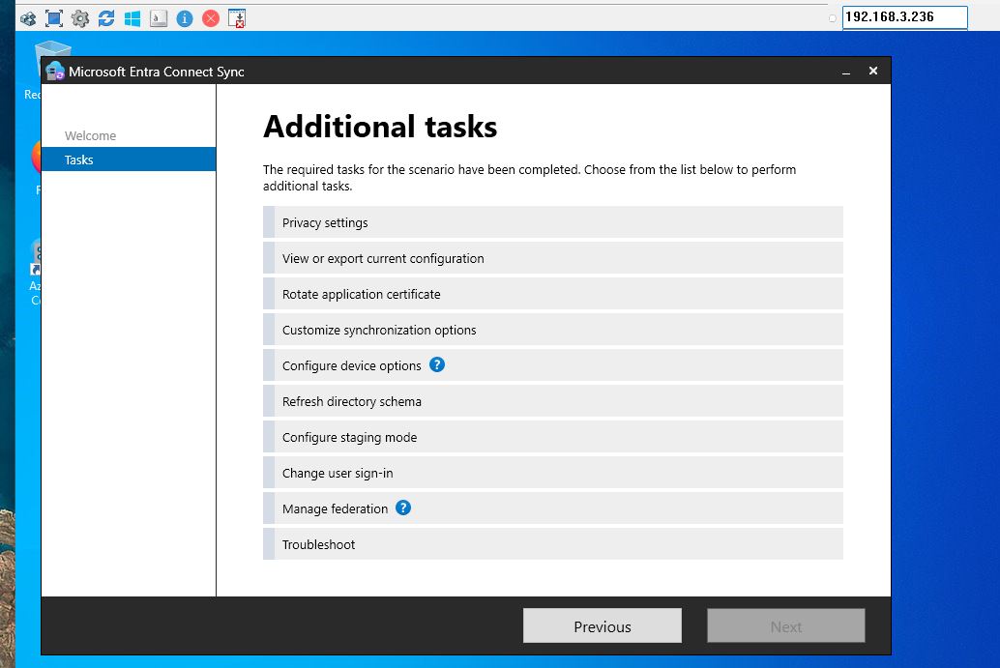](assets/05-aadconnect-configure-device-options.png)

2. Selected **Configure Hybrid Microsoft Entra ID join**.

[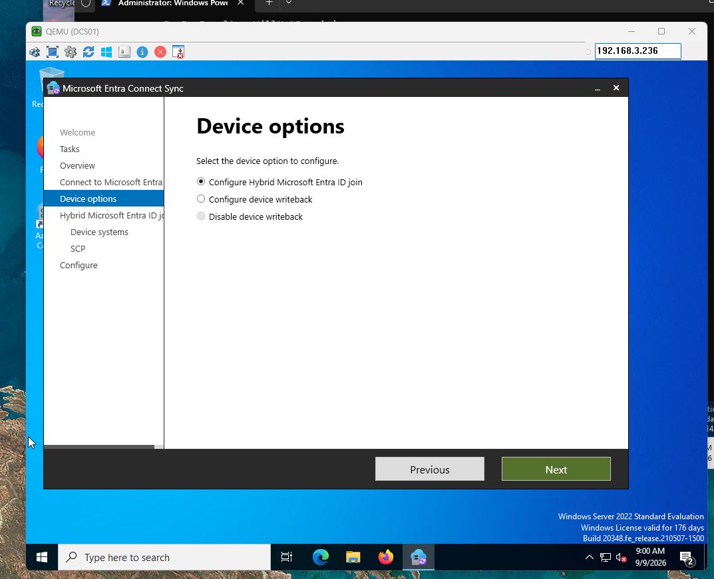](assets/06-aadconnect-hybrid-join-selection.png)

3. Targeted modern corporate OS builds by checking **Windows 10 or later domain-joined devices**.

[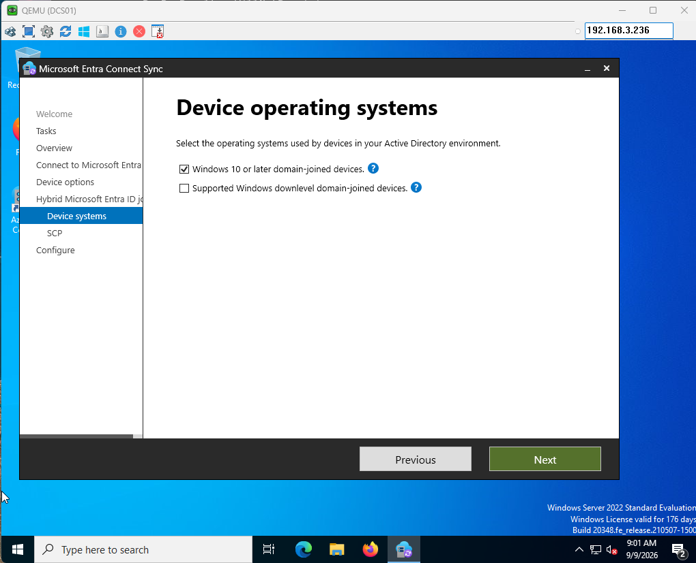](assets/07-aadconnect-os-support-win10-later.png)

4. Configured the SCP for forest `corp.local`, assigned Authentication Service to **Microsoft Entra ID**, and authenticated using Enterprise Admin credentials (`CORP\Administrator`) to write the Active Directory SCP object.

[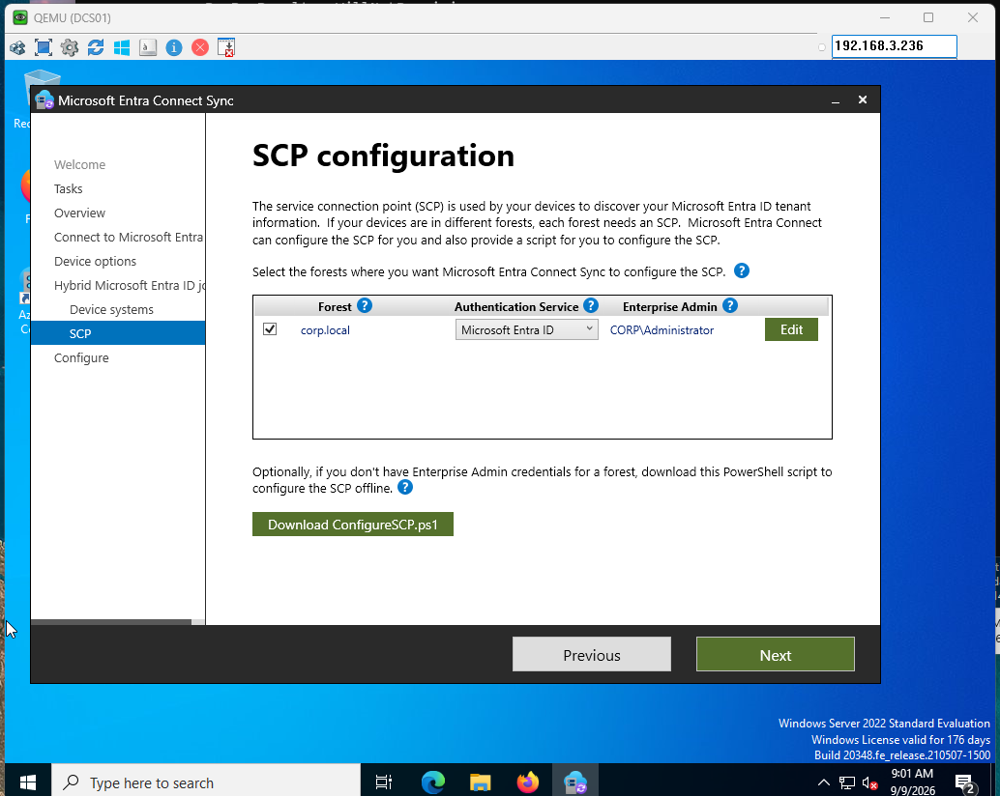](assets/08-aadconnect-scp-active-directory-commit.png)

5. Successfully committed the hybrid device join configuration to the Active Directory Configuration partition.

[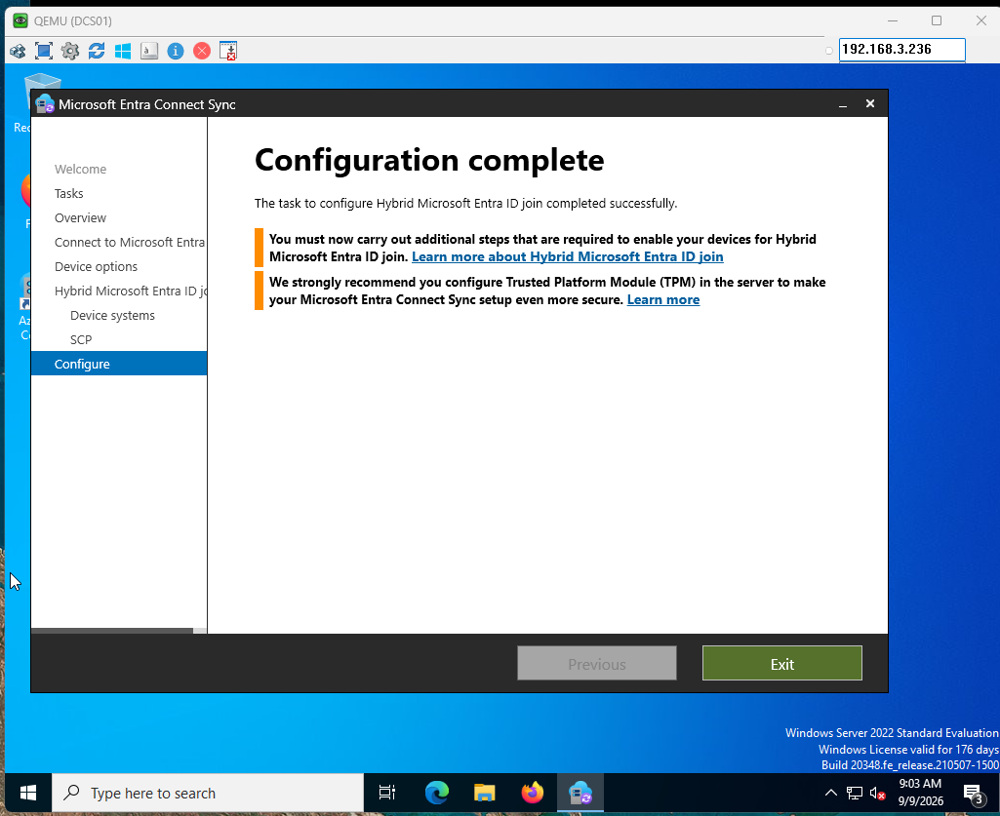](assets/09-aadconnect-configuration-complete.png)

---

### 4.3. Phase 3: Cryptographic Device Join Execution (`CORPPC01`)

Following SCP creation and a delta synchronization cycle (`Start-ADSyncSyncCycle -PolicyType Delta`), the Windows 11 endpoint triggered the `\Microsoft\Windows\Workplace Join\Automatic-Device-Join` scheduled task via:

```cmd
dsregcmd /join
```

Subsequent status interrogation confirmed complete **Microsoft Entra Hybrid Join**:

```text
+----------------------------------------------------------------------+
| Device State                                                         |
+----------------------------------------------------------------------+

             AzureAdJoined : YES
          EnterpriseJoined : NO
              DomainJoined : YES
                DomainName : CORP
               Device Name : corppc01.corp.local

+----------------------------------------------------------------------+
| Device Details                                                       |
+----------------------------------------------------------------------+

                  DeviceId : 4785a6bd-534b-476d-b779-37782e2b7ff0
                Thumbprint : 98BAF54EF4056784198D1E2D18B8905B7BFA9653
DeviceCertificateValidity : [ 2026-09-09 13:43:37.000 UTC -- 2036-09-09 14:13:37.000 UTC ]
            KeyContainerId : a4f1c767-aa53-4245-b4d5-eeec9566e876
               KeyProvider : Microsoft Software Key Storage Provider
              TpmProtected : NO
          DeviceAuthStatus : SUCCESS
```

[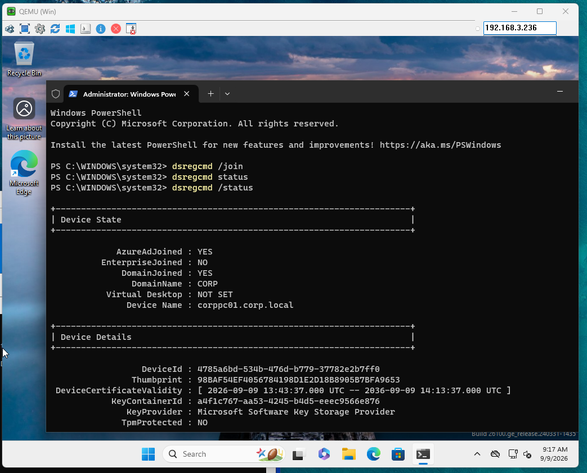](assets/10-corppc01-hybrid-device-state-success.png)

---

### 4.4. Phase 4: Resolving Non-Routable `.local` UPN Namespace & PRT Acquisition

While the workstation identity joined successfully (`DeviceAuthStatus : SUCCESS`), the user authentication layer exhibited a failure under the administrative logon session:

```text
+----------------------------------------------------------------------+
| SSO State                                                            |
+----------------------------------------------------------------------+

                AzureAdPrt : NO
      AcquirePrtDiagnostics : PRESENT
             Attempt Status : 0xc00000d0
              User Identity : Administrator@corp.local
                 HTTP status : 400
           Server Error Code : invalid_request
    Server Error Description : AADSTS90002: Tenant 'corp.local' not found.
```

[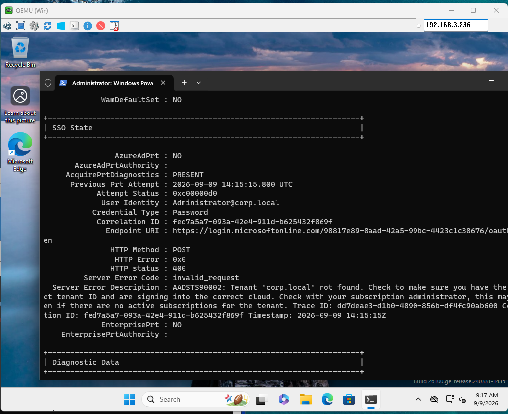](assets/11-corppc01-prt-aadsts90002-domain-admin.png)

#### Architectural Root Cause:
1. **Tier-0 Isolation Enforcement:** `CORP\Administrator` is not synchronized to Entra ID by design, leaving the cloud tenant unaware of that identity.
2. **Non-Routable UPN Suffix:** The on-premises forest uses `.local`, an RFC 2606 reserved top-level domain that cannot be publicly verified in Microsoft Entra ID. Consequently, Entra Connect remaps synced cloud identities to `user1@Binhiemihotmail.onmicrosoft.com`. However, when Windows Web Account Manager (WAM) requests a Primary Refresh Token, it transmits the local UPN (`user1@corp.local`), triggering `AADSTS90002`.

#### Remediation Workflow:
1. **Registered Alternative UPN Suffix:** On `CORPDC01`, opened **Active Directory Domains and Trusts** (`domain.msc`), accessed root properties, and added `Binhiemihotmail.onmicrosoft.com` as an alternative UPN suffix.

[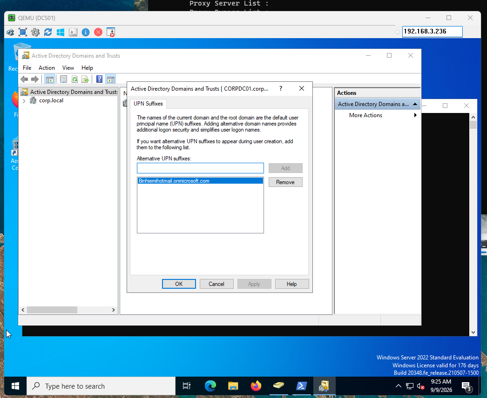](assets/12-ad-domains-trusts-alternative-upn-suffix.png)

2. **Aligned User Logon Identity:** In **Active Directory Users and Computers** (`dsa.msc`), modified `user1` properties under the **Account** tab, changing the User Logon Name suffix to `@Binhiemihotmail.onmicrosoft.com`.

[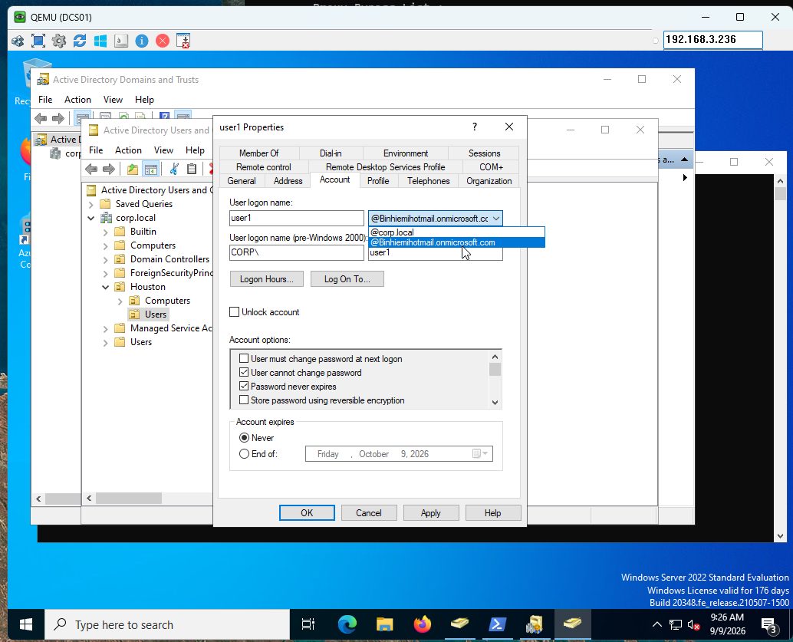](assets/13-aduc-user1-logon-name-upn-alignment.png)

3. **Pushed Delta Directory Synchronization:** Triggered an immediate synchronization cycle via PowerShell on `CORPDC01`:

```powershell
Start-ADSyncSyncCycle -PolicyType Delta
```

[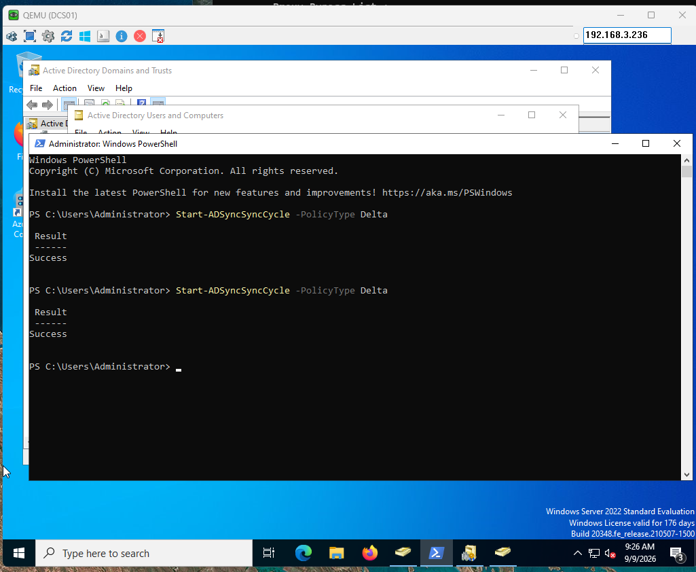](assets/14-aadconnect-delta-sync-execution.png)

---

### 4.5. Phase 5: Primary Refresh Token (PRT) & Seamless SSO Verification

On `CORPPC01`, the active session was signed out and re-authenticated under the newly aligned identity:
* **Logon Account:** `user1@Binhiemihotmail.onmicrosoft.com` (or `CORP\user1`)
* **Authentication Method:** Kerberos v5 via on-prem DC $\rightarrow$ Seamless SSO Kerberos assertion to Cloud WAM.

Subsequent `dsregcmd /status` validation confirmed complete token acquisition:

```text
+----------------------------------------------------------------------+
| SSO State                                                            |
+----------------------------------------------------------------------+

                AzureAdPrt : YES
      AzureAdPrtUpdateTime : 2026-09-09 14:30:51.000 UTC
      AzureAdPrtExpiryTime : 2026-09-23 14:31:30.000 UTC
       AzureAdPrtAuthority : https://login.microsoftonline.com/98817e89-8aad-42a5-99bc-4423c1c38676
             EnterprisePrt : NO
                  OnPremTgt : NO
                  CloudTgt : YES
       KerbTopLevelNames : .windows.net,.windows.net:1433,.windows.net:3342,.azure.net,.azure.net:1433,.azure.net:3342

+----------------------------------------------------------------------+
| Diagnostic Data                                                      |
+----------------------------------------------------------------------+

        AadRecoveryEnabled : NO
    Executing Account Name : CORP\user1, user1@Binhiemihotmail.onmicrosoft.com
               KeySignTest : PASSED
        DisplayNameUpdated : YES
          OsVersionUpdated : YES
           HostNameUpdated : YES
```

[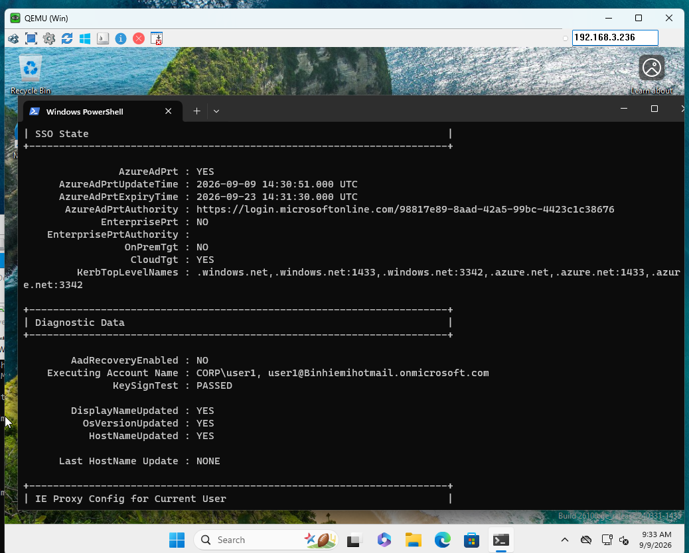](assets/15-corppc01-full-hybrid-join-sso-prt-verified.png)

Evaluating the Next Generation Credential (NGC) pre-check verified that both device and user layers are fully recognized by Microsoft Entra ID:

```text
+----------------------------------------------------------------------+
| Ngc Prerequisite Check                                               |
+----------------------------------------------------------------------+

            IsDeviceJoined : YES
             IsUserAzureAD : YES
             PolicyEnabled : NO
           PostLogonEnabled : YES
             DeviceEligible : YES
          SessionIsNotRemote : YES
              CertEnrollment : none
               PreReqResult : WillNotProvision
```

[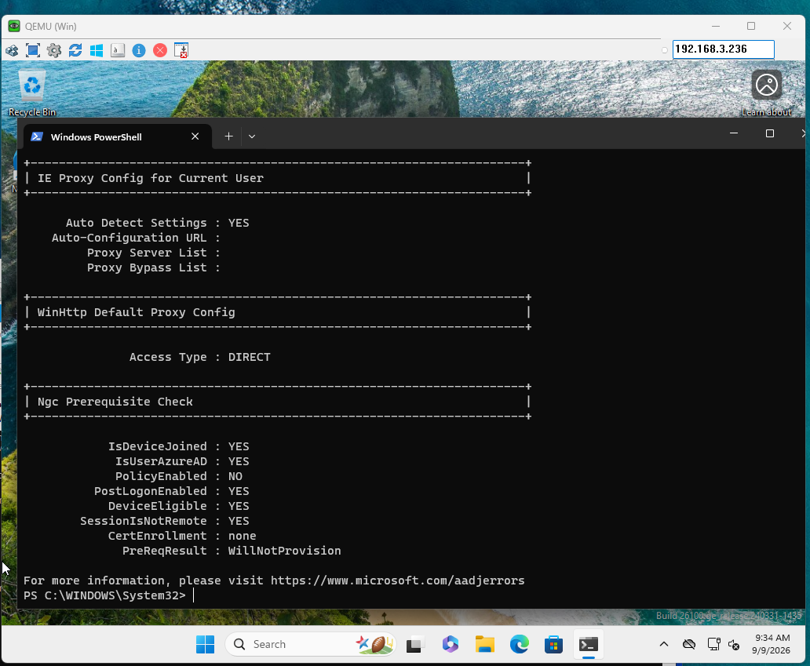](assets/16-corppc01-ngc-prereq-user-azuread-yes.png)

---

### 4.6. Phase 6: Cloud Tenant Governance in Microsoft Entra Admin Center

Accessing **Microsoft Entra Admin Center** ([entra.microsoft.com](https://entra.microsoft.com)) confirmed cloud ingestion and directory binding:
1. **Devices Overview:** Confirmed active registered inventory.

[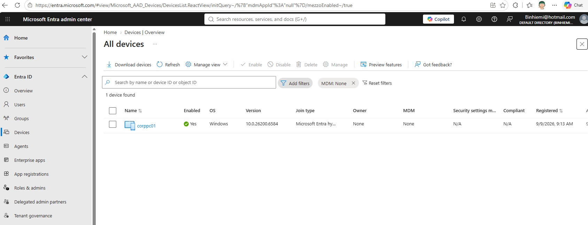](assets/17-entra-admin-center-devices-overview.png)

2. **All Devices Inventory:**
   * **Device Name:** `corppc01`
   * **Enabled:** `Yes`
   * **Operating System:** `Windows` (`10.0.26200.6584`)
   * **Join Type:** **`Microsoft Entra hybrid joined`**
   * **MDM:** `None`
   * **Registered Date:** `9/9/2026, 9:13 AM`

[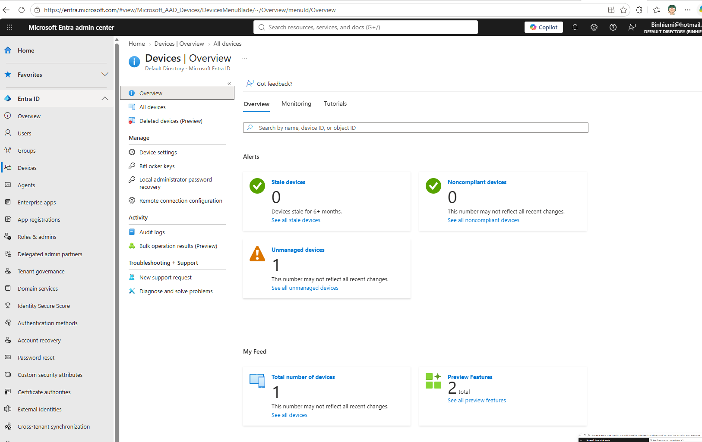](assets/18-entra-admin-center-all-devices-hybrid-joined.png)

---

## 5. Engineering Field Runbook & Incident Troubleshooting

### Incident 1: Clock Drift / Future Assertion Certificate (`AADSTS700027`)
* **Symptom:** Entra Connect wizard fails during Microsoft Graph application authentication with:
  `AADSTS700027: The certificate with identifier used to sign the client assertion is expired on application. [Reason - The key used is expired., found key 'Start=09/09/2026 17:51:32...']`.
* **Root Cause:** Virtualized hypervisor environments (QEMU/KVM) maintain virtual hardware clocks in UTC. An on-premises system clock offset ahead of real-world UTC causes client assertion certificates to be generated with activation timestamps in the future. Entra ID rejects these assertions as invalid.
* **Remediation:** Aligned the Windows Time service (`w32time`) directly to an authoritative NTP pool:
  ```cmd
  w32tm /config /manualpeerlist:"time.windows.com" /syncfromflags:manual /reliable:YES /update
  net stop w32time && net start w32time
  w32tm /resync /force
  ```

### Incident 2: Missing Service Connection Point (`0x80070002` / `0x801c001d`)
* **Symptom:** `dsregcmd /join` exits immediately with `PreReqResult : WillNotProvision` and `AD Configuration Test : FAIL [0x80070002]`.
* **Root Cause:** The endpoint queries Active Directory LDAP for `CN=Device Registration Configuration,CN=Services,CN=Configuration,DC=corp,DC=local`. If absent, the client cannot determine the tenant ID (`azureADId`) or tenant domain name (`azureADName`), aborting DRS registration.
* **Remediation:** Executed the **Configure device options** task in Entra Connect and supplied Enterprise Admin credentials to write the SCP object into AD.

### Incident 3: Non-Synced Tier-0 Admin PRT Rejection (`AADSTS90002`)
* **Symptom:** `AzureAdJoined : YES`, but `AzureAdPrt : NO` with `AADSTS90002: Tenant 'corp.local' not found`.
* **Root Cause:** The active Windows logon session was `CORP\Administrator`. Because Tier-0 administrative accounts are scoped out of cloud synchronization to preserve security boundaries, Entra ID has no directory object for `Administrator@corp.local`.
* **Remediation:** Expected behavior under the Microsoft Enterprise Access model. User SSO was validated by logging on as the synchronized production user (`CORP\user1`).

### Incident 4: Non-Routable Top-Level Domain (`.local`)
* **Symptom:** Synced end-users fail cloud authentication due to domain suffix mismatch between on-premises Active Directory (`user1@corp.local`) and cloud tenant (`user1@Binhiemihotmail.onmicrosoft.com`).
* **Root Cause:** Cloud identity providers cannot route or verify private namespaces (`.local`).
* **Remediation:** Registered the verified tenant domain name as an **Alternative UPN Suffix** in Active Directory Domains and Trusts and updated the user's primary UPN attribute.

---

## 6. Author & Copyright Notice

Authored and copyrighted © 2026 Philippe Truong. All rights reserved.  
All architecture topologies, design documentation, and original implementation configurations are the property of Philippe Truong.
