# Lab 08: Enterprise Windows Server DNS Infrastructure & Service Resolution

**Author:** Philippe Truong  
**Copyright:** © 2026 Philippe Truong. All rights reserved.  
**Domain:** Enterprise Windows Server Infrastructure, Active Directory Domain Services (AD DS), DNS Server Role, Forward Lookup Zones, Reverse Lookup Zones, Resource Records (A, CNAME, PTR, SRV), Recursive Resolvers & Upstream Forwarders, Active Directory Locator Records.

**Status:** 🟢 Completed  

---

## 1. Executive Summary & Objective

Domain Name System (DNS) is the foundational control plane for enterprise networking, Active Directory identity boundaries, and hybrid cloud integration.

This lab designs, deploys, and validates a Windows DNS coupled with an Active Directory Domain Services (`corp.local`) environment.

1. **Upstream Forwarding & Recursive Resolution:** Configured  forwarders to Google Public DNS (`8.8.8.8`, `8.8.4.4`) 
2. **Reverse Lookup Infrastructure (`in-addr.arpa`):** Deployed two Active Directory-Integrated reverse lookup zones (`10.10.10.in-addr.arpa` and `9.10.10.in-addr.arpa`) with Pointer (`PTR`) records, resolving IP-to-hostname audit requirements.
3. **Canonical Name (CNAME) Abstraction:** Aliases (`dc.corp.local` and `gw.corp.local`) decoupling application endpoints from underlying server hostnames and raw IP addresses.
4. **Active Directory Locator (`SRV`) Validation:** CLI inspection of AD Service Location (`SRV`) records on LDAP port 389.

```
                          [ Public Internet / Root Hints ]
                                         ^
                                         | Upstream Forwarders
                                         | (8.8.8.8 / 8.8.4.4)
                                         v
                     +---------------------------------------+
                     |    CORPDC01: Windows Server 2022     |
                     |      Primary DNS Server & AD DS       |
                     |             10.10.10.10               |
                     +---------------------------------------+
                                  |                 |
         Forward Lookup (corp.local)               Reverse Lookup (in-addr.arpa)
         ---------------------------               -----------------------------
         A:     corpdc01.corp.local                PTR: 10.10.10.10 -> corpdc01
         A:     router.corp.local                  PTR: 10.10.10.11 -> CORPDC02
         CNAME: dc.corp.local -> corpdc01          PTR: 10.10.9.1   -> router
         CNAME: gw.corp.local -> router
         SRV:   _ldap._tcp.dc._msdcs (Port 389)
                                  |
                +-----------------+-----------------+
                |                                   |
                v                                   v
  +---------------------------+       +---------------------------+
  |  CORPDC02: Secondary DC   |       |    Cisco Edge Router      |
  |       (10.10.10.11)       |       |  router.corp.local (GW)   |
  |  AD-Integrated Replica    |       |        (10.10.9.1)        |
  +---------------------------+       +---------------------------+
```

---

## 2. DNS Zone Architecture & Record Matrix

### 2.1 Authoritative DNS Zones

| Zone Name | Zone Type | Storage & Replication Scope | Purpose |
| :--- | :--- | :--- | :--- |
| **`corp.local`** | Forward Lookup | Active Directory-Integrated (Domain-Wide) | Primary namespace for enterprise hosts, servers, and aliases |
| **`_msdcs.corp.local`** | Forward Lookup | Active Directory-Integrated (Forest-Wide) | Active Directory domain controller and global catalog locator SRV records |
| **`10.10.10.in-addr.arpa`** | Reverse Lookup | Active Directory-Integrated (Domain-Wide) | Reverse IP-to-Name resolution for Server Subnet (`10.10.10.0/24`) |
| **`9.10.10.in-addr.arpa`** | Reverse Lookup | Active Directory-Integrated (Domain-Wide) | Reverse IP-to-Name resolution for Router/Transit Subnet (`10.10.9.0/24`) |

---

### 2.2 Configured Resource Record Matrix

| Record Name / FQDN | Record Type | Target / Data | TTL | Operational Function |
| :--- | :---: | :--- | :---: | :--- |
| **`corpdc01.corp.local`** | `A` | `10.10.10.10` | 3600s | Primary Domain Controller & DNS Server host address |
| **`CORPDC02.corp.local`** | `A` | `10.10.10.11` | 3600s | Secondary Domain Controller & DNS Server host address |
| **`router.corp.local`** | `A` | `10.10.9.1` | 3600s | Cisco vIOS Edge Router transit interface address |
| **`dc.corp.local`** | `CNAME` | `corpdc01.corp.local` | 3600s | Service alias for administrative scripts and LDAP queries |
| **`gw.corp.local`** | `CNAME` | `router.corp.local` | 3600s | Network alias for default gateway management |
| **`10.10.10.10.in-addr.arpa`** | `PTR` | `corpdc01.corp.local` | 3600s | Reverse pointer for SIEM, Kerberos, and nslookup verification |
| **`11.10.10.10.in-addr.arpa`** | `PTR` | `CORPDC02.corp.local` | 3600s | Reverse pointer for secondary domain controller |
| **`1.9.10.10.in-addr.arpa`** | `PTR` | `router.corp.local` | 3600s | Reverse pointer for router hop traceroutes and syslog audits |
| **`_ldap._tcp.dc._msdcs.corp.local`** | `SRV` | `corpdc01` & `corpdc02` (Port 389) | 600s | Active Directory locator: Priority 0, Weight 100 load balancing |

---

## 3. Step-by-Step Implementation Workflow

### Step 3.1: Upstream Forwarders & External Resolution
By default, an isolated Windows DNS server relies on Root Hints (`a.root-servers.net` to `m.root-servers.net`) for recursive lookups, which adds multi-hop query latency.
1. Navigated to **`CORPDC01` Properties** $\rightarrow$ **Forwarders** tab.
2. Added Google Public DNS servers **`8.8.8.8`** and **`8.8.4.4`**.
3. Tested external recursive lookup via Command Prompt:
   ```cmd
   nslookup google.com
   ```

[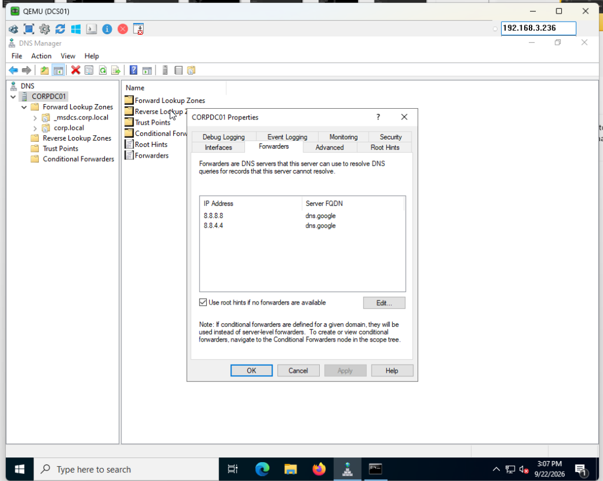](./assets/02_upstream_forwarders_google_cloudflare.png)  
*Figure 3.1: Configuring validated upstream DNS forwarders (8.8.8.8 / 8.8.4.4) on CORPDC01.*

[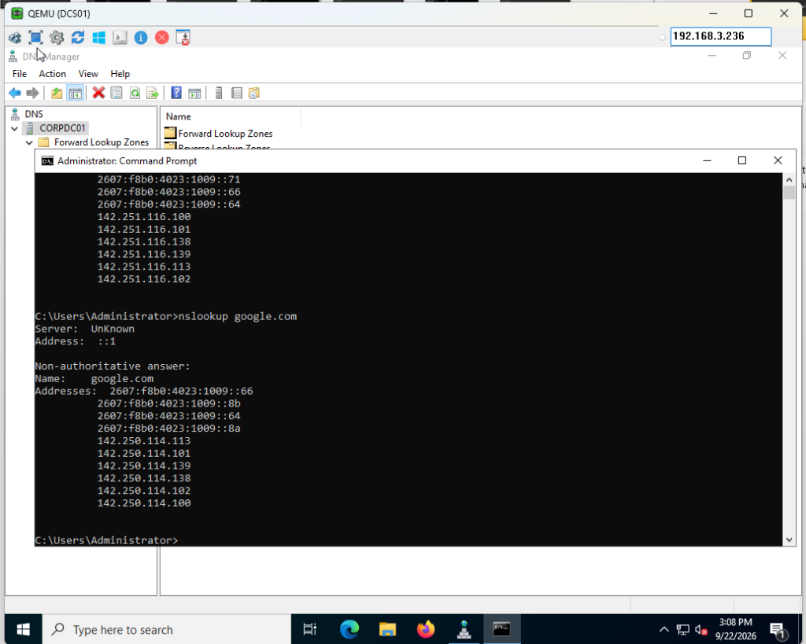](./assets/03_nslookup_google_forwarder_unknown_server.png)  
*Figure 3.2: Initial nslookup test resolving google.com via forwarders, noting 'Server: UnKnown' due to missing reverse lookup zone.*

---

### Step 3.2: Reverse Lookup Zone Deployment (`10.10.10.in-addr.arpa`)
When `nslookup` initializes, it immediately queries its own DNS server IP address in reverse. Without an active reverse zone, it outputs `Server: UnKnown`.
1. In DNS Manager, launched the **New Zone Wizard** on **Reverse Lookup Zones**.
2. Selected **Active Directory-Integrated Primary Zone** with replication to all DNS servers in `corp.local`.
3. Specified IPv4 Network ID: **`10.10.10`** (Windows automatically created `10.10.10.in-addr.arpa`).
4. Created **Pointer (PTR)** records for both Domain Controllers:
   * `10.10.10.10` $\rightarrow$ `corpdc01.corp.local`
   * `10.10.10.11` $\rightarrow$ `CORPDC02.corp.local`

[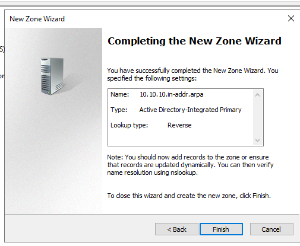](./assets/04_reverse_lookup_zone_10_10_10_in_addr_arpa.png)  
*Figure 3.3: Creating the Active Directory-Integrated reverse lookup zone 10.10.10.in-addr.arpa.*

[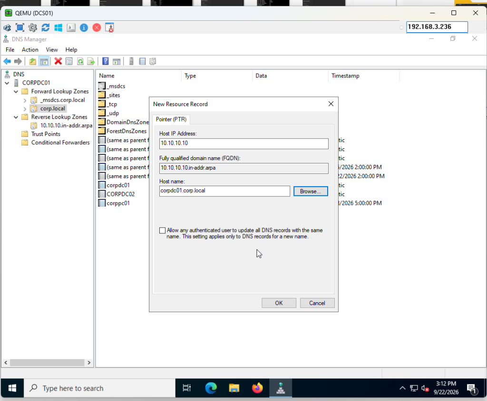](./assets/06_new_ptr_record_corpdc01.png)  
*Figure 3.4: Defining the host pointer (PTR) mapping 10.10.10.10 to corpdc01.corp.local.*

[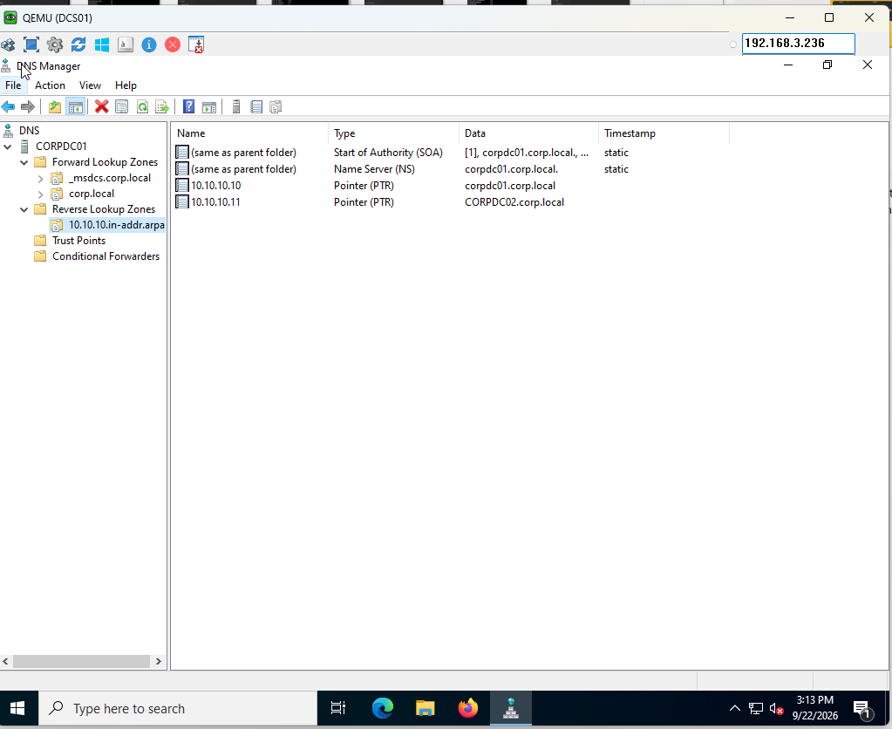](./assets/09_both_dc_ptr_records_active.png)  
*Figure 3.5: Verified active PTR records for both domain controllers in the 10.10.10.in-addr.arpa zone.*

#### Reverse Resolution Verification
Executed reverse lookups and verified that `Server: UnKnown` was resolved to the server's FQDN:
```cmd
nslookup 10.10.10.10 10.10.10.10
```
[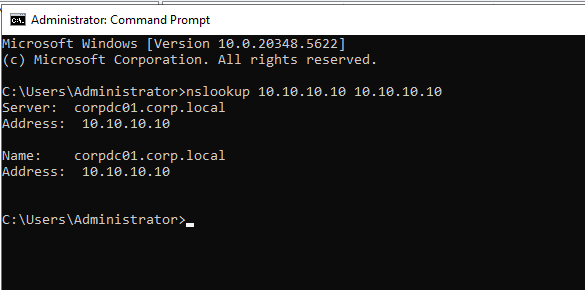](./assets/11_nslookup_ipv4_fqdn_resolved.png)  
*Figure 3.6: CLI verification showing instantaneous reverse resolution to corpdc01.corp.local.*

---

### Step 3.3: Canonical Name (CNAME) Aliasing & Troubleshooting
Canonical Name records allow multiple service identities to point to a single canonical `A` record without duplicating IP configurations.

1. Under **Forward Lookup Zones** $\rightarrow$ **`corp.local`**, created a **New Alias (CNAME)**:
   * **Alias name:** `dc` (`dc.corp.local`)
   * **Target Host:** `corpdc01.corp.local`
2. **Real-World Troubleshooting:** When initial inspection showed `NameHost` pointing to a root dot (`.`), diagnosed and updated the target FQDN in the record properties:

[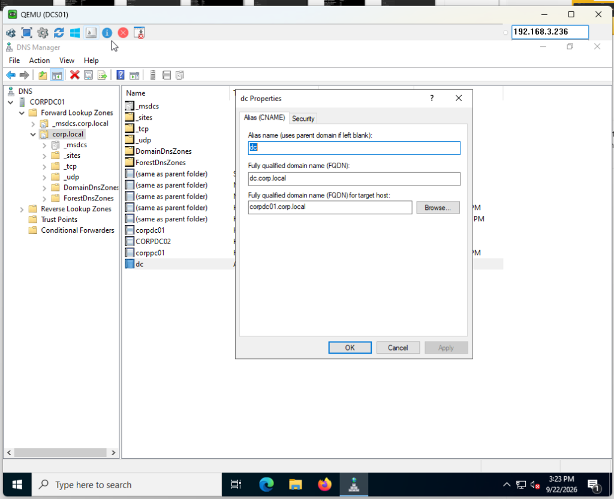](./assets/14_cname_corrected_target_corpdc01.png)  
*Figure 3.7: Correcting the CNAME target host to corpdc01.corp.local in record properties.*

3. Verified the complete resolution chain via PowerShell and ICMP:
```powershell
Resolve-DnsName dc.corp.local
ping dc.corp.local
```

[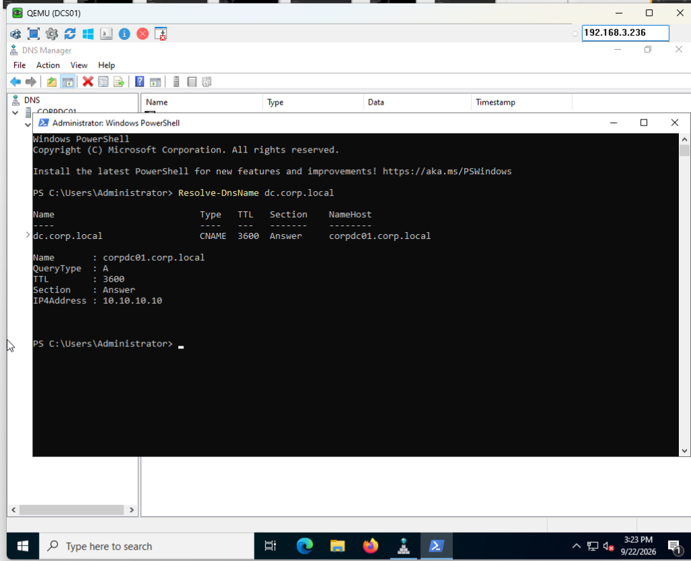](./assets/15_cname_dc_resolution_powershell.png)  
*Figure 3.8: PowerShell Resolve-DnsName proving seamless CNAME-to-A record resolution chain.*

[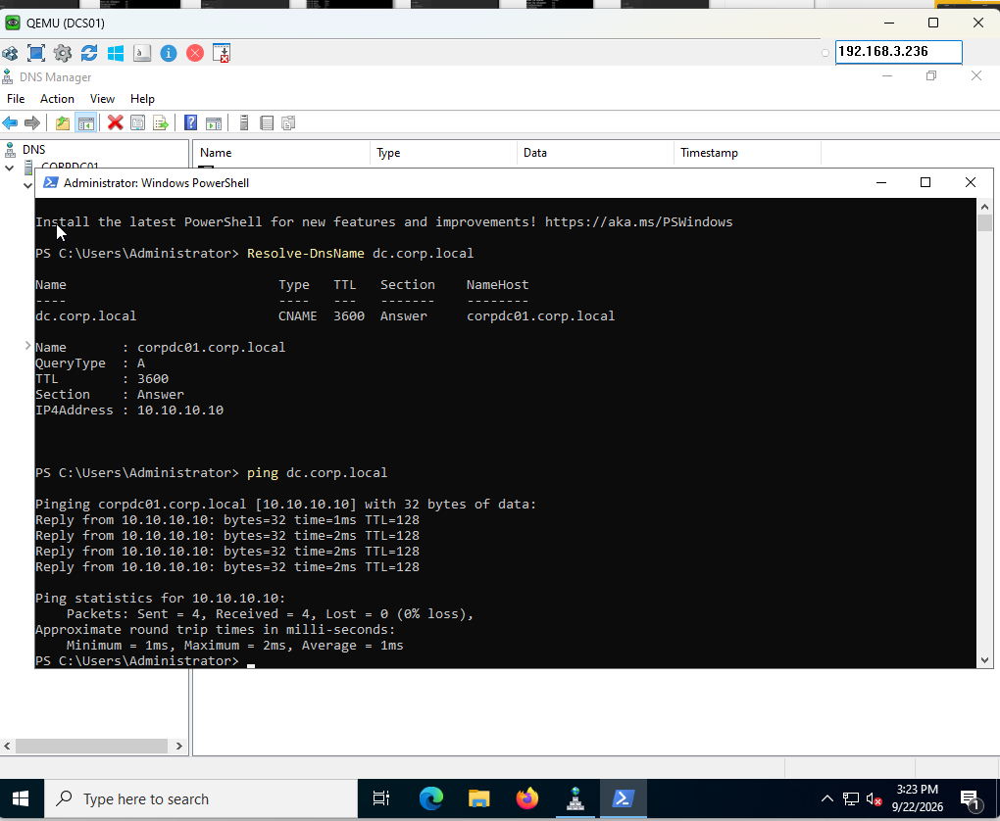](./assets/16_cname_dc_ping_verified.png)  
*Figure 3.9: ICMP ping to alias dc.corp.local automatically translating to 10.10.10.10.*

---

### Step 3.4: Network Infrastructure Mapping (Cisco Edge Router)
Enterprise environments require physical network devices to be fully integrated into DNS for logging, monitoring, and traceroute identification:

1. Created **`A` Record**: `router.corp.local` pointing to `10.10.9.1`.
2. Created **Reverse Lookup Zone**: **`9.10.10.in-addr.arpa`** for the transit subnet (`10.10.9.0/24`).
3. Created **`PTR` Record**: `10.10.9.1` $\rightarrow$ `router.corp.local`.
4. Created **`CNAME` Alias**: `gw.corp.local` $\rightarrow$ `router.corp.local`.

[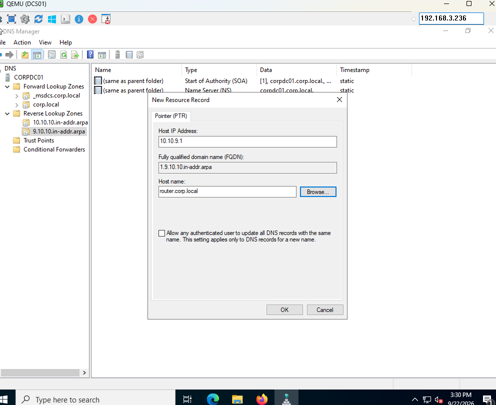](./assets/20_router_ptr_configuration_dialog.png)  
*Figure 3.10: Configuring the router pointer record in the 9.10.10.in-addr.arpa reverse zone.*

[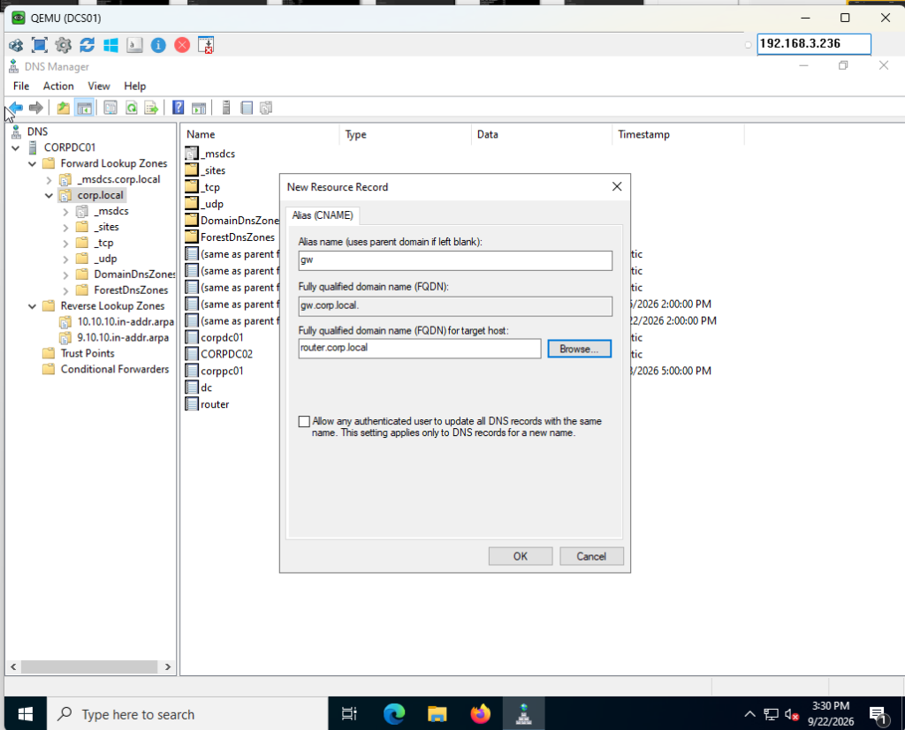](./assets/21_cname_gateway_gw_creation.png)  
*Figure 3.11: Creating the generic gateway alias gw.corp.local pointing to router.corp.local.*

#### Verification of Router Forward, Reverse & Alias:
```powershell
Resolve-DnsName gw.corp.local
ping gw.corp.local
Resolve-DnsName 10.10.9.1
```

[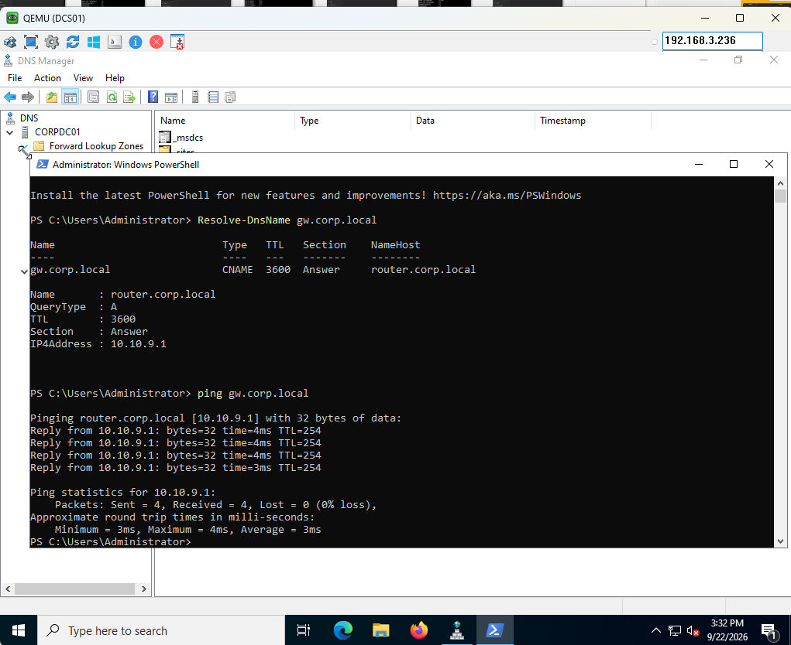](./assets/22_gateway_cname_and_ping_verified.png)  
*Figure 3.12: Verification showing gw.corp.local resolving to router.corp.local and replying with TTL=254 (Cisco IOS).*

[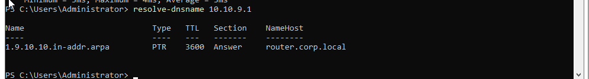](./assets/23_router_reverse_lookup_verified.png)  
*Figure 3.13: Reverse DNS lookup on 10.10.9.1 correctly returning router.corp.local via 1.9.10.10.in-addr.arpa.*

---

### Step 3.5: Active Directory Service Location (`SRV`) Deep Dive

Active Directory domain membership, Kerberos authentication, and group policy application rely entirely on **`SRV` (Service Location)** records:

```powershell
Resolve-DnsName _ldap._tcp.dc._msdcs.corp.local -Type SRV
```

[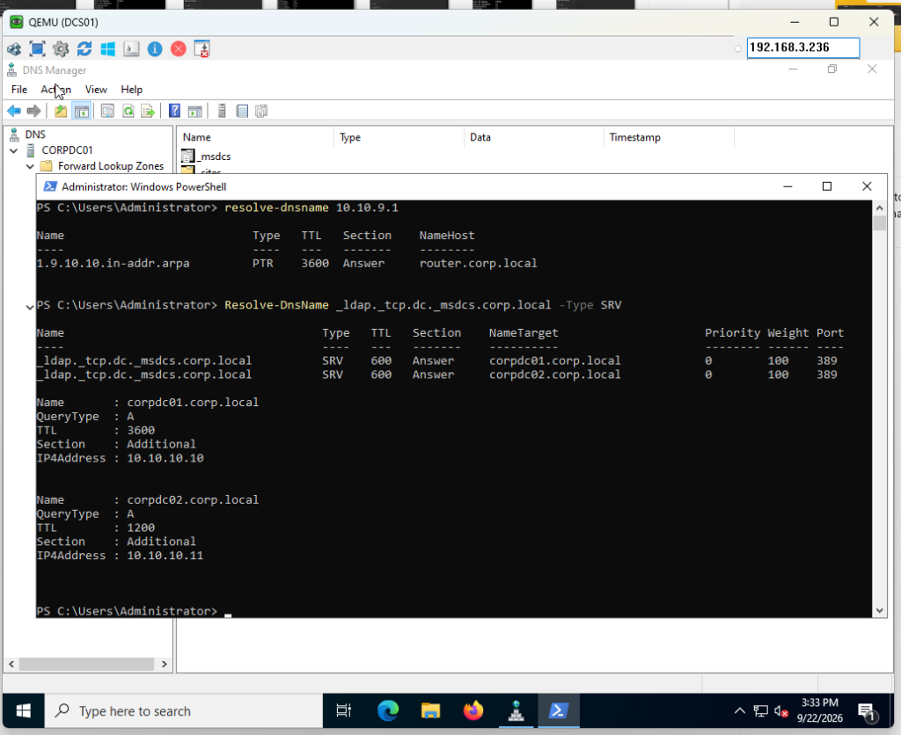](./assets/24_active_directory_srv_records_verified.png)  
*Figure 3.14: PowerShell query revealing active SRV locator records for both domain controllers on LDAP port 389.*

#### Architectural Breakdown of the SRV Query:
* **`_ldap`:** Identifies the service protocol (Lightweight Directory Access Protocol).
* **`_tcp`:** Specifies the transport layer protocol.
* **`dc._msdcs.corp.local`:** The Microsoft Domain Controller locator zone.
* **`Port 389`:** The standardized LDAP listening port.
* **`Priority 0` & `Weight 100`:** Tells domain clients how to load-balance traffic between `corpdc01` and `corpdc02`. If one DC fails, clients seamlessly failover to the surviving node without administrative intervention.

---

## 4. Key Engineering Challenges & Solutions

### 4.1 The `Server: UnKnown` IPv6 Loopback Trap
* **Challenge:** When running `nslookup` on Windows Server, the tool repeatedly displayed `Server: UnKnown` with `Address: ::1`.
* **Root Cause:** By default, Windows prefers IPv6 over IPv4. Because `CORPDC01` had its loopback DNS set to `::1`, `nslookup` sent reverse queries for `::1` into the `ip6.arpa` tree. Because no IPv6 reverse zone existed, the query returned `NXDOMAIN`, falling back to `UnKnown`.
* **Solution:** Validated queries explicitly against the IPv4 listener (`nslookup <target> 10.10.10.10`) and demonstrated that client workstations receiving DHCP IPv4 DNS configurations never encounter this loopback artifact.

### 4.2 CNAME Target Apex & The Root Dot (`.`) Issue
* **Challenge:** An initial test of `ping dc.corp.local` failed with `"Ping request could not find host"`.
* **Root Cause:** In the CNAME creation dialog, leaving the target host blank resulted in Windows DNS assigning the record target as `.` (the DNS root zone).
* **Solution:** Inspected the record in PowerShell using `Resolve-DnsName`, identified `NameHost : .`, and edited the record properties in DNS Manager to explicitly specify the FQDN `corpdc01.corp.local.`.

### 4.3 Inverted Octet Hierarchy in Multi-Subnet Architecture
* **Challenge:** The Cisco Edge Router transit interface resides on subnet `10.10.9.0/24`, which could not be stored in the existing `10.10.10.in-addr.arpa` zone.
* **Solution:** Deployed a dedicated reverse lookup zone for `10.10.9.0/24`. Confirmed that DNS correctly inverted the octets to **`9.10.10.in-addr.arpa`**, successfully housing the `1.9.10.10.in-addr.arpa` PTR pointer for `router.corp.local`.


## 5. Author & Copyright

**Authored by:** Philippe Truong  
**Copyright:** © 2026 Philippe Truong. All rights reserved.  
*All architecture topologies, design documentation, and configuration templates are the intellectual property of Philippe Truong.*
