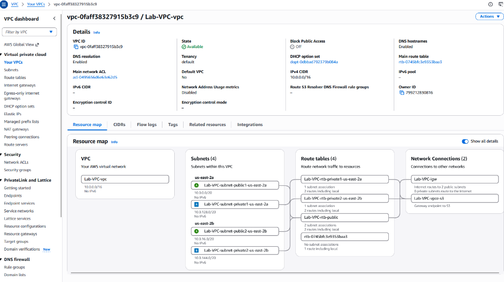
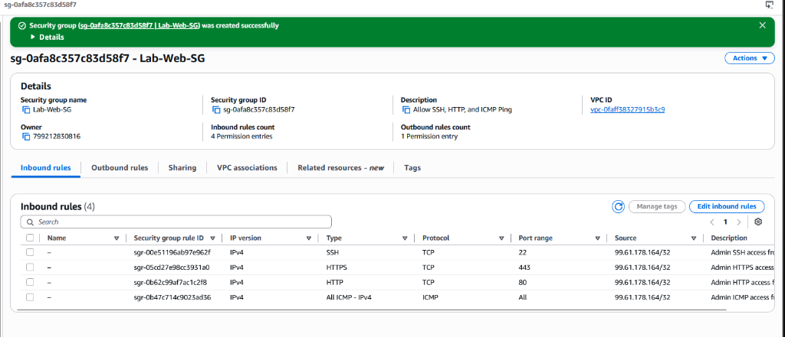
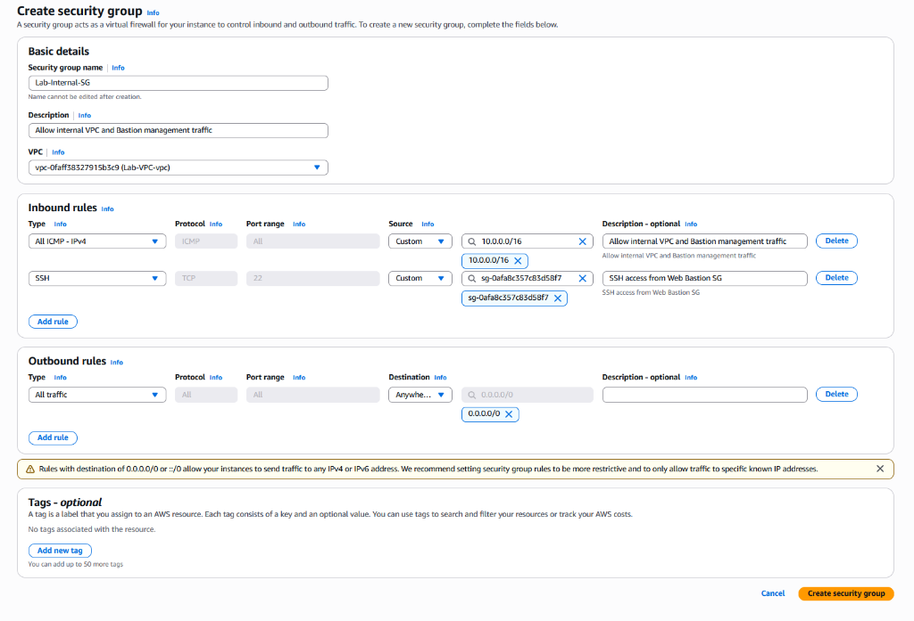
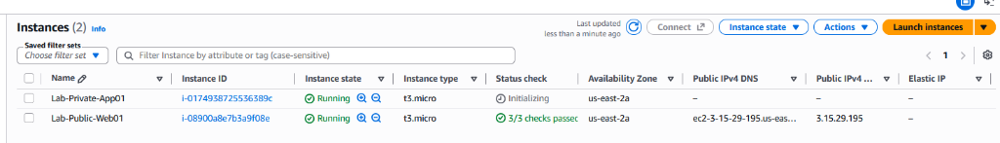
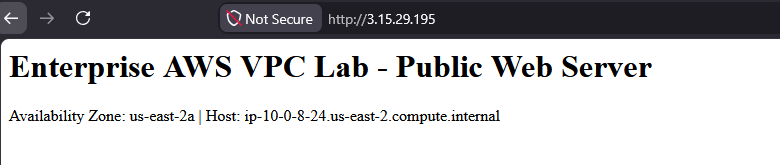
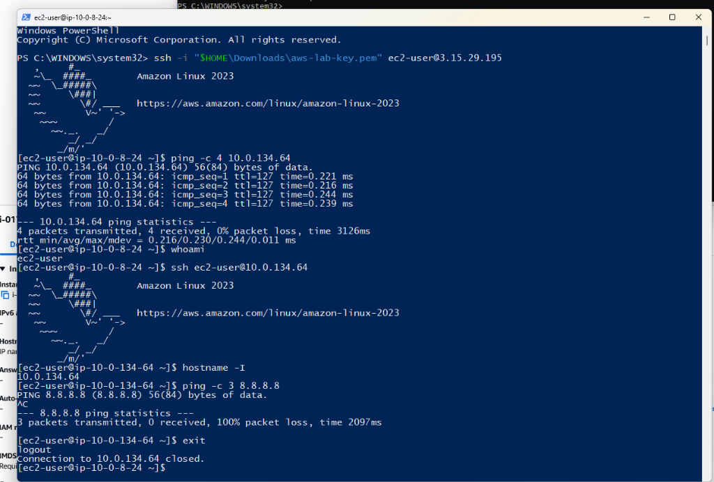

# Lab 09: Enterprise AWS Multi-Tier VPC Networking, Routing & Zero-Trust Cloud Architecture

**Author:** Philippe Truong  
**Copyright:** © 2026 Philippe Truong. All rights reserved.  
**Domain:** AWS Cloud Networking, Virtual Private Cloud (VPC), Subnetting & CIDR Calculation, Route Tables, Internet Gateway (IGW), Stateful Security Groups, Zero-Trust SG Referencing, Bastion Jump Host, Multi-AZ Architecture, EC2 Compute, Cloud-Init Automation.  
**Status:** 🟢 Completed  

---

## 1. Executive Summary & Objective

Modern enterprise cloud adoption requires strict network segmentation, deterministic traffic engineering, and defense-in-depth perimeter security. Simply deploying virtual machines into a flat default VPC exposes sensitive database and application workloads to unauthorized scanning and lateral movement attacks.

This lab designs, provisions, and empirically verifies a multi-tier, multi-Availability Zone AWS Virtual Private Cloud (**Lab-VPC**) in the `us-east-2` (Ohio) region. 

### Core Architectural Objectives:
1. **Multi-AZ Subnet Segmentation:** Architected a `/16` VPC CIDR (`10.0.0.0/16`) segmented into `/20` subnets spanning `us-east-2a` and `us-east-2b`, reserving dedicated address spaces for public ingress and private workloads.
2. **Deterministic Route Table Isolation:** Engineered independent route tables ensuring that public subnets route default internet traffic (`0.0.0.0/0`) through an **Internet Gateway (IGW)**, while private subnets remain completely air-gapped from direct internet ingress.
3. **Stateful Perimeter & Zero-Trust Chaining:** Implemented stateful Security Groups:
   * **`Lab-Web-SG`:** Hardened public ingress permitting SSH (Port 22), HTTP (Port 80), HTTPS (Port 443), and ICMP Ping strictly from the administrator's specific public ISP IP (`/32`).
   * **`Lab-Internal-SG`:** Cloud-native **Security Group Referencing**, dynamically authorizing SSH management exclusively when originating from members of `Lab-Web-SG`.
4. **Automated Compute Bootstrapping:** Provisioned compute instances with `cloud-init` User Data scripts to deploy Apache HTTP services automatically upon boot.
5. **Bastion Jump & Network Reachability Verification:** Validated end-to-end connectivity:
   * Public ingress verification via external ICMP (35ms avg) and HTTP 200 responses.
   * Intra-VPC inter-subnet routing latency test (**0.230 ms avg**).
   * Bastion SSH jump host traversal using default OpenSSH identity resolution (`~/.ssh/id_rsa`).
   * Negative isolation proof confirming private instances cannot route to the internet without a NAT gateway.

```
                                    +------------------------------+
                                    |     Administrator Home PC    |
                                    |        (99.61.178.164)       |
                                    +------------------------------+
                                                   |
                             HTTPS / HTTP / SSH    | ICMP Echo
                             (Allowed by /32 SG)   |
                                                   v
==================================== [ Public Internet ] ====================================
                                                   |
                                                   v
                                   +-------------------------------+
                                   |  Internet Gateway (Lab-VPC-igw)|
                                   |     igw-0ef29f2936f484c80     |
                                   +-------------------------------+
                                                   |
                                                   |  Default Route (0.0.0.0/0)
                                                   v
+-------------------------------------------------------------------------------------------+
| AWS Region: us-east-2 (Ohio)                Lab-VPC (10.0.0.0/16)                         |
|                                                                                           |
|  +-------------------------------------------------------------------------------------+  |
|  | Public Tier (Route Table: Lab-VPC-rtb-public -> 0.0.0.0/0 to IGW)                   |  |
|  |                                                                                     |  |
|  |   Availability Zone: us-east-2a                 Availability Zone: us-east-2b       |  |
|  |   +---------------------------------------+     +---------------------------------+ |  |
|  |   | Subnet: public1-us-east-2a            |     | Subnet: public2-us-east-2b      | |  |
|  |   | CIDR: 10.0.0.0/20 (4,091 hosts)       |     | CIDR: 10.0.16.0/20              | |  |
|  |   |                                       |     | (Spare Capacity / Failover)     | |  |
|  |   | [ Lab-Public-Web01 ]                  |     +---------------------------------+ |  |
|  |   | Private IP: 10.0.8.24                 |                                         |  |
|  |   | Public IP:  3.15.29.195               |                                         |  |
|  |   | SG: Lab-Web-SG                        |                                         |  |
|  |   | (Bastion Host + Apache Web)           |                                         |  |
|  |   +---------------------------------------+                                         |  |
|  +---------------------------------------|---------------------------------------------+  |
|                                          |                                                |
|                                          | Intra-VPC Router (0.230 ms Latency)            |
|                                          v                                                |
|  +-------------------------------------------------------------------------------------+  |
|  | Private Tier (Route Table: Lab-VPC-rtb-private1-us-east-2a -> Local VPC Only)       |  |
|  |                                                                                     |  |
|  |   Availability Zone: us-east-2a                 Availability Zone: us-east-2b       |  |
|  |   +---------------------------------------+     +---------------------------------+ |  |
|  |   | Subnet: private1-us-east-2a           |     | Subnet: private2-us-east-2b     | |  |
|  |   | CIDR: 10.0.128.0/20 (4,091 hosts)     |     | CIDR: 10.0.144.0/20             | |  |
|  |   |                                       |     | (Spare Capacity / Failover)     | |  |
|  |   | [ Lab-Private-App01 ]                 |     +---------------------------------+ |  |
|  |   | Private IP: 10.0.134.64               |                                         |  |
|  |   | Public IP:  NONE (-)                  |                                         |  |
|  |   | SG: Lab-Internal-SG                   |                                         |  |
|  |   | (Air-Gapped App/DB Tier)              |                                         |  |
|  |   +---------------------------------------+                                         |  |
|  +-------------------------------------------------------------------------------------+  |
|                                          |                                                |
|                                          +---> [ S3 Gateway VPC Endpoint: vpce-s3 ]       |
+-------------------------------------------------------------------------------------------+
```

---

## 2. VPC Subnetting & CIDR Topology Architecture

### 2.1 Subnet Allocation Matrix

| Subnet Identifier | Subnet ID | Availability Zone | IPv4 CIDR Block | Total IPv4 | Usable Hosts | Default Route | Role / Tier |
| :--- | :--- | :---: | :---: | :---: | :---: | :--- | :--- |
| **`Lab-VPC-subnet-public1-us-east-2a`** | `subnet-0ba17566d5c316382` | `us-east-2a` | `10.0.0.0/20` | 4,096 | 4,091 | `igw-0ef29f2936f484c80` | Public Web & Bastion Host |
| **`Lab-VPC-subnet-public2-us-east-2b`** | `subnet-05f2e2a2e2788d74b` | `us-east-2b` | `10.0.16.0/20` | 4,096 | 4,091 | `igw-0ef29f2936f484c80` | Public Ingress Multi-AZ Secondary |
| **`Lab-VPC-subnet-private1-us-east-2a`** | `subnet-08cfe1b22fd8909e5` | `us-east-2a` | `10.0.128.0/20` | 4,096 | 4,091 | `local` | Isolated Application / Database Tier |
| **`Lab-VPC-subnet-private2-us-east-2b`** | `subnet-009e4895f3f539024` | `us-east-2b` | `10.0.144.0/20` | 4,096 | 4,091 | `local` | Isolated Database Multi-AZ Replica |

[](./assets/01_aws_vpc_resource_map.png)  
*Figure 2.1: AWS VPC Resource Map showing the complete Lab-VPC topology, dual Availability Zones, 4 subnets, route tables, and network gateway connections.*

---

### 2.2 Deep Dive: AWS CIDR Math & Subnetting Logic

#### 1. Why Did AWS "Hop" from `10.0.16.0` to `10.0.128.0`?
In standard classless inter-domain routing (CIDR), `/20` subnets have block sizes of 16 in the 3rd octet ($2^{(32-20)} = 4,096$ addresses $\rightarrow 16 \times 256$). The contiguous ranges are `10.0.0.0/20`, `10.0.16.0/20`, `10.0.32.0/20`, `10.0.48.0/20`, etc.

However, enterprise cloud architectures utilize **Bit-Boundary Route Summarization**:
* The VPC is a `/16` (`10.0.0.0` – `10.0.255.255`).
* Splitting on the 17th bit creates two equal halves of 32,768 addresses:
  * **Lower Half (`10.0.0.0/17` $\rightarrow$ `10.0.0.0` to `10.0.127.255`):** Dedicated to **Public Subnets**.
  * **Upper Half (`10.0.128.0/17` $\rightarrow$ `10.0.128.0` to `10.0.255.255`):** Dedicated to **Private Subnets**.
* **Enterprise Benefit:** Security teams can write a single firewall rule or transit gateway routing summary matching `10.0.128.0/17` that instantly encompasses *every present and future private subnet* without managing sprawling IP lists.

#### 2. AWS Reserved IP Addresses (The "Missing 5" Rule)
In standard on-premises networking, 2 addresses are reserved per subnet (Network ID and Broadcast). In AWS VPC, **5 IP addresses are reserved in every subnet**:
* **`10.0.0.0`:** Network address.
* **`10.0.0.1`:** VPC Router (Default Gateway for instances in that subnet).
* **`10.0.0.2`:** AmazonProvidedDNS (Route 53 Resolver / Base VPC IP + 2).
* **`10.0.0.3`:** Reserved by AWS for future functionality.
* **`10.0.15.255`:** Network broadcast address (AWS VPC does not support broadcast; address is reserved).
* **Result:** A `/20` block provides $4,096 - 5 = \mathbf{4,091}$ usable host addresses.

---

## 3. Route Table & Gateway Architecture

### 3.1 Public Route Table (`Lab-VPC-rtb-public`)
Associated with `Lab-VPC-subnet-public1-us-east-2a` and `Lab-VPC-subnet-public2-us-east-2b`.

| Destination | Target | Status | Propagated | Purpose |
| :--- | :--- | :---: | :---: | :--- |
| `10.0.0.0/16` | `local` | Active | No | Local intra-VPC routing across all subnets |
| `0.0.0.0/0` | `igw-0ef29f2936f484c80` | Active | No | Default gateway directing outbound/inbound internet via IGW |

### 3.2 Private Route Tables (`Lab-VPC-rtb-private1-us-east-2a` & `Lab-VPC-rtb-private2-us-east-2b`)
Associated strictly with the private subnets.

| Destination | Target | Status | Propagated | Purpose |
| :--- | :--- | :---: | :---: | :--- |
| `10.0.0.0/16` | `local` | Active | No | Local intra-VPC routing across all subnets |
| `pl-68a54001` (S3 Prefix List) | `vpce-0c77870e031e31a71` | Active | No | Direct private routing to AWS S3 storage without traversing the internet |

### 3.3 Strategic FinOps Decision: NAT Gateway vs. Zero-Cost Air Gap
* A standard AWS NAT Gateway incurs **$0.045/hour (~$32.40/month)** plus $0.045/GB data processing fees.
* In this lab, NAT Gateway was deliberately set to **`None`**:
  1. Preserves 100% of the user's $100 AWS credits for compute and future multi-VPC peering labs.
  2. Creates a genuine **air-gapped zero-trust private tier**, where instances cannot initiate outbound connections to the internet, satisfying strict compliance architectures (e.g., PCI-DSS / HIPAA database subnets).

---

## 4. Stateful Firewalling & Zero-Trust Security Groups

In AWS, Security Groups function as **stateful virtual firewalls** operating at the hypervisor elastic network interface (ENI) level, completely independent of the operating system firewall.

### 4.1 Public Web Tier: `Lab-Web-SG` (`sg-0afa8c357c83d58f7`)
Hardened ingress strictly authorized for the administrator's ISP public IP (`99.61.178.164/32`):

| Direction | Type | Protocol | Port Range | Source / Destination | Description |
| :--- | :--- | :---: | :---: | :--- | :--- |
| **Inbound** | `SSH` | TCP | 22 | `99.61.178.164/32` | Administrative SSH access from home PC |
| **Inbound** | `HTTP` | TCP | 80 | `99.61.178.164/32` | Administrative Web testing access |
| **Inbound** | `HTTPS` | TCP | 443 | `99.61.178.164/32` | Administrative TLS testing access |
| **Inbound** | `All ICMP - IPv4` | ICMP | All | `99.61.178.164/32` | Inbound diagnostic ping from home PC |
| **Outbound** | `All traffic` | All | All | `0.0.0.0/0` | Enables package installs (`dnf install httpd`) and internal hops |

[](./assets/02_security_group_web.png)  
*Figure 4.1: Lab-Web-SG rule configuration showing strict /32 ingress filtering and outbound internet routing.*

---

### 4.2 Private Database Tier: `Lab-Internal-SG` (`sg-05845926812633895`)
Employs **Security Group Chaining (Referencing)** instead of static IP ranges:

| Direction | Type | Protocol | Port Range | Source / Destination | Description |
| :--- | :--- | :---: | :---: | :--- | :--- |
| **Inbound** | `All ICMP - IPv4` | ICMP | All | `10.0.0.0/16` | Intra-VPC diagnostic echo ping |
| **Inbound** | `SSH` | TCP | 22 | `sg-0afa8c357c83d58f7` (`Lab-Web-SG`) | **SG Referencing:** SSH allowed *only* from instances bearing Lab-Web-SG |
| **Outbound** | `All traffic` | All | All | `0.0.0.0/0` | Outbound response evaluation (gated by route table) |

[](./assets/03_security_group_internal.png)  
*Figure 4.2: Lab-Internal-SG rule configuration demonstrating Security Group chaining from sg-0afa8c357c83d58f7.*

> [!IMPORTANT]
> **Enterprise Best Practice: Security Group Referencing**  
> Rather than allowing an entire subnet (`10.0.0.0/20`) to SSH into the database, AWS permits specifying the Source as another Security Group ID (`sg-0afa8c357c83d58f7`). Even if instances scale up, change IP addresses, or terminate, only servers explicitly tagged with `Lab-Web-SG` are permitted ingress.

---

## 5. Compute Workloads & Cloud-Init Bootstrap

Two `t3.micro` instances were provisioned to validate traffic flow across availability tiers:

| Instance Name | Instance ID | Tier / Subnet | Private IPv4 | Public IPv4 | Elastic IP | Status |
| :--- | :--- | :--- | :---: | :---: | :---: | :---: |
| **`Lab-Public-Web01`** | `i-08900a8e7b3a9f08e` | Public (`10.0.0.0/20`) | `10.0.8.24` | `3.15.29.195` | None | `Running (3/3 checks passed)` |
| **`Lab-Private-App01`** | `i-0174938725536389c` | Private (`10.0.128.0/20`) | `10.0.134.64` | *None (-)* | None | `Running (3/3 checks passed)` |

[](./assets/04_ec2_instances_status.png)  
*Figure 5.1: EC2 Management Console displaying both instances running, highlighting public IPv4 on Web01 and complete lack of public exposure on App01.*

### 5.1 Automated Cloud-Init User Data Script
Upon initial VM instantiation, `Lab-Public-Web01` executed the following bash payload as `root` to stand up the web service without manual administrative intervention:

```bash
#!/bin/bash
# 1. Update OS packages and repository metadata
dnf update -y

# 2. Install Apache HTTP Server
dnf install -y httpd

# 3. Start Apache and enable auto-restart upon reboot
systemctl start httpd
systemctl enable httpd

# 4. Generate custom landing page with dynamic hostname and AZ injection
echo "<h1>Enterprise AWS VPC Lab - Public Web Server</h1><p>Availability Zone: us-east-2a | Host: $(hostname -f)</p>" > /var/www/html/index.html
```

---

## 6. Step-by-Step Verification Matrix & Live Telemetry

### 6.1 Verification Results Summary

| Test Case | Traffic Source | Target Host / IP | Protocol / Port | Observed Result | Architectural Validation |
| :--- | :--- | :--- | :---: | :---: | :--- |
| **1. Public Ingress ICMP** | Home PC (`99.61.178.164`) | `3.15.29.195` | ICMP Echo | **0% Loss (35ms avg)** | Bi-directional Internet Gateway routing verified |
| **2. Public Ingress HTTP** | Home Browser (`99.61.178.164`) | `3.15.29.195` | HTTP (TCP 80) | **HTTP 200 OK** | Security Group + Apache Cloud-Init verified |
| **3. Direct Admin SSH** | Home PC (`99.61.178.164`) | `3.15.29.195` | SSH (TCP 22) | **Authenticated (Uptime OK)** | RSA keypair handshake permitted from allowed IP |
| **4. Zero-Trust Drop** | AWS Browser Proxy | `3.15.29.195` | SSH (TCP 22) | **Connection Refused** | EC2 Instance Connect proxy dropped (not admin IP) |
| **5. Intra-VPC Routing** | `10.0.8.24` (Public Subnet) | `10.0.134.64` (Private Subnet) | ICMP Echo | **0% Loss (0.230ms avg)** | Software-defined VPC router connects subnets at sub-ms |
| **6. Bastion SSH Jump** | `10.0.8.24` (Bastion Host) | `10.0.134.64` (Private Host) | SSH (TCP 22) | **Success (`~/.ssh/id_rsa`)** | Lateral jump authenticated via internal key management |
| **7. Private Outbound Isolation** | `10.0.134.64` (Private Host) | `8.8.8.8` (Public DNS) | ICMP Echo | **100% Packet Loss** | Air-gap proof: No NAT Gateway exists to leak packets |
| **8. External Inbound Isolation** | Home PC (Internet) | `10.0.134.64` | ICMP Echo | **Net Unreachable** | RFC 1918 space unroutable across public internet |

---

### 6.2 Visual Verification Proofs

#### Test Case 2: Web Server Live Ingress
Navigating to `http://3.15.29.195` from the administrator's workstation returned the customized landing page, validating that inbound TCP 80 traverses the IGW and hits Apache on the `10.0.8.24` private IP.

[](./assets/05_public_web_server_live.png)  
*Figure 6.1: Live HTTP response from Lab-Public-Web01 displaying Availability Zone us-east-2a and hostname ip-10-0-8-24.us-east-2.compute.internal.*

---

#### Test Cases 3, 5, 6 & 7: Bastion SSH Jump & Air-Gapped Isolation
The terminal session below documents the complete operational sequence:
1. Connecting into the Public Bastion (`3.15.29.195` / `10.0.8.24`).
2. Pinging across the VPC router to `10.0.134.64` with **0.230 ms average latency**.
3. Performing an internal SSH jump: `ssh ec2-user@10.0.134.64`.
4. Prompt transform: `[ec2-user@ip-10-0-8-24 ~]$` $\rightarrow$ `[ec2-user@ip-10-0-134-64 ~]$`.
5. Testing outbound internet access (`ping -c 3 8.8.8.8`), resulting in **100% packet loss**, proving total private tier air-gap isolation.
6. Clean exit back to the public bastion.

[](./assets/06_bastion_jump_and_isolation_proof.png)  
*Figure 6.2: Live terminal capture verifying SSH ingress, intra-VPC ping (0.230 ms), lateral Bastion jump to private host, and outbound packet drop.*

---

## 7. SSH Key Management & Bastion Architecture

### 7.1 How OpenSSH Resolves Keys Automatically
When running `ssh ec2-user@10.0.134.64` without an explicit `-i <keyfile>` argument, the Linux OpenSSH client automatically inspects default identity locations:
```text
/home/ec2-user/.ssh/id_rsa
/home/ec2-user/.ssh/id_ecdsa
/home/ec2-user/.ssh/id_ed25519
```

By placing the private key at `/home/ec2-user/.ssh/id_rsa` with strict read-only permissions (`chmod 400`), OpenSSH presents the key to `10.0.134.64` seamlessly.

```bash
# Directory inspection on Lab-Public-Web01
[ec2-user@ip-10-0-8-24 ~]$ ls -la ~/.ssh/
total 16
drwx------. 2 ec2-user ec2-user   85 Sep 23 14:34 .
drwx------. 3 ec2-user ec2-user   74 Sep 23 14:15 ..
-rw-------. 1 ec2-user ec2-user  393 Sep 23 14:15 authorized_keys   # Public keys authorized to log IN
-r--------. 1 ec2-user ec2-user 1678 Sep 23 14:30 id_rsa            # Private key used to jump OUT
-rw-------. 1 ec2-user ec2-user  266 Sep 23 14:34 known_hosts       # Target fingerprint
```

### 7.2 Alternative Enterprise Jump Pattern: `ProxyJump` (`-J`)
In high-security enterprise environments where storing private keys on a bastion disk is restricted, engineers use OpenSSH **ProxyJump** to tunnel through the bastion directly into the private instance without leaving key artifacts behind:

```powershell
# Windows PowerShell ProxyCommand One-Liner
ssh -i "$HOME\Downloads\aws-lab-key.pem" -o ProxyCommand="ssh -i '$HOME\Downloads\aws-lab-key.pem' -W %h:%p ec2-user@3.15.29.195" ec2-user@10.0.134.64
```

---

## 8. FinOps & Cloud Resource Governance

### 8.1 Free Tier Spend Analysis
| AWS Resource | Quantity | Free Tier Allowance | Billed Cost |
| :--- | :---: | :---: | :---: |
| **VPC & Subnets** | 1 VPC, 4 Subnets | Included | **$0.00** |
| **Internet Gateway** | 1 IGW | Included | **$0.00** |
| **S3 Gateway Endpoint** | 1 VPCE | Included (No hourly charge) | **$0.00** |
| **NAT Gateway** | 0 (Deliberately Omitted) | Not in Free Tier ($32.40/mo avoided) | **$0.00** |
| **EC2 `t3.micro` Instances** | 2 Instances | 750 Hours / Month (Free Tier) | **$0.00** |
| **EBS Storage (gp3)** | 2x 8 GiB (16 GiB total) | 30 GiB / Month (Free Tier) | **$0.00** |
| **Total Realized Lab Cost** | | | **$0.00** |

### 8.2 Safe Instance Management (Preserving Credits)
To preserve the $100 AWS credit balance for future labs when the environment is not actively being tested:
* **Stop Instances:** In the EC2 Console, select both instances $\rightarrow$ **Instance state** $\rightarrow$ **Stop instance**. (Stops compute charges; retains disk and configurations for immediate resumption).
* **Terminate Instances:** When the lab portfolio is fully documented, select **Terminate instance** to delete compute and EBS volumes.

---

## 9. Key Takeaways & Lessons Learned

1. **Stateful vs. Stateless Filtering:** AWS Security Groups are stateful; return traffic is automatically allowed. However, omitting outbound rules entirely prevents the server from initiating package downloads (`dnf update`) or DNS lookups.
2. **Security Group Chaining:** Referencing `sg-0afa8c357c83d58f7` within `Lab-Internal-SG` enforces true zero-trust isolation, decoupling security policy from volatile private IP addresses.
3. **Route Table Superiority:** Security Groups control port-level access, but Route Tables control network reachability. Without a route to an Internet Gateway (`0.0.0.0/0 -> igw`), a private subnet cannot leak packets to the internet regardless of firewall settings.
4. **Cloud-Init Velocity:** Embedding User Data bootstrap scripts eliminates post-deployment manual configuration, turning compute provisioning into an automated, repeatable infrastructure artifact.
