# Lab 04: Azure Hub-and-Spoke Cloud Architecture & Azure Firewall

**Author:** Philippe Truong  
**Copyright:** © 2026 Philippe Truong. All rights reserved.  
**Domain:** Enterprise Cloud Networking, Software-Defined Networking (SDN), Hub-and-Spoke Topology, VNet Peering, Azure Firewall (Basic), User-Defined Routing (UDR), Network Security Groups (NSG), Layer 4 & Layer 7 Threat Filtering, Cloud FinOps  

**Status:** 🟢 Completed  

---

## 1. Executive Summary & Objective

This lab designs, engineers, and validates an enterprise **Hub-and-Spoke Cloud Network Architecture** in Microsoft Azure (`East US`, Resource Group `rg-enterprise-networking`).

The architecture implements a centralized security perimeter, transit routing engine, and segmented workload spokes following Microsoft's Cloud Adoption Framework (CAF) and Zero Trust networking standards.

```
                               +--------------------------------------------+
                               |        Azure Firewall (afw-hub-eastus)     |
                               |          Data Private IP: 10.100.1.4       |
                               |    pip-afw-data-eastus / pip-afw-mgmt-eastus|
                               +---------------------+----------------------+
                                                     |
                         +---------------------------+---------------------------+
                         |                                                       |
                         v                                                       v
+-------------------------------------------------+     +-------------------------------------------------+
|   Spoke-01: vnet-spoke-prod-eastus              |     |   Spoke-02: vnet-spoke-dev-eastus               |
|   Address Space: 10.101.0.0/16                  |     |   Address Space: 10.102.0.0/16                  |
|   Subnet: Spoke-01 (10.101.1.0/24)              |     |   Subnet: snet-workload-dev (10.102.1.0/24)     |
|   UDR: 0.0.0.0/0 -> 10.100.1.4                  |     |   UDR: 0.0.0.0/0 -> 10.100.1.4                  |
|   NSG: nsg-spoke-workloads (Pri 1000 Admin Allow)|    |   NSG: nsg-spoke-workloads (Pri 1000 Admin Allow)|
+-------------------------------------------------+     +-------------------------------------------------+
```

### Core Engineering Deliverables:
1. **Central Transit Hub (`vnet-hub-eastus` — `10.100.0.0/16`):**
   * **`GatewaySubnet` (`10.100.0.0/27`):** Pre-allocated to host the hybrid route-based Virtual Network Gateway in Lab 05.
   * **`AzureFirewallSubnet` (`10.100.1.0/26`):** Dedicated to the Azure Firewall data plane.
   * **`AzureFirewallManagementSubnet` (`10.100.2.0/26`):** Dedicated control plane interface for Azure Firewall Basic.
   * **`DefaultSharedServices` (`10.100.10.0/24`):** Hosts shared infrastructure (Active Directory Domain Controllers, private DNS resolvers, monitoring agents, and jumpboxes).
2. **Workload Spokes:**
   * **Spoke-01 (`vnet-spoke-prod-eastus` — `10.101.0.0/16`):** Isolated Production tier (`Spoke-01`: `10.101.1.0/24`).
   * **Spoke-02 (`vnet-spoke-dev-eastus` — `10.102.0.0/16`):** Isolated Development tier (`snet-workload-dev`: `10.102.1.0/24`).
3. **High-Speed SDN Peering:** Full mesh bidirectional VNet peering linking Hub to both Spokes with `AllowForwardedTraffic` enabled for transit inspection.
4. **Azure Firewall Basic Deployment:** Stateful packet inspection firewall with policy-driven governance (`afw-policy-eastus`) and zone-redundant standard public IPs.
5. **Forced Egress & Transit Routing (UDR):** Custom route table (`rt-spoke-to-firewall`) intercepting all outbound and cross-boundary traffic (`0.0.0.0/0` $\rightarrow$ Next Hop: `Virtual appliance` `10.100.1.4`).
6. **Firewall Policy Rule Collections:**
   * **Network Rules (`net-rc-core-infrastructure` — Priority 200):** Permits internal DNS (`UDP/TCP 53`), NTP (`UDP 123`), and monitored inter-spoke ICMP transit.
   * **Application Rules (`app-rc-web-egress` — Priority 300):** Enforces Layer 7 FQDN egress whitelisting for operating system updates (`*.microsoft.com`, `*.windowsupdate.com`, `*.github.com`) over HTTP/HTTPS.
7. **Subnet Microsegmentation (NSG):** Subnet-level boundary filter (`nsg-spoke-workloads`) permitting administrative access (RDP/SSH) strictly from the Hub shared services subnet (`10.100.10.0/24`).
8. **Cloud FinOps Deallocation:** Programmatic compute deallocation of Azure Firewall via Azure Cloud Shell PowerShell to halt hourly billing meters while preserving all architectural configurations.

---

## 2. Enterprise Cloud Architecture Topology

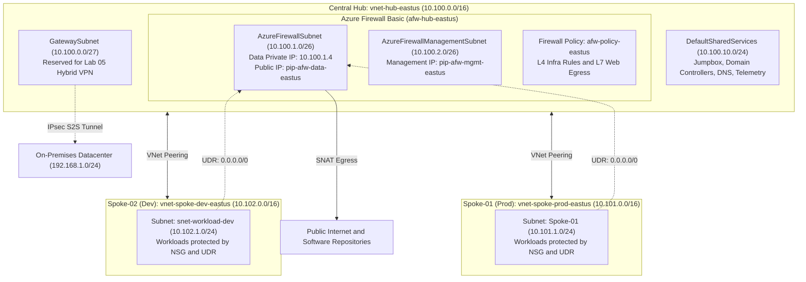
```mermaid
flowchart TD
    subgraph HubVNet ["Central Hub: vnet-hub-eastus (10.100.0.0/16)"]
        direction TB
        GW["GatewaySubnet (10.100.0.0/27)<br/>Reserved for Lab 05 Hybrid VPN"]
        
        subgraph FWCluster ["Azure Firewall Basic (afw-hub-eastus)"]
            FWData["AzureFirewallSubnet (10.100.1.0/26)<br/>Data Private IP: 10.100.1.4<br/>Public IP: pip-afw-data-eastus"]
            FWMgmt["AzureFirewallManagementSubnet (10.100.2.0/26)<br/>Management IP: pip-afw-mgmt-eastus"]
            FWPol["Firewall Policy: afw-policy-eastus<br/>L4 Infra Rules and L7 Web Egress"]
        end

        Shared["DefaultSharedServices (10.100.10.0/24)<br/>Jumpbox, Domain Controllers, DNS, Telemetry"]
    end

    subgraph SpokeProd ["Spoke-01 (Prod): vnet-spoke-prod-eastus (10.101.0.0/16)"]
        ProdSubnet["Subnet: Spoke-01 (10.101.1.0/24)<br/>Workloads protected by NSG and UDR"]
    end

    subgraph SpokeDev ["Spoke-02 (Dev): vnet-spoke-dev-eastus (10.102.0.0/16)"]
        DevSubnet["Subnet: snet-workload-dev (10.102.1.0/24)<br/>Workloads protected by NSG and UDR"]
    end

    WAN["Public Internet and Software Repositories"]
    OnPrem["On-Premises Datacenter (192.168.1.0/24)"]

    HubVNet <--->|"VNet Peering"| SpokeProd
    HubVNet <--->|"VNet Peering"| SpokeDev

    ProdSubnet -.->|"UDR: 0.0.0.0/0"| FWData
    DevSubnet -.->|"UDR: 0.0.0.0/0"| FWData

    FWData --->|"SNAT Egress"| WAN
    GW -.->|"IPsec S2S Tunnel"| OnPrem
```

### Full Resource Topology Map (Azure Resource Visualizer)
The entire software-defined networking fabric, peering mesh, route tables, and firewall interfaces mapped directly within Azure Resource Manager:

[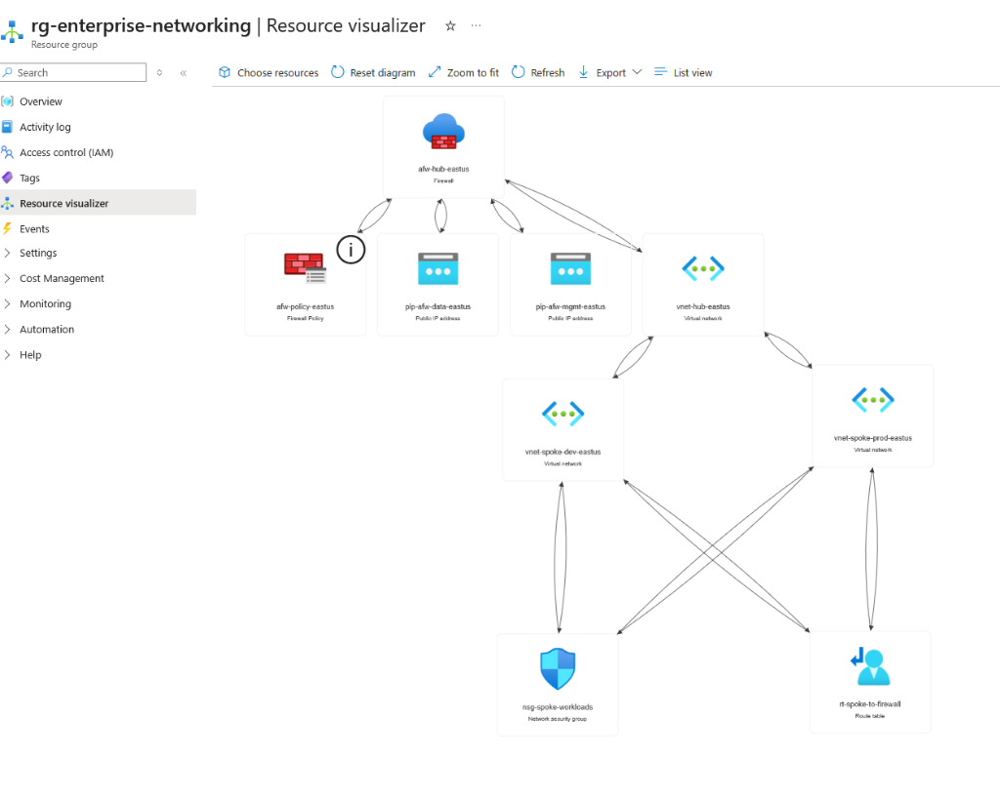](assets/20_resource_visualizer_hub_spoke_topology.png)

---

## 3. Network Addressing & Routing Schema

### Subnet Allocation Matrix
| Virtual Network | Address Space | Subnet Name | CIDR Prefix | Usable IPs | Next Hop / Protection | Purpose |
| :--- | :--- | :--- | :--- | :--- | :--- | :--- |
| **`vnet-hub-eastus`** | `10.100.0.0/16` | `GatewaySubnet` | `10.100.0.0/27` | 27 | VPN Gateway (Lab 05) | Dedicated for hybrid BGP IPsec gateway |
| **`vnet-hub-eastus`** | `10.100.0.0/16` | `AzureFirewallSubnet` | `10.100.1.0/26` | 59 | `10.100.1.4` (Internal IP) | Stateful L4/L7 inspection data plane |
| **`vnet-hub-eastus`** | `10.100.0.0/16` | `AzureFirewallManagementSubnet` | `10.100.2.0/26` | 59 | Azure Fabric Management | Dedicated control plane for Basic SKU updates |
| **`vnet-hub-eastus`** | `10.100.0.0/16` | `DefaultSharedServices` | `10.100.10.0/24` | 251 | Local SDN Routing | Shared Domain Controllers, DNS, Jumpbox |
| **`vnet-spoke-prod-eastus`** | `10.101.0.0/16` | `Spoke-01` | `10.101.1.0/24` | 251 | `rt-spoke-to-firewall` | Production workload tier |
| **`vnet-spoke-dev-eastus`** | `10.102.0.0/16` | `snet-workload-dev` | `10.102.1.0/24` | 251 | `rt-spoke-to-firewall` | Development and testing tier |

---

### User-Defined Route Table (`rt-spoke-to-firewall`)
| Route Name | Destination Prefix | Next Hop Type | Next Hop IP Address | Subnet Associations | Operational Effect |
| :--- | :--- | :--- | :--- | :--- | :--- |
| **`to-firewall-default`** | `0.0.0.0/0` | `Virtual appliance` | `10.100.1.4` | `Spoke-01`, `snet-workload-dev` | Overrides default Azure internet breakout; forces all egress and inter-spoke packets to Azure Firewall |

---

### Azure Firewall Policy Rules (`afw-policy-eastus`)
#### Network Rule Collection (`net-rc-core-infrastructure` — Priority: 200, Action: Allow)
| Rule Name | Source Type | Source Address | Protocols | Destination Ports | Destination Type | Destination Address | Purpose |
| :--- | :--- | :--- | :--- | :--- | :--- | :--- | :--- |
| **`allow-dns`** | IP Address | `10.0.0.0/8` | TCP, UDP | `53` | IP Address | `*` | Enables internal & external domain resolution |
| **`allow-ntp`** | IP Address | `10.0.0.0/8` | UDP | `123` | IP Address | `*` | Enables system clock synchronization |
| **`allow-spoke-transit-icmp`** | IP Address | `10.102.1.0/24` | ICMP | `*` | IP Address | `10.101.1.0/24` | Monitored ICMP transit verification across firewall |

#### Application Rule Collection (`app-rc-web-egress` — Priority: 300, Action: Allow)
| Rule Name | Source Type | Source Address | Protocols:Ports | Destination Type | Target FQDNs | Purpose |
| :--- | :--- | :--- | :--- | :--- | :--- |
| **`allow-os-updates`** | IP Address | `10.0.0.0/8` | `http:80, https:443` | FQDN | `*.microsoft.com`, `*.windowsupdate.com`, `*.github.com` | Whitelisted L7 FQDN web egress for OS patches and code repositories |

---

### Network Security Group (`nsg-spoke-workloads`)
| Priority | Direction | Name | Source | Port | Destination | Dest Port | Protocol | Action | Description |
| :--- | :--- | :--- | :--- | :--- | :--- | :--- | :--- | :--- | :--- |
| **1000** | Inbound | `allow-management-from-hub` | `10.100.10.0/24` | Any | Any | `3389, 22` | TCP | **Allow** | Restricts administrative RDP/SSH strictly to the Hub shared services/jumpbox subnet |
| **65000** | Inbound | `AllowVnetInBound` | `VirtualNetwork` | Any | `VirtualNetwork` | Any | Any | **Allow** | Default intra-VNet communication |
| **65001** | Inbound | `AllowAzureLoadBalancerInBound` | `AzureLoadBalancer` | Any | Any | Any | Any | **Allow** | Health probe accessibility |
| **65500** | Inbound | `DenyAllInBound` | Any | Any | Any | Any | Any | **Deny** | Drops all unsolicited external ingress |

---

## 4. Step-by-Step Implementation & Verification Evidence

### Phase 1: Virtual Network Architecture & Subnet Provisioning
The hub virtual network (`vnet-hub-eastus`) and isolated spoke networks were created with strict CIDR boundaries preventing address overlap.

| Production Spoke VNet Overview | Development Spoke VNet Overview |
| :---: | :---: |
| [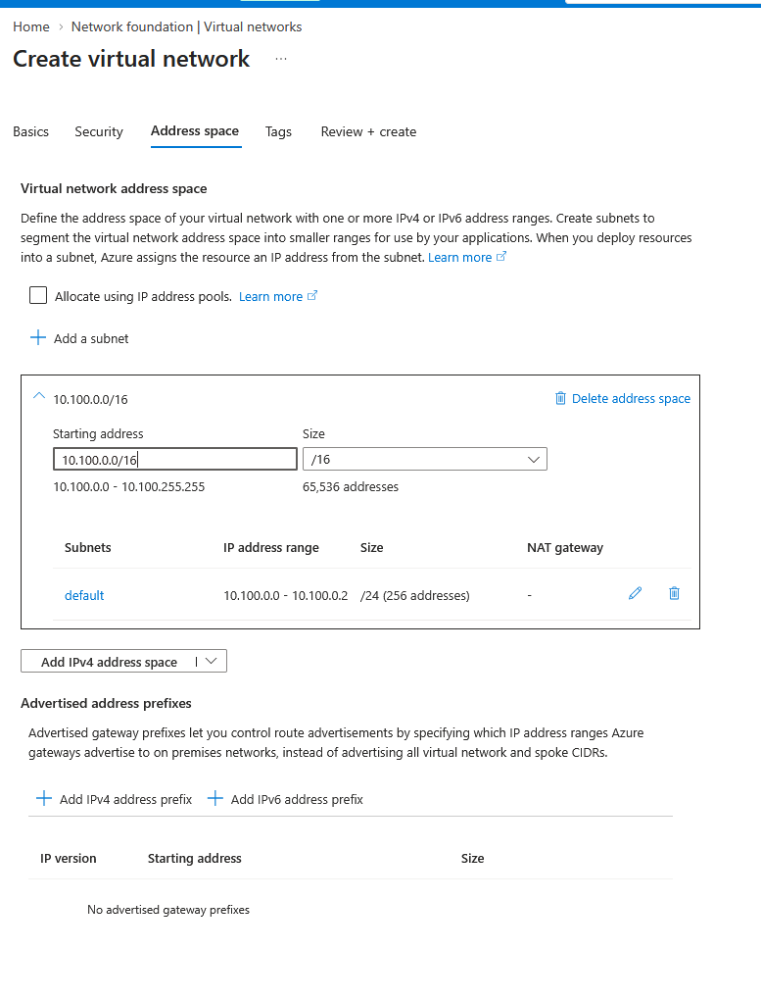](assets/01_vnet_spoke_prod_overview.png) | [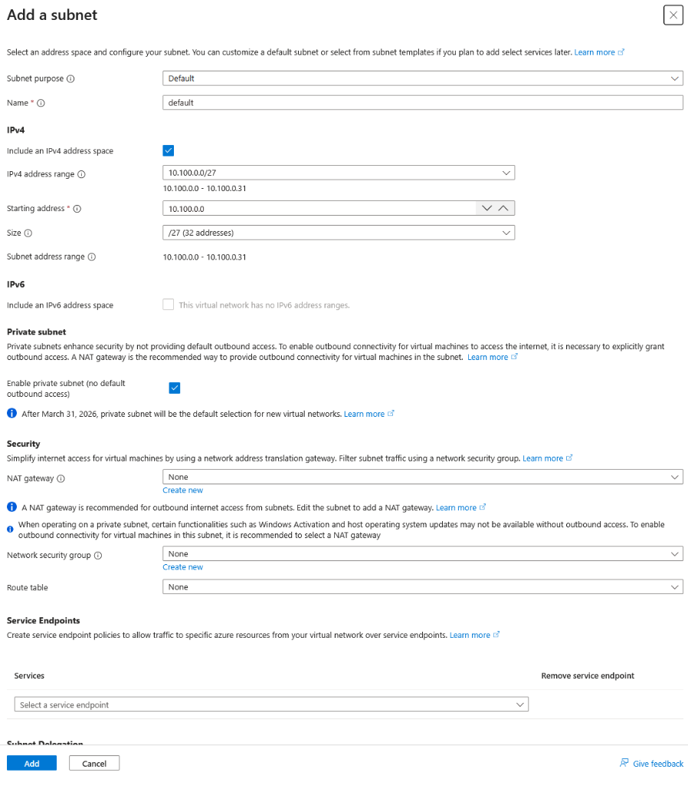](assets/02_vnet_spoke_dev_overview.png) |
| *`vnet-spoke-prod-eastus` (`10.101.0.0/16`)* | *`vnet-spoke-dev-eastus` (`10.102.0.0/16`)* |

---

### Phase 2: High-Speed Bidirectional VNet Peering Mesh
Bidirectional peering links were established across the Microsoft SDN backbone. Forwarded traffic was explicitly enabled to permit the firewall to transit packets originated outside the immediate local peering segment.

| Hub to Spoke Peering Configuration | Spoke to Hub Peering Link |
| :---: | :---: |
| [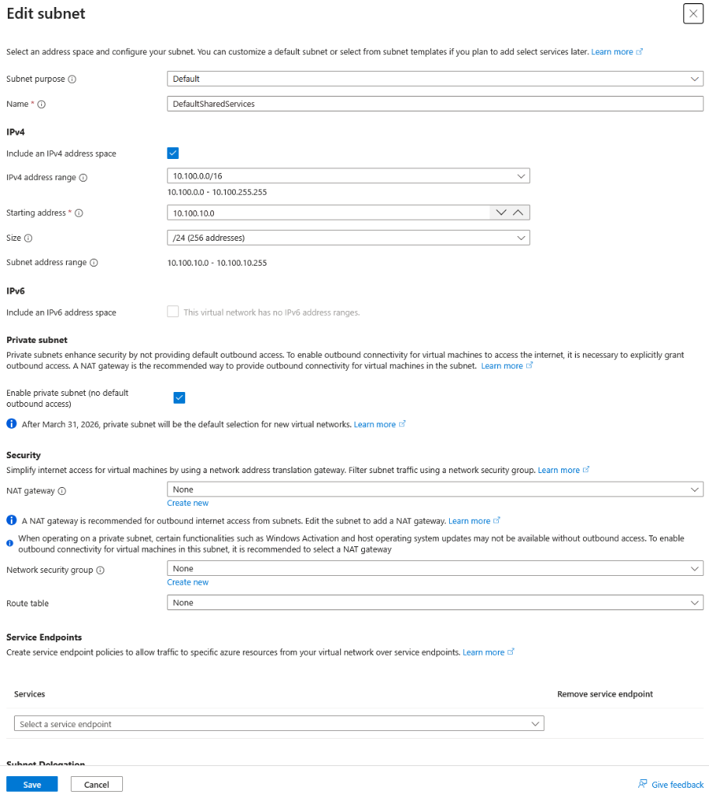](assets/03_vnet_peering_hub_to_prod.png) | [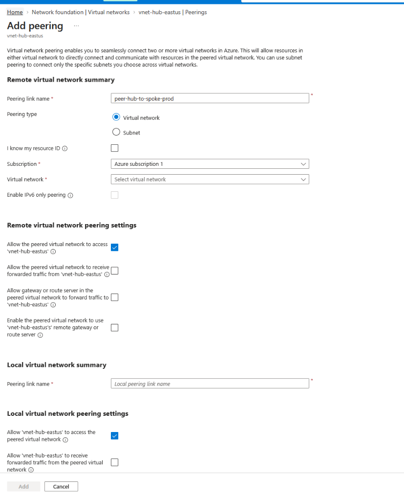](assets/04_vnet_peering_spoke_to_hub.png) |
| *Hub $\rightarrow$ Spoke peering with `AllowForwardedTraffic`* | *Reverse Spoke $\rightarrow$ Hub peering configuration* |

#### Peering Synchronization State Verification:
Both peerings achieved active, synchronized status:
[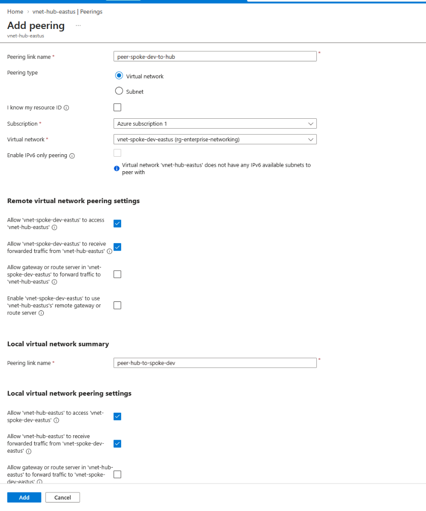](assets/05_vnet_peerings_connected_summary.png)

---

### Phase 3: Azure Firewall Basic Deployment & Dual-Plane Allocation
Azure Firewall Basic was provisioned with two dedicated static Standard Public IPs:
* `pip-afw-data-eastus` (Data plane egress SNAT & DNAT)
* `pip-afw-mgmt-eastus` (Dedicated control plane telemetry)

| Firewall Configuration Basics | Pre-Deployment Validation |
| :---: | :---: |
| [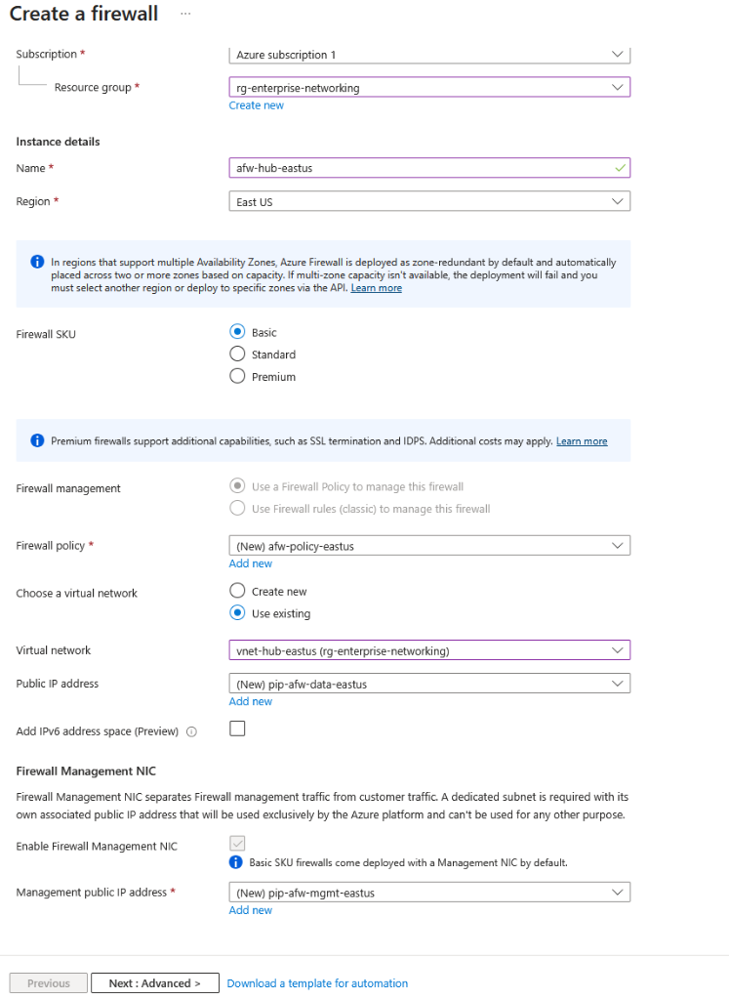](assets/06_azure_firewall_config_basics.png) | [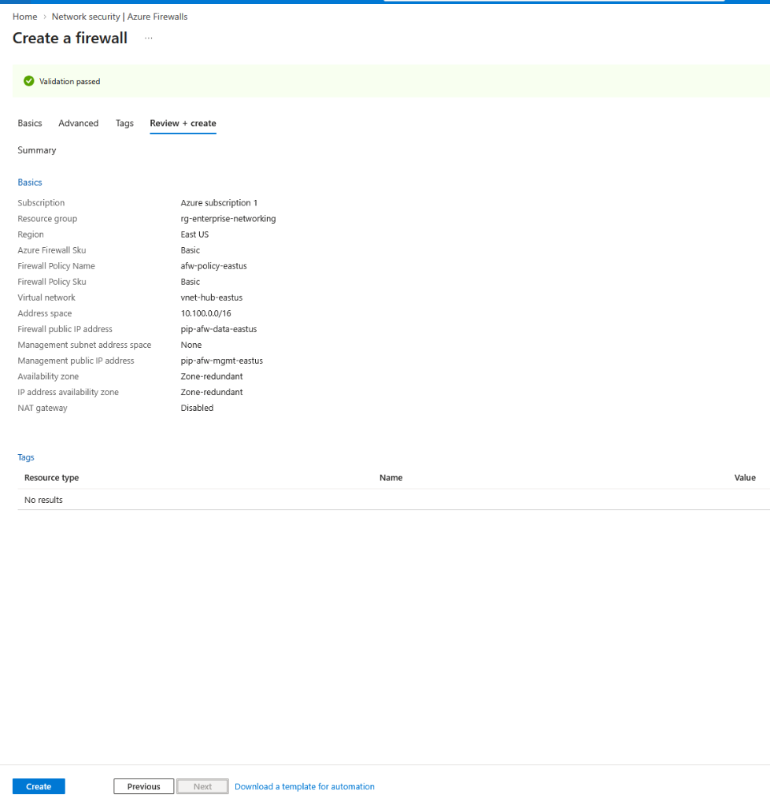](assets/07_azure_firewall_validation_summary.png) |
| *Binding to pre-allocated subnets and public IPs* | *Validation passed: Basic SKU with Zone-Redundancy* |

| Deployment Completion | Firewall Overview & Private IP Binding |
| :---: | :---: |
| [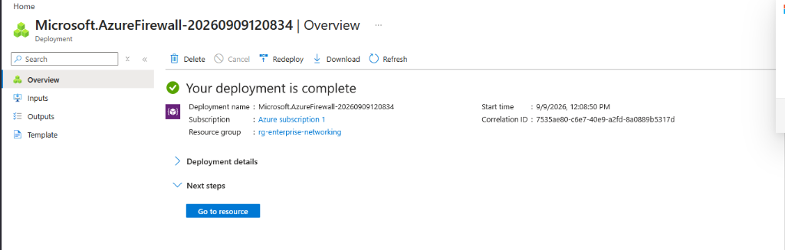](assets/08_azure_firewall_deployment_complete.png) | [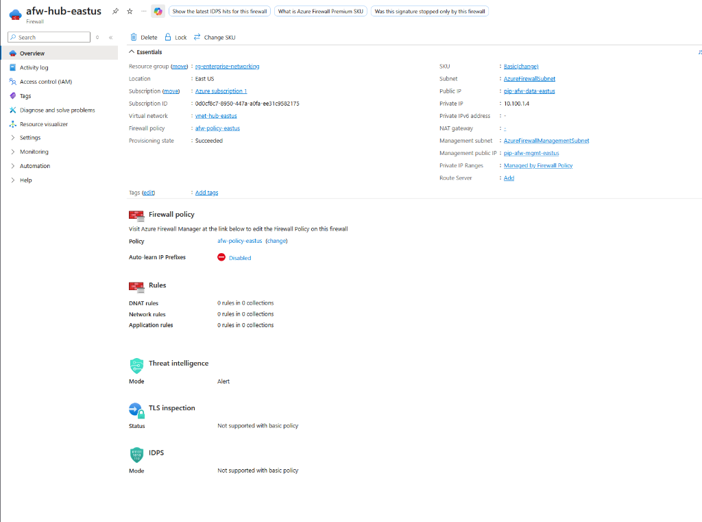](assets/09_azure_firewall_overview_private_ip.png) |
| *Successful provisioning of firewall cluster* | *Firewall active at `10.100.1.4` (`AzureFirewallSubnet`)* |

---

### Phase 4: User-Defined Routing (UDR) & Subnet Association
To prevent spoke subnets from bypassing the firewall via default internet routing, route table `rt-spoke-to-firewall` was deployed with a default route (`0.0.0.0/0` $\rightarrow$ `10.100.1.4`) and associated with all workload subnets.

| Route Table Creation | Default Route (`0.0.0.0/0`) Applied |
| :---: | :---: |
| [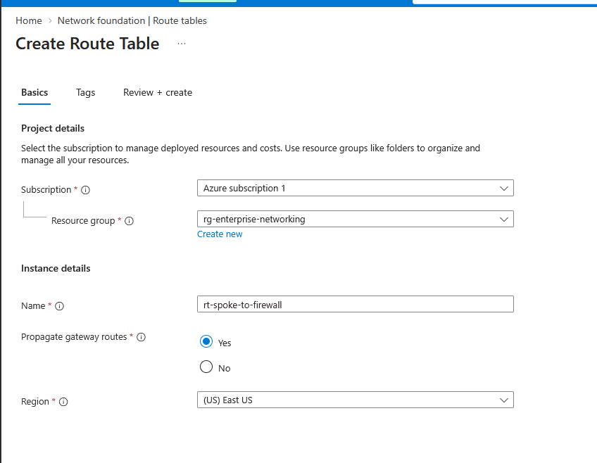](assets/10_route_table_creation.png) | [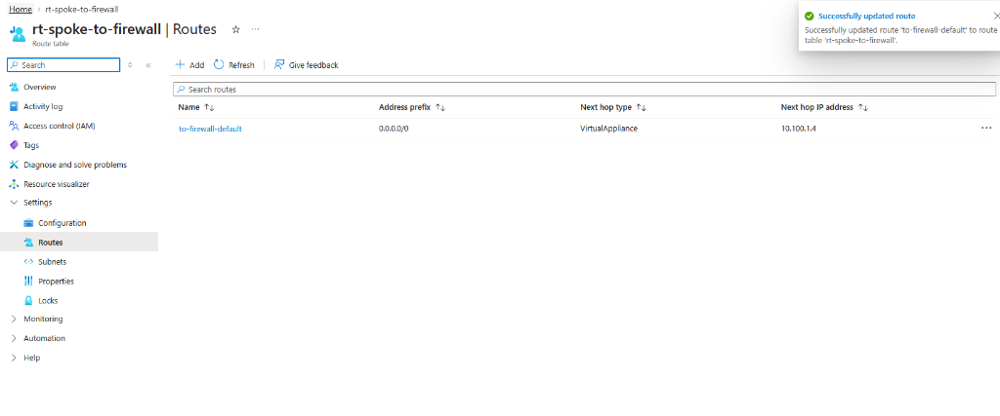](assets/12_route_table_default_route_added.png) |
| *`rt-spoke-to-firewall` with gateway propagation enabled* | *Static route forcing traffic to `10.100.1.4`* |

| Dev Subnet Associated | Prod Subnet Associated |
| :---: | :---: |
| [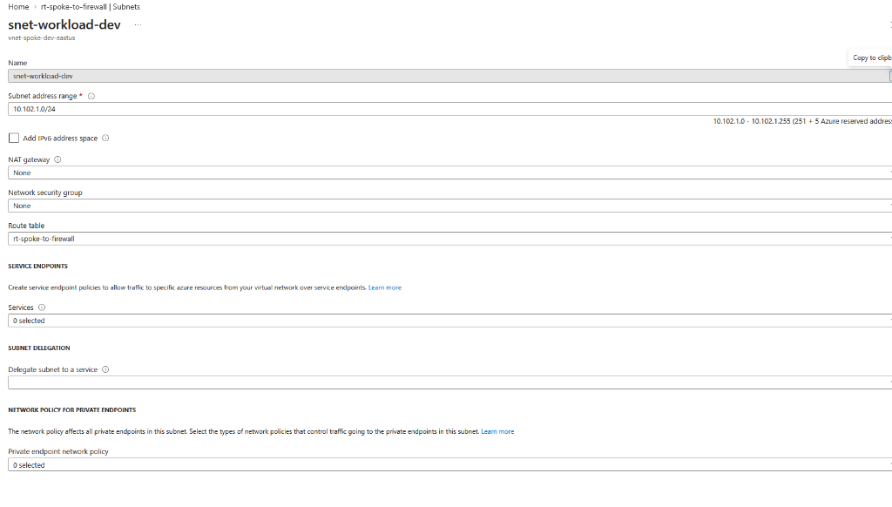](assets/13_route_table_spoke_dev_associated.png) | [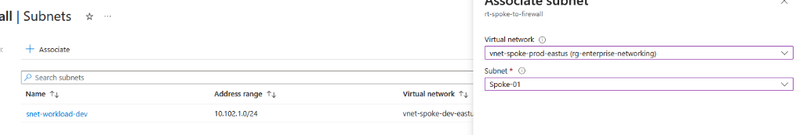](assets/14_route_table_spoke_prod_associated.png) |
| *`snet-workload-dev` attached to UDR* | *`Spoke-01` attached to UDR* |

---

### Phase 5: Policy-Driven Firewall Governance
Security rule collections were deployed via `afw-policy-eastus` to govern Layer 4 and Layer 7 egress traffic:

| Layer 4 Infrastructure Rule Collection | Layer 7 Web Egress FQDN Filtering |
| :---: | :---: |
| [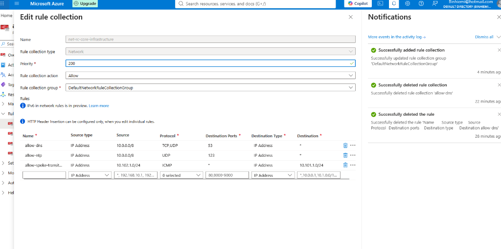](assets/15_firewall_network_rule_collections_active.png) | [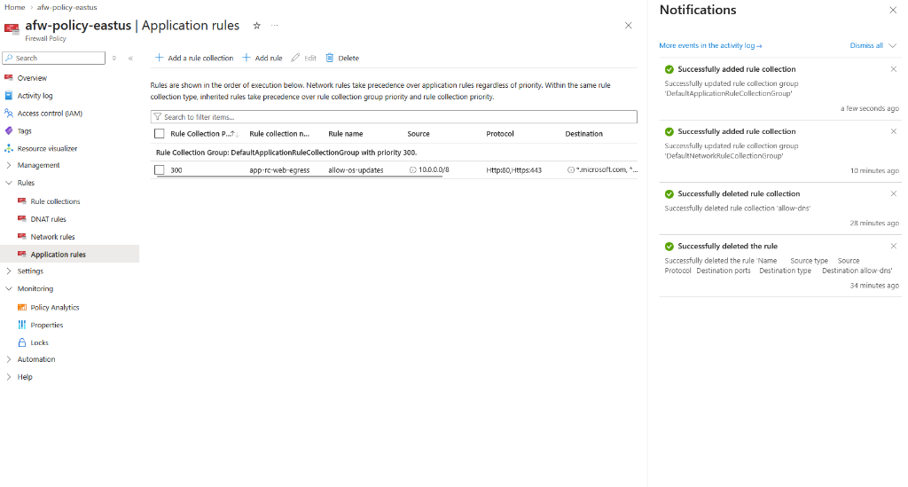](assets/16_firewall_application_rule_collections_active.png) |
| *`net-rc-core-infrastructure` (Priority 200): DNS, NTP, ICMP* | *`app-rc-web-egress` (Priority 300): Whitelisted FQDNs* |

---

### Phase 6: Subnet Microsegmentation (NSG Hardening)
Subnet security was established using `nsg-spoke-workloads` to prevent lateral scanning and enforce administrative access strictly from the Hub shared services subnet.

| NSG Inbound Security Rules | Subnet Associations |
| :---: | :---: |
| [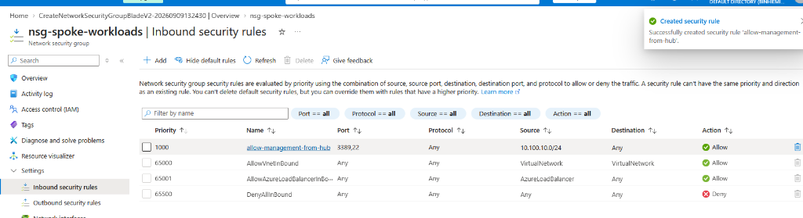](assets/17_nsg_inbound_management_rules.png) | [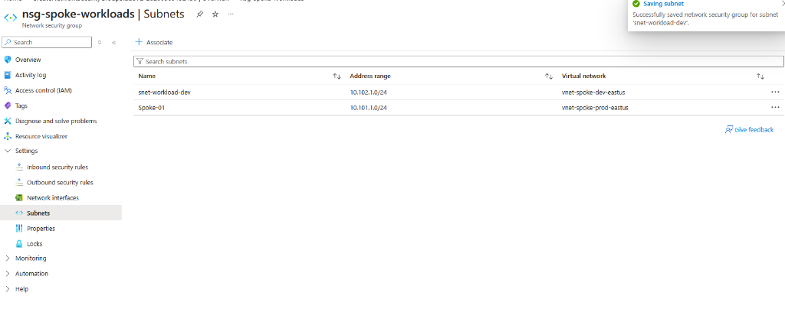](assets/18_nsg_subnets_associated.png) |
| *Priority 1000: Allow RDP/SSH strictly from `10.100.10.0/24`* | *Bound to both `Spoke-01` and `snet-workload-dev`* |

[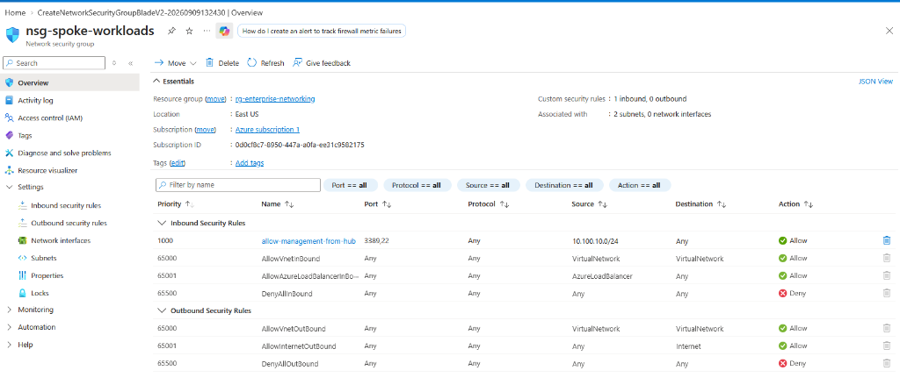](assets/19_nsg_overview.png)

---

### Phase 7: Cloud FinOps — Azure Firewall Compute Deallocation
To protect subscription credits between lab phases, the Azure Firewall compute scale-set was gracefully deallocated via Azure Cloud Shell while preserving the complete configuration.

```powershell
$azfw = Get-AzFirewall -Name afw-hub-eastus -ResourceGroupName rg-enterprise-networking
$azfw.Deallocate()
Set-AzFirewall -AzureFirewall $azfw
```

[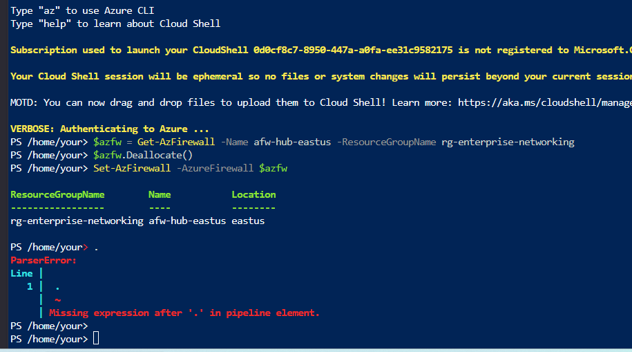](assets/21_firewall_cloudshell_deallocated.png)
*Figure: Azure Firewall compute deallocated successfully — hourly billing halted at $0.00/hr while keeping all routing and policy configurations intact.*

---

## 5. Deep-Dive Engineering & Architectural Analyses

### 1. Packet Walk: Spoke VM Egress to the Internet (SNAT / PAT)
```
[ Workload VM (10.101.1.5) ]
              │
              │ 1. Destination: 140.82.113.4 (github.com:443)
              │    Local NIC evaluates effective routes.
              │    Matches UDR default route: 0.0.0.0/0
              ▼
[ VNet Peering: peer-spoke-prod-to-hub ]
              │
              │ 2. Encapsulated packet traverses Azure SDN fabric into Hub
              ▼
[ Azure Firewall: 10.100.1.4 ]
              │
              │ 3. Layer 7 Inspection (afw-policy-eastus):
              │    - Evaluates TLS Client Hello SNI header (github.com).
              │    - Matches Application Rule 'allow-os-updates' (*.github.com).
              │    - Traffic is ALLOWED.
              ▼
[ Source NAT (PAT): pip-afw-data-eastus ]
              │
              │ 4. Firewall replaces private IP (10.101.1.5:54321)
              │    with Public IP (pip-afw-data-eastus:2496).
              ▼
[ Public Internet ]
```

---

### 2. Packet Walk: Spoke VM to On-Premises Domain Controller (Lab 05 Integration Preview)
In Lab 05, an Azure Virtual Network Gateway will be provisioned into `GatewaySubnet` (`10.100.0.0/27`).
* **Route Propagation:** Because `Propagate gateway routes` is enabled on `rt-spoke-to-firewall`, the on-premises prefix (`192.168.1.0/24`) learned via BGP over IPsec will be dynamically injected into the spoke routing tables.
* **Longest Prefix Match:** Packets destined for `192.168.1.10` match `192.168.1.0/24` (more specific than `0.0.0.0/0`), routing directly through the peering to `GatewaySubnet` and across the encrypted IPsec tunnel into on-premises.

---

### 3. Architectural Disclaimer: Development vs. Production Spoke Isolation
> [!IMPORTANT]
> **Enterprise Architecture Disclaimer:**  
> In a production enterprise environment, **Development and Production spokes should remain strictly isolated** with zero routable paths between them. 
> 
> In this lab deployment, the rule `allow-spoke-transit-icmp` was created **strictly to demonstrate and validate transit routing inspection across the central firewall engine**. In a live environment, SecOps maintains a default-deny posture between environments, using Azure Monitor and SIEM alerting to detect and block unauthorized lateral traversal attempts.

---

### 4. Azure Firewall Basic: Dual-Plane Subnet Architecture
Azure Firewall Basic enforces strict separation of concerns via two mandatory subnets:
* **`AzureFirewallSubnet` (Data Plane):** Handles customer traffic, user-defined routing, and stateful rule filtering.
* **`AzureFirewallManagementSubnet` (Management Plane):** Dedicated strictly to Microsoft platform management, patch delivery, and health telemetry via `pip-afw-mgmt-eastus`. This architectural separation eliminates "forced-tunneling blackouts" where outbound management routes are accidentally broken by user UDRs.

---

## 6. Infrastructure-as-Code (IaC) Automation Artifacts

All architectural components are fully codified in the [`templates/`](templates/) directory for automated redeployment:

| Template Artifact | Path | Description |
| :--- | :--- | :--- |
| **Virtual Networks & Subnets** | [`templates/01_hub_and_spoke_vnets.json`](templates/01_hub_and_spoke_vnets.json) | Deploys Hub VNet (4 subnets) and Spoke 1 & 2 VNets |
| **Azure Firewall & Public IPs** | [`templates/02_firewall_template.json`](templates/02_firewall_template.json) | Deploys Azure Firewall Basic, dual public IPs, and policy |
| **Route Table (UDR)** | [`templates/03_route_table_template.json`](templates/03_route_table_template.json) | Deploys `rt-spoke-to-firewall` with default route `0.0.0.0/0` |
| **Network Security Group** | [`templates/04_nsg_template.json`](templates/04_nsg_template.json) | Deploys `nsg-spoke-workloads` with inbound management rules |
| **Firewall Policy Rules** | [`templates/05_firewall_policy_rules.json`](templates/05_firewall_policy_rules.json) | Deploys Network Rule Group (200) and Application Rule Group (300) |

---

## 7. Author & Copyright Notice

**Authored and copyrighted © 2026 Philippe Truong. All rights reserved.**  
All architecture topologies, diagrams, technical analyses, and configuration artifacts are the intellectual property of Philippe Truong.


