# Lab 05: Hybrid Site-to-Site IPsec VPN & BGP Peering (Fortinet FortiGate 40F ⟷ Microsoft Azure)

**Author:** Philippe Truong  
**Copyright:** © 2026 Philippe Truong. All rights reserved.  
**Domain:** Hybrid Cloud Networking, Route-Based IPsec VPN (IKEv2), BGP, Azure Networking, Fortinet FortiOS 7.6.4

**Status:** 🟢 Completed & Fully Converged  

---

## 1. Executive Summary & Objective

This project engineers, deploys, and verifies IPSEC VPN to Azure Networks with BGP peering. The lab designs on-prem 40F Fortinet Gateway across the public internet to Microsoft Azure networks terminating at Microsoft Azure gateway. BGP is used also in this lab.

---

## 2. Enterprise Hybrid Cloud Topology

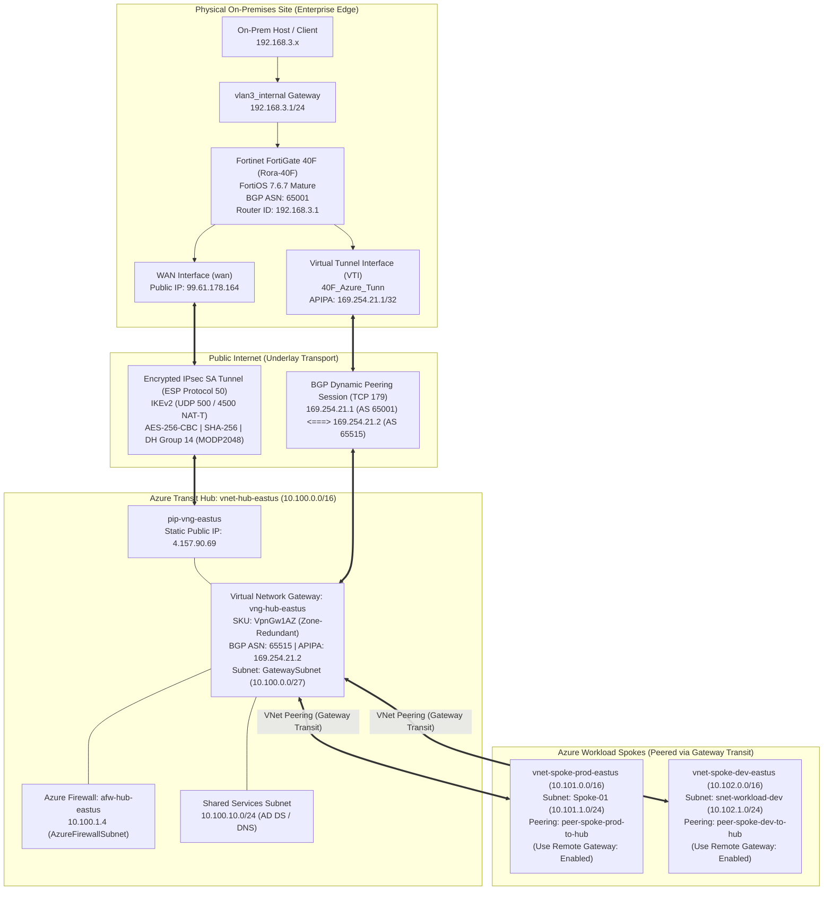
```mermaid
flowchart TD
    subgraph OnPremises ["Physical On-Premises Site (Enterprise Edge)"]
        ClientHost["On-Prem Host / Client<br>192.168.3.x"]
        FGT_LAN["vlan3_internal Gateway<br>192.168.3.1/24"]
        FGT_Core["Fortinet FortiGate 40F (Rora-40F)<br>FortiOS 7.6.7 Mature<br>BGP ASN: 65001<br>Router ID: 192.168.3.1"]
        FGT_VTI["Virtual Tunnel Interface (VTI)<br>40F_Azure_Tunn<br>APIPA: 169.254.21.1/32"]
        FGT_WAN["WAN Interface (wan)<br>Public IP: 99.61.178.164"]

        ClientHost --> FGT_LAN
        FGT_LAN --> FGT_Core
        FGT_Core --> FGT_VTI
        FGT_Core --> FGT_WAN
    end

    subgraph InternetTransit ["Public Internet (Underlay Transport)"]
        IPsecTunnel["Encrypted IPsec SA Tunnel (ESP Protocol 50)<br>IKEv2 (UDP 500 / 4500 NAT-T)<br>AES-256-CBC | SHA-256 | DH Group 14 (MODP2048)"]
        BGPSession["BGP Dynamic Peering Session (TCP 179)<br>169.254.21.1 (AS 65001) <===> 169.254.21.2 (AS 65515)"]
    end

    subgraph AzureHub ["Azure Transit Hub: vnet-hub-eastus (10.100.0.0/16)"]
        AzurePIP["pip-vng-eastus<br>Static Public IP: 4.157.90.69"]
        AzureVNG["Virtual Network Gateway: vng-hub-eastus<br>SKU: VpnGw1AZ (Zone-Redundant)<br>BGP ASN: 65515 | APIPA: 169.254.21.2<br>Subnet: GatewaySubnet (10.100.0.0/27)"]
        AzureFW["Azure Firewall: afw-hub-eastus<br>10.100.1.4 (AzureFirewallSubnet)"]
        HubShared["Shared Services Subnet<br>10.100.10.0/24 (AD DS / DNS)"]

        AzurePIP --- AzureVNG
        AzureVNG --- AzureFW
        AzureVNG --- HubShared
    end

    subgraph AzureSpokes ["Azure Workload Spokes (Peered via Gateway Transit)"]
        SpokeProd["vnet-spoke-prod-eastus (10.101.0.0/16)<br>Subnet: Spoke-01 (10.101.1.0/24)<br>Peering: peer-spoke-prod-to-hub<br>(Use Remote Gateway: Enabled)"]
        SpokeDev["vnet-spoke-dev-eastus (10.102.0.0/16)<br>Subnet: snet-workload-dev (10.102.1.0/24)<br>Peering: peer-spoke-dev-to-hub<br>(Use Remote Gateway: Enabled)"]
    end

    FGT_WAN <==> IPsecTunnel <==> AzurePIP
    FGT_VTI <==> BGPSession <==> AzureVNG
    AzureVNG <== "VNet Peering (Gateway Transit)" ==> SpokeProd
    AzureVNG <== "VNet Peering (Gateway Transit)" ==> SpokeDev
```

### Azure Resource Visualizer Topology Map
[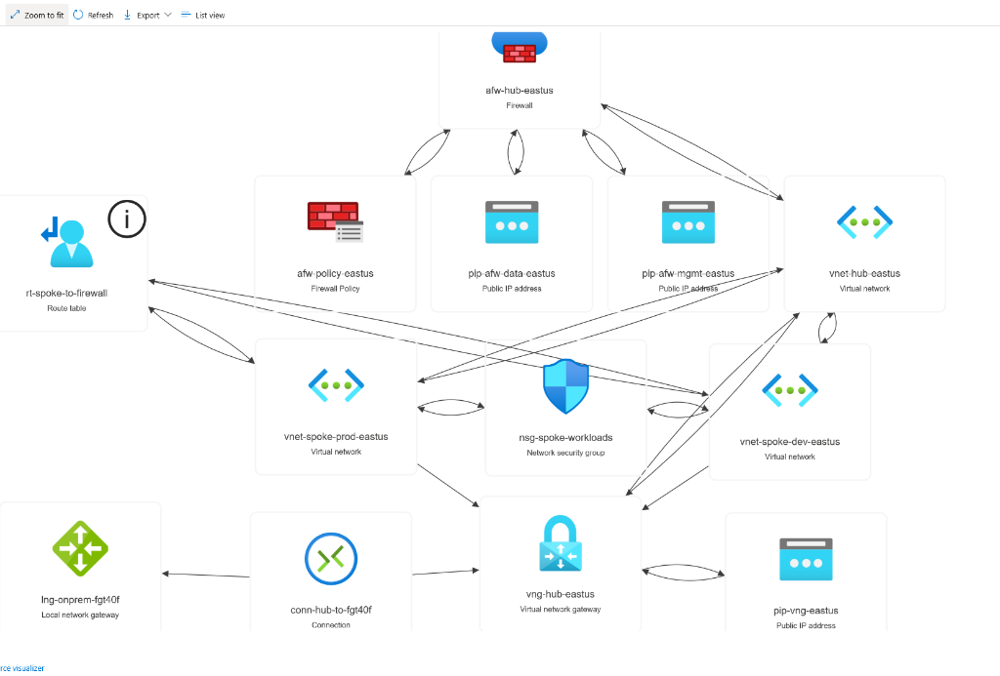](./assets/00_azure_resource_visualizer_topology.png)

*Figure 2.1: Live Azure Resource Visualizer graph showing the Hub VNet (`vnet-hub-eastus`), Azure Firewall (`afw-hub-eastus`), Spoke VNets (`vnet-spoke-prod-eastus`, `vnet-spoke-dev-eastus`), Route Tables (`rt-spoke-to-firewall`), NSGs, and the hybrid IPsec connection (`conn-hub-to-fgt40f` ⟷ `lng-onprem-fgt40f`).*

---

## 3. Cryptographic & Protocol Architecture Specification

### 3.1 IPsec Phase 1 & Phase 2 Parameters

IPSEC S2S configurations

| Parameter | IKE Phase 1 (Main Mode / SA_INIT) | IPsec Phase 2 (Quick Mode / CHILD_SA) | Technical Rationale |
| :--- | :--- | :--- | :--- |
| **Protocol Version** | **IKEv2** | **ESP (IP Protocol 50)** | Eliminates aggressive mode vulnerabilities, native NAT-T support |
| **Encryption Algorithm** | **AES-256-CBC** | **AES-256-CBC** | 256-bit symmetric encryption meeting enterprise compliance |
| **Integrity / Hash** | **SHA-256** (SHA2_256_128) | **SHA-256** | Secure hash digest preventing replay and tampering |
| **Diffie-Hellman / PFS** | **DH Group 14 (MODP2048)** | **PFS Group 14 (`PFS2048`)** | 2048-bit modular exponentiation; prevents session compromise |
| **Traffic Selectors** | Host Endpoints (`99.61.178.164` $\leftrightarrow$ `4.157.90.69`) | **`0.0.0.0/0` $\longleftrightarrow$ `0.0.0.0/0`** | Route-based VTI tunnel; routing table directs packet flow |
| **SA Lifetime** | **28,800 seconds (8 Hours)** | **27,000 seconds (7.5 Hours)** | Staggered rekeying prevents synchronized tunnel teardown |
| **Dead Peer Detection** | **On-Idle / 10s interval / 3 retries** | **Keepalive Enabled** | Rapid detection of blackholes with automatic re-initiation |

---

### 3.2 Dynamic Routing (BGP) Architecture

| BGP Attribute | On-Premises (Fortinet FortiGate 40F) | Microsoft Azure (Virtual Network Gateway) |
| :--- | :--- | :--- |
| **Autonomous System Number (ASN)** | **`65001`** (eBGP Private Range) | **`65515`** (Azure Default BGP ASN) |
| **BGP Peering IP (Transport)** | **`169.254.21.1/32`** (APIPA RFC 3927) | **`169.254.21.2`** (Azure Custom APIPA) |
| **Router Identifier** | `192.168.3.1` | `10.100.0.30` (Gateway Instance) |
| **eBGP Multihop** | Enabled (`ebgp-enforce-multihop`) | Native |
| **Soft Reconfiguration** | Enabled (`soft-reconfiguration enable`) | Supported |
| **TCP Peering Port** | TCP Port 179 | TCP Port 179 |
| **Announced Networks** | `192.168.3.0/24` (Physical VLAN 3) | `10.100.0.0/16` (Hub), `10.101.0.0/16` (Prod), `10.102.0.0/16` (Dev) |
| **Administrative Distance** | `20` (eBGP External Route) | `30` (Azure Dynamic Gateway Route) |

---

## 4. Step-by-Step Implementation & Verification Evidence

### Phase 1: Physical Fortinet FortiGate 40F IPsec Tunnel Configuration (FortiOS 7.6.7 Mature)

The route-based IPsec Virtual Tunnel Interface (VTI) `40F_Azure_Tunn` was constructed directly on the physical FortiGate 40F edge firewall running FortiOS 7.6.7 Mature. Route-based IPsec encapsulates all traffic routed into the virtual interface, decoupling cryptographic negotiation from firewall security policies.

```fortios
config vpn ipsec phase1-interface
    edit "40F_Azure_Tunn"
        set interface "wan"
        set ike-version 2
        set peertype any
        set net-device disable
        set proposal aes256-sha256
        set dpd on-idle
        set dhgrp 14
        set remote-gw 4.157.90.69
        set psksecret <PRE_SHARED_KEY>
        set dpd-retryinterval 10
    next
end

config vpn ipsec phase2-interface
    edit "azure-vpn-p2"
        set phase1name "40F_Azure_Tunn"
        set proposal aes256-sha256
        set dhgrp 14
        set auto-negotiate enable
        set keylifeseconds 27000
        set src-subnet 0.0.0.0 0.0.0.0
        set dst-subnet 0.0.0.0 0.0.0.0
    next
end

config system interface
    edit "40F_Azure_Tunn"
        set ip 169.254.21.1 255.255.255.255
        set allowaccess ping
        set type tunnel
        set remote-ip 169.254.21.2/30
        set interface "wan"
    next
end
```

| FortiGate Phase 1 Gateway Settings | FortiGate Phase 1 Crypto Proposal |
| :---: | :---: |
| [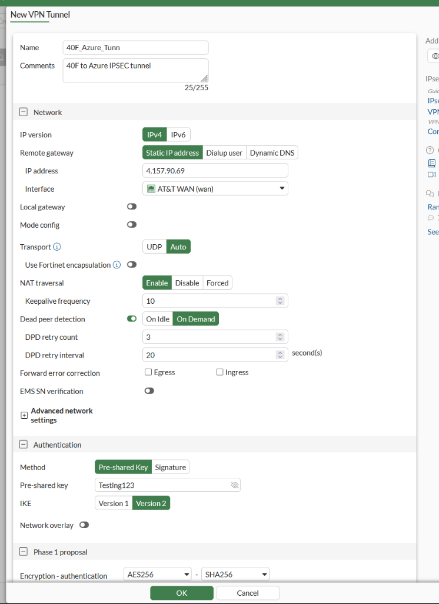](./assets/fgt_01_phase1_config.png) | [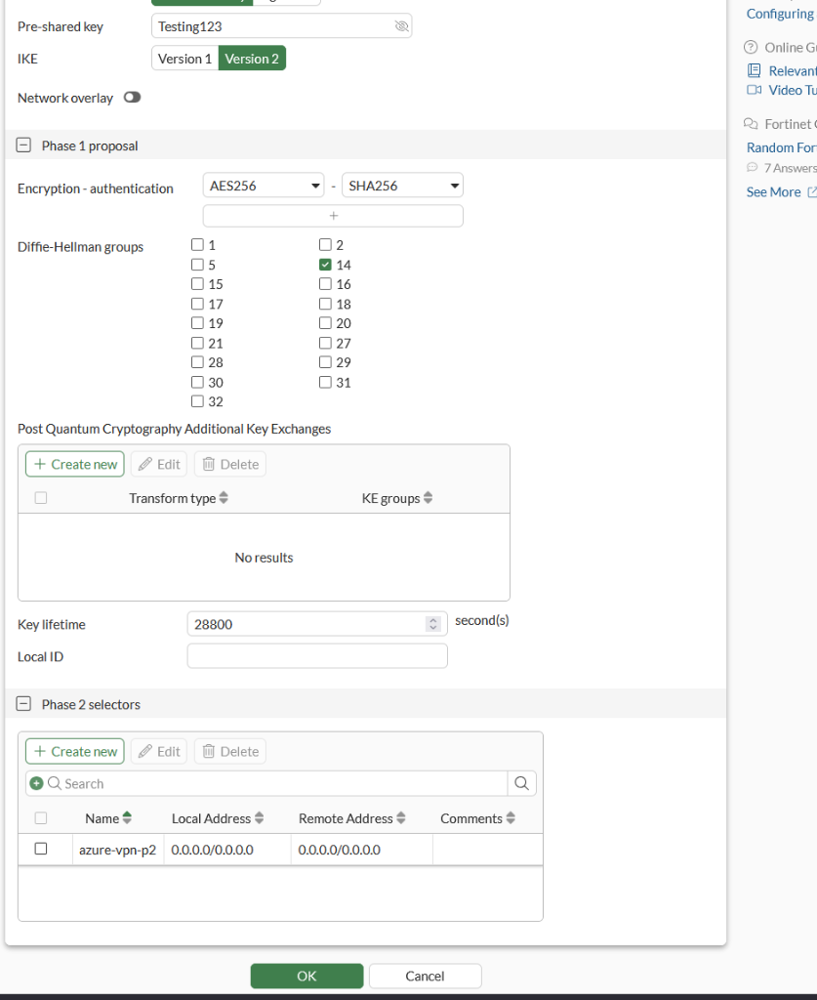](./assets/fgt_02_phase1_proposal.png) |
| *Figure 4.1: FortiOS Phase 1 Interface binding to WAN, Remote Gateway `4.157.90.69`, IKEv2, and PSK authentication.* | *Figure 4.2: Phase 1 cryptographic proposal: AES-256, SHA-256, Diffie-Hellman Group 14 (`MODP2048`), and 28,800s keylife.* |

| FortiGate Phase 2 Selectors & PFS | FortiGate VTI Interface & APIPA Addressing |
| :---: | :---: |
| [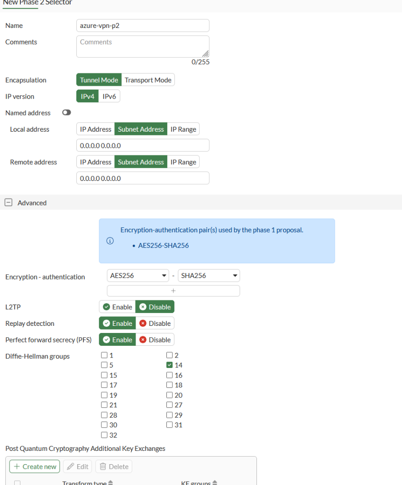](./assets/fgt_03_phase2_selector.png) | [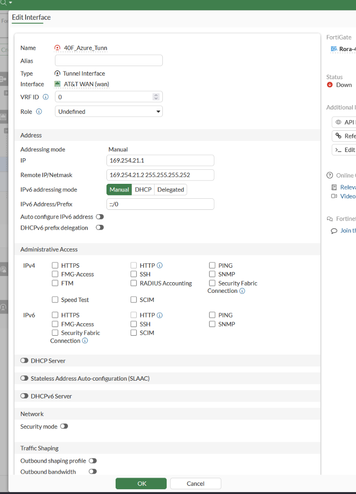](./assets/fgt_04_vti_interface_ip.png) |
| *Figure 4.3: Route-based Phase 2 selectors (`0.0.0.0/0` <-> `0.0.0.0/0`), AES256-SHA256, and PFS Group 14 (`PFS2048`).* | *Figure 4.4: Virtual Tunnel Interface `40F_Azure_Tunn` configured with APIPA `169.254.21.1/32` and Remote IP `169.254.21.2`.* |

---

### Phase 2: FortiOS Security Policies & Central SNAT Bypass

Bidirectional firewall policies to permit traffic through 40F

```fortios
config firewall policy
    edit 1
        set name "LAN_TO_AZURE_TEST"
        set srcintf "vlan3_internal"
        set dstintf "40F_Azure_Tunn"
        set action accept
        set srcaddr "all"
        set dstaddr "all"
        set schedule "always"
        set service "ALL"
        set logtraffic all
    next
    edit 2
        set name "Azure_to_LAN"
        set srcintf "40F_Azure_Tunn"
        set dstintf "vlan3_internal"
        set action accept
        set srcaddr "all"
        set dstaddr "all"
        set schedule "always"
        set service "ALL"
        set logtraffic all
    next
end
```

| FortiGate Firewall Policy: LAN to Azure | FortiGate Firewall Policy: Azure to LAN |
| :---: | :---: |
| [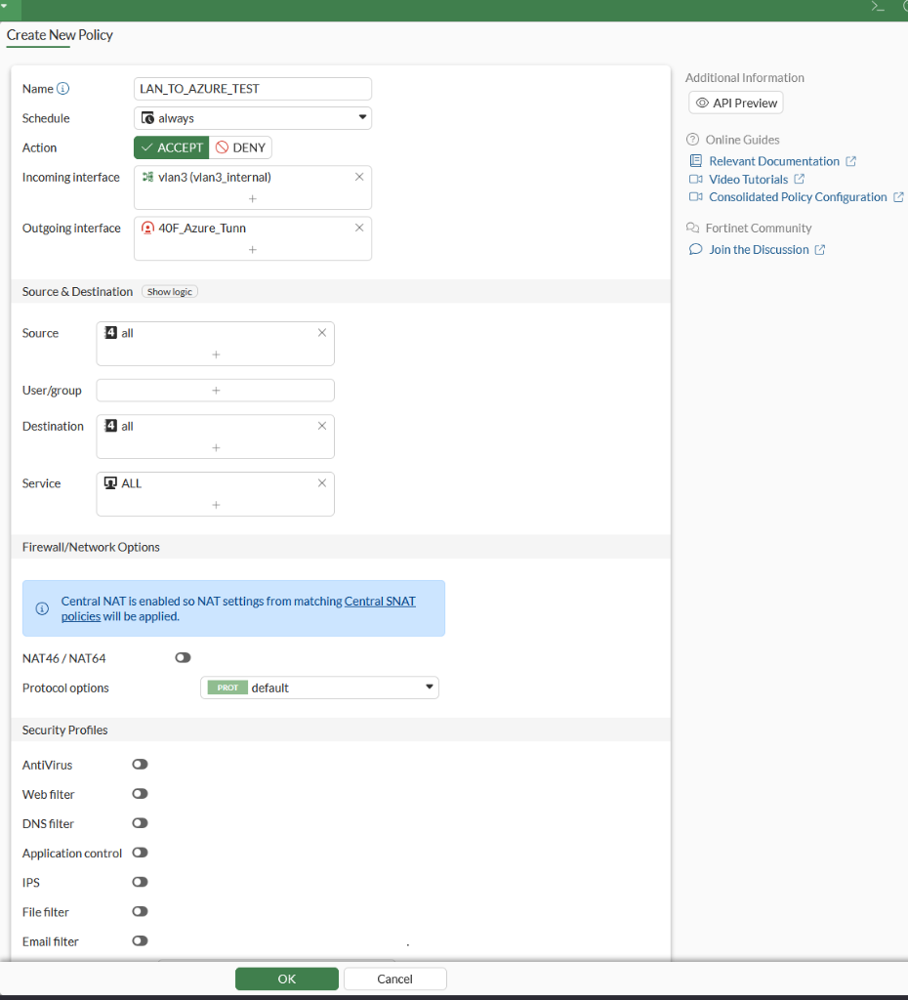](./assets/fgt_05_policy_lan_to_azure.png) | [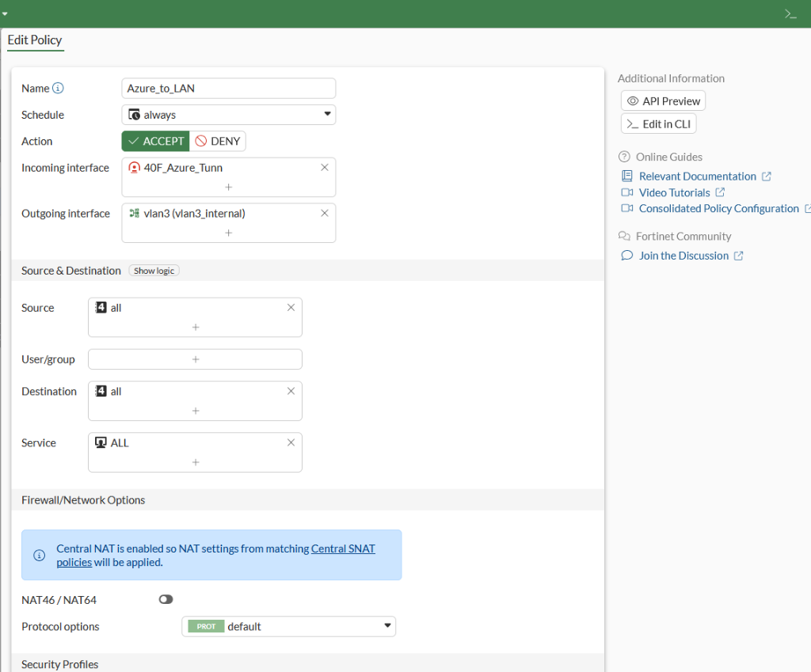](./assets/fgt_06_policy_azure_to_lan.png) |
| *Figure 4.5: Policy `LAN_TO_AZURE_TEST` permitting traffic from `vlan3_internal` into `40F_Azure_Tunn` with NAT disabled.* | *Figure 4.6: Policy `Azure_to_LAN` permitting return traffic from `40F_Azure_Tunn` into `vlan3_internal` with NAT disabled.* |

| FortiGate Firewall Policies Table View | FortiGate Central SNAT Mapping Table |
| :---: | :---: |
| [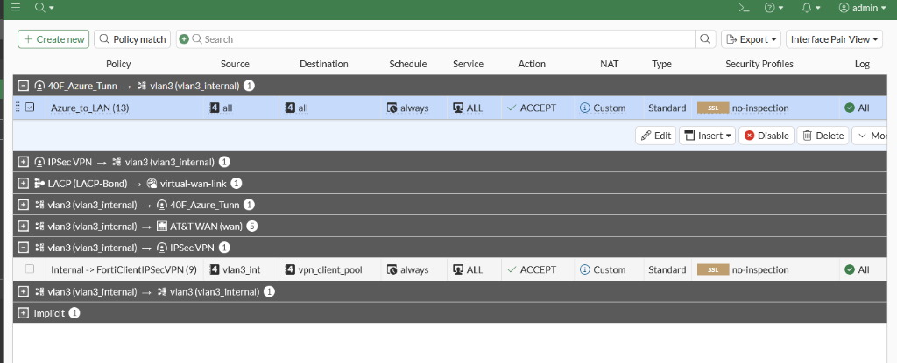](./assets/fgt_07_firewall_policies_table.png) | [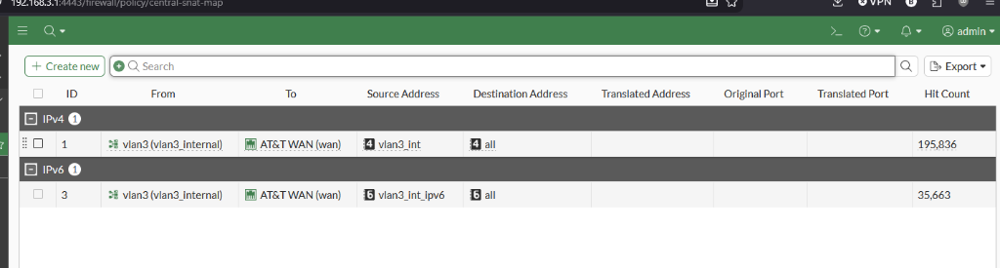](./assets/fgt_08_central_snat_wan_only.png) |
| *Figure 4.7: FortiOS Security Policy table confirming both bidirectional rules are active with logging enabled.* | *Figure 4.8: Central SNAT table confirming NAT applies strictly to WAN egress; tunnel egress bypasses address translation.* |

---

### Phase 3: FortiOS Dynamic Routing Daemon & Static Transport Route

BGP advertisement was implemented on 40F. A static transport host route (`169.254.21.2/32`) was pinned to the virtual tunnel interface.

```fortios
config router bgp
    set as 65001
    set router-id 192.168.3.1
    config neighbor
        edit "169.254.21.2"
            set remote-as 65515
            set interface "40F_Azure_Tunn"
            set ebgp-enforce-multihop enable
            set soft-reconfiguration enable
        next
    end
    config network
        edit 1
            set prefix 192.168.3.0 255.255.255.0
        next
    end
end

config router static
    edit 0
        set dst 169.254.21.2 255.255.255.255
        set device "40F_Azure_Tunn"
    next
end
```

| FortiGate BGP Global AS & Router ID | FortiGate BGP Neighbor Peering Configuration |
| :---: | :---: |
| [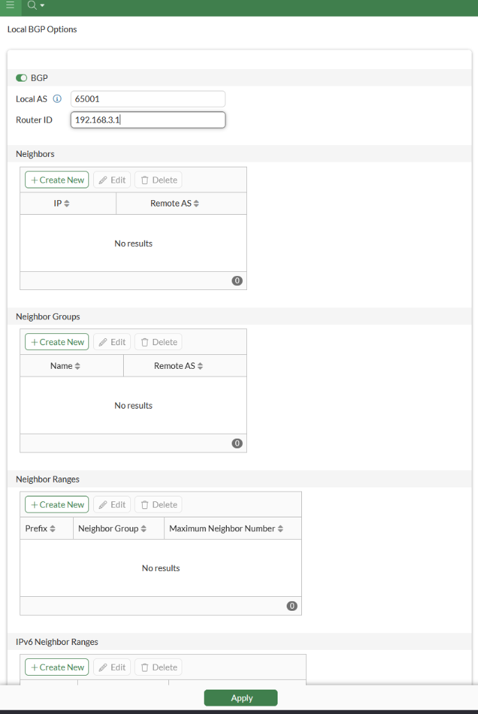](./assets/fgt_09_bgp_global_asn.png) | [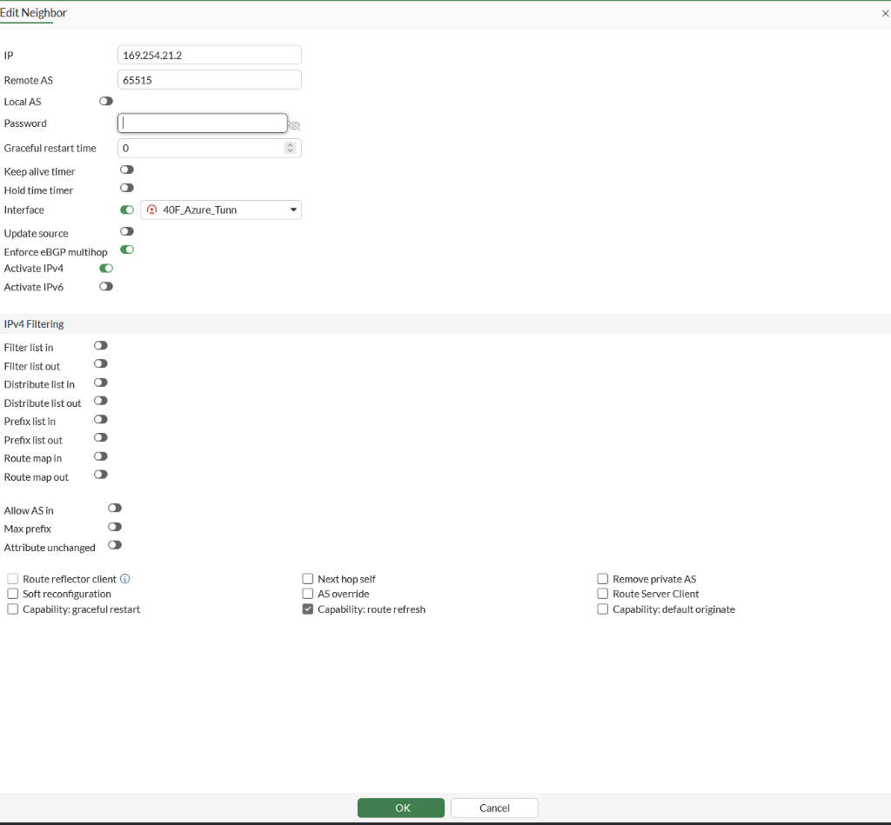](./assets/fgt_10_bgp_neighbor_config.png) |
| *Figure 4.9: FortiOS BGP daemon settings: Local ASN `65001`, Router ID `192.168.3.1`, and graceful restart.* | *Figure 4.10: Neighbor `169.254.21.2`, Remote ASN `65515`, interface `40F_Azure_Tunn`, and eBGP multihop enabled.* |

| FortiGate BGP Network Prefix Announcement | FortiGate Static Host Route for BGP Transport |
| :---: | :---: |
| [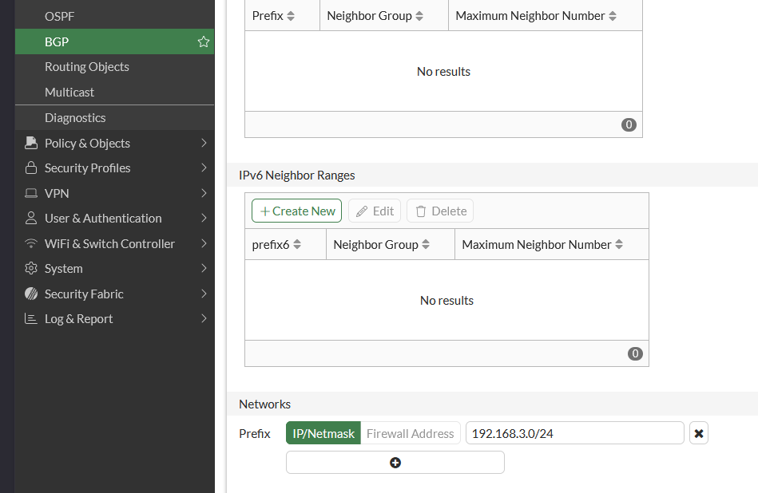](./assets/fgt_11_bgp_network_announcement.png) | [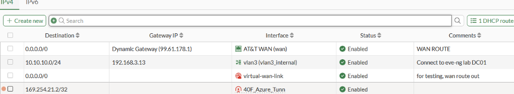](./assets/fgt_12_static_route_bgp_transport.png) |
| *Figure 4.11: Dynamic BGP network statement advertising on-premises physical subnet `192.168.3.0/24` to Azure.* | *Figure 4.12: Explicit static transport route `169.254.21.2/32` directed to `40F_Azure_Tunn` enabling TCP 179 egress.* |

---

### Phase 4: Azure Cloud Infrastructure & Local Network Gateway Provisioning

Azure transit infrastructure was deployed in `rg-enterprise-networking` (`East US`). The Local Network Gateway represents the physical FortiGate 40F edge, and the Virtual Network Gateway provides zone-redundant IPsec and BGP termination.

| Azure Local Network Gateway: Basics | Azure Local Network Gateway: Advanced BGP |
| :---: | :---: |
| [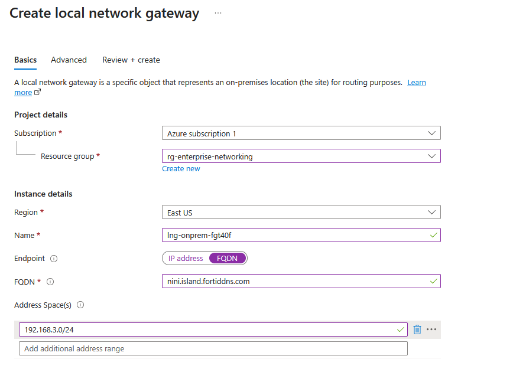](./assets/az_lng_01_basics.png) | [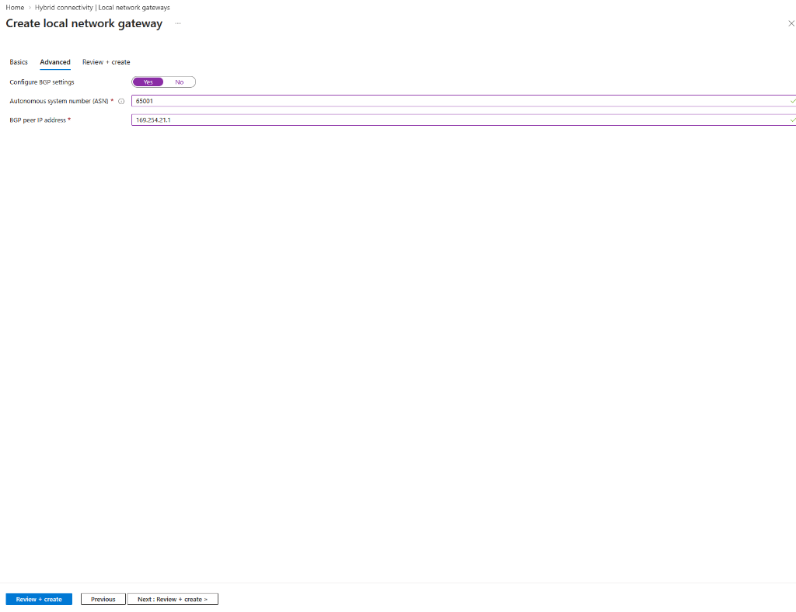](./assets/az_lng_02_advanced_bgp.png) |
| *Figure 4.13: Provisioning `lng-onprem-fgt40f` targeting physical FortiGate WAN IP `99.61.178.164` and subnet `192.168.3.0/24`.* | *Figure 4.14: Local Network Gateway advanced BGP blade: On-premises ASN `65001` and BGP Peering IP `169.254.21.1`.* |

| Azure LNG Deployment Succeeded | Azure Gateway Public IP & FinOps Overview |
| :---: | :---: |
| [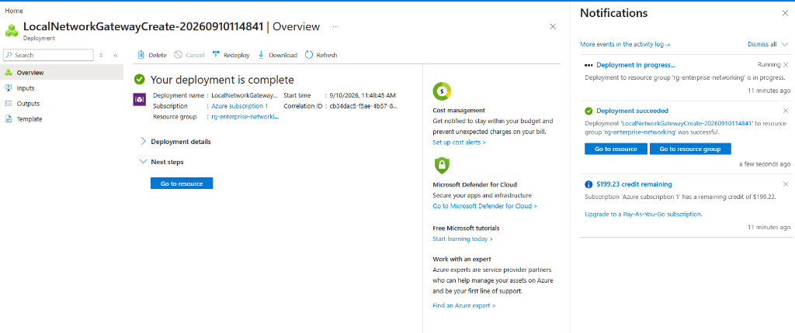](./assets/az_lng_03_deployment_complete.png) | [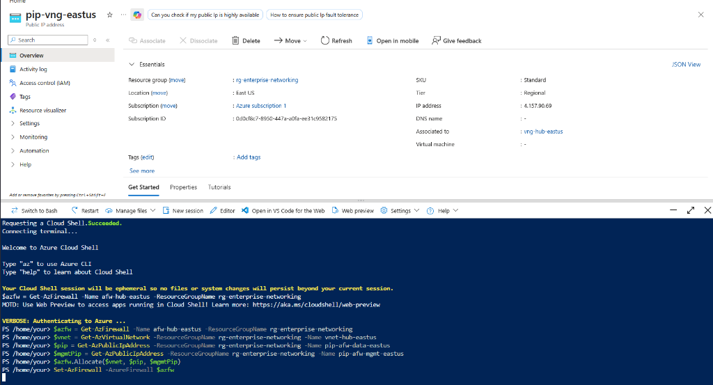](./assets/az_pip_vng_overview.png) |
| *Figure 4.15: ARM engine deployment completion confirmation for `lng-onprem-fgt40f` in `rg-enterprise-networking`.* | *Figure 4.16: Static Standard Public IP `4.157.90.69` (`pip-vng-eastus`) and Azure Cloud Shell PowerShell scripts.* |

---

### Phase 5: Azure Site-to-Site Connection & Custom Cryptographic Policy Enforcement

A Site-to-Site IPsec connection (`conn-hub-to-fgt40f`) was established linking `vng-hub-eastus` to `lng-onprem-fgt40f`. Custom IPsec/IKE policies were applied to ensure cryptographically hardened interoperability with FortiOS.

| Azure Connection: Basics | Azure Connection: Settings & BGP APIPA |
| :---: | :---: |
| [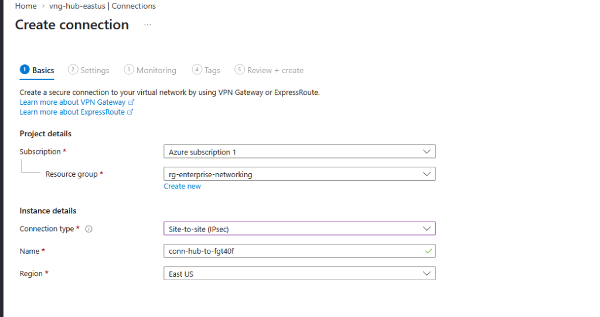](./assets/01_connection_basics.png) | [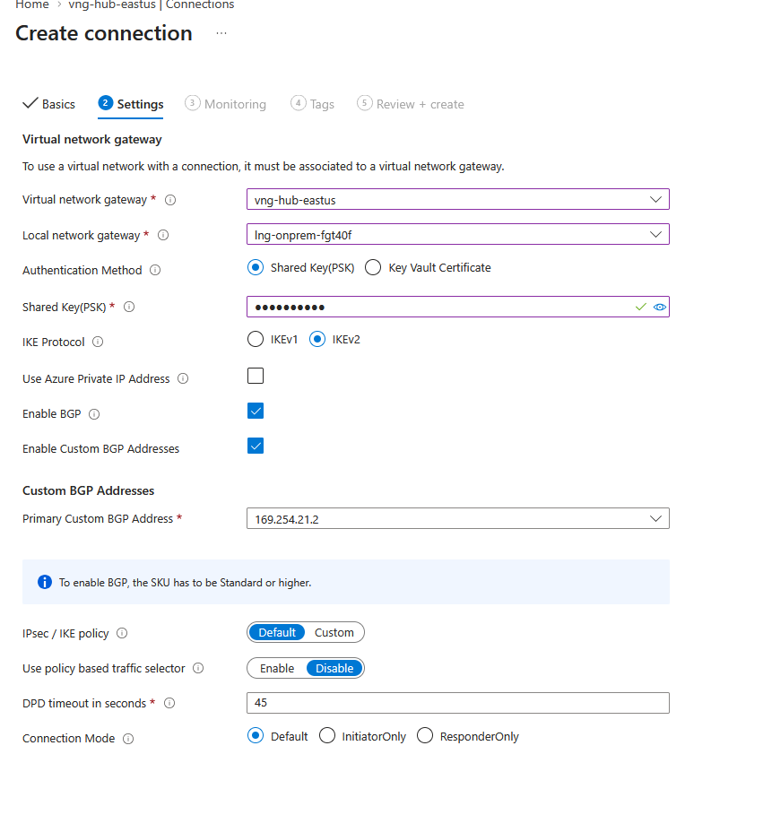](./assets/02_connection_settings.png) |
| *Figure 4.17: Connection basics blade defining connection type Site-to-site (IPsec) and resource group binding.* | *Figure 4.18: Connection settings binding `vng-hub-eastus` to `lng-onprem-fgt40f` with Custom APIPA `169.254.21.2`.* |

| Azure ARM Validation Succeeded | Azure Custom IPsec / IKE Policy Enforcement |
| :---: | :---: |
| [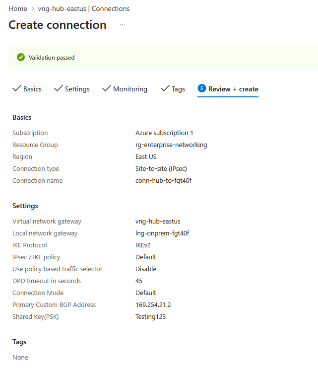](./assets/03_connection_validation_passed.png) | [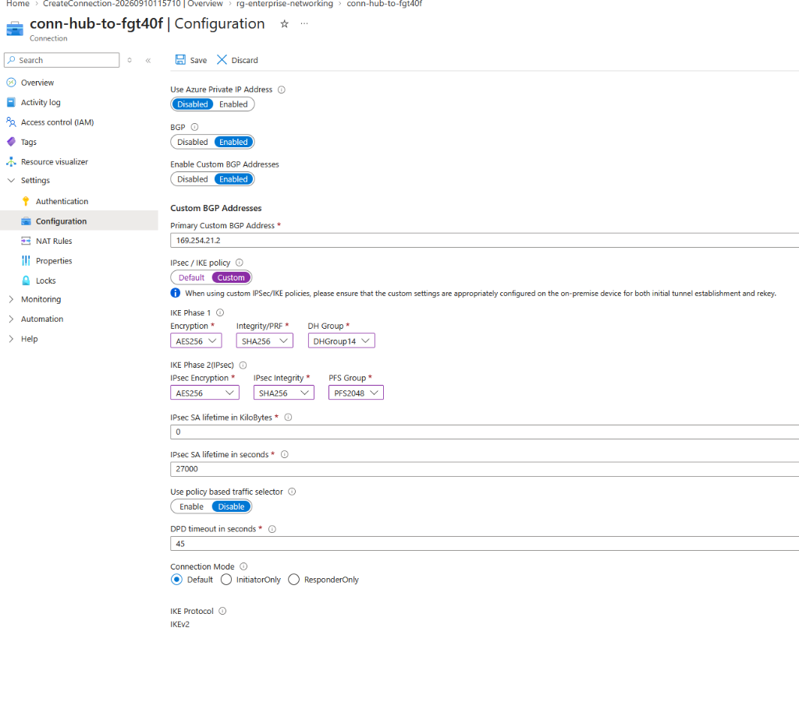](./assets/04_azure_custom_ipsec_policy.png) |
| *Figure 4.19: Azure ARM pre-flight validation returning 'Validation passed' with zero deployment errors.* | *Figure 4.20: Enforcing Custom IPsec/IKE policy: AES256, SHA256, DH Group 14, and PFS Group 14 (`PFS2048`).* |

---

### Phase 6: Live Tunnel Telemetry & Route Synchronization Verification

Tunnel telemetry and dynamic BGP session state were validated across both the FortiOS CLI/GUI and Azure Portal monitoring blades.

| FortiOS IPsec Tunnel Monitor (GUI) | FortiOS SAs & BGP Established (CLI) |
| :---: | :---: |
| [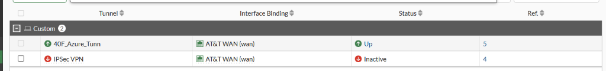](./assets/05_fortigate_tunnel_up_gui.png) | [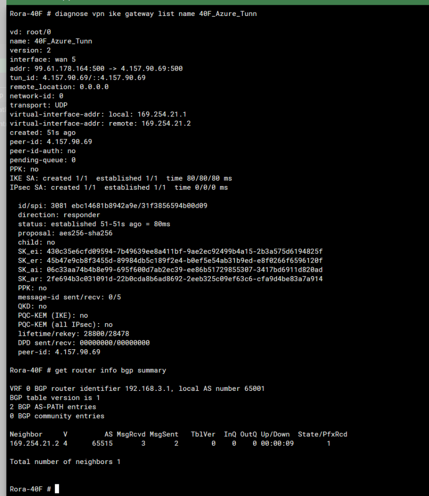](./assets/06_fortigate_bgp_established_cli.png) |
| *Figure 4.21: FortiOS GUI showing `40F_Azure_Tunn` with solid green 'Up' status and live byte counters on WAN.* | *Figure 4.22: CLI confirmation: IPsec SA established (80ms handshake) and BGP neighbor `169.254.21.2` in `Established` state.* |

| FortiOS Learned Azure BGP Routes | FortiOS Advertised On-Premises Routes |
| :---: | :---: |
| [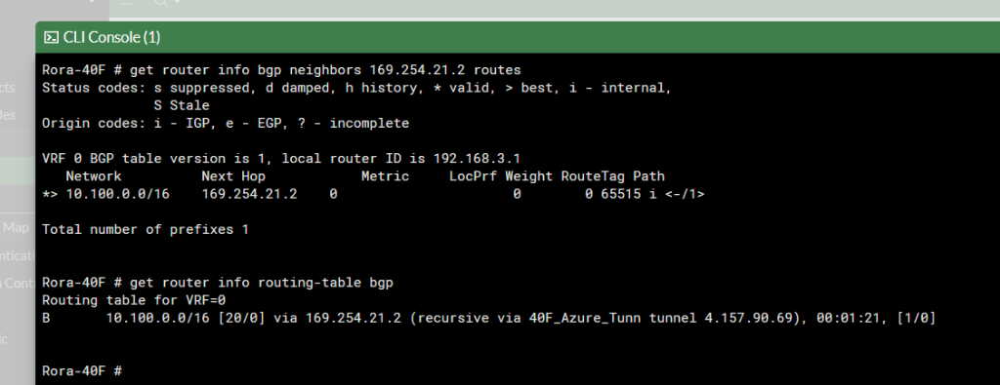](./assets/07_fortigate_learned_azure_routes_bgp.png) | [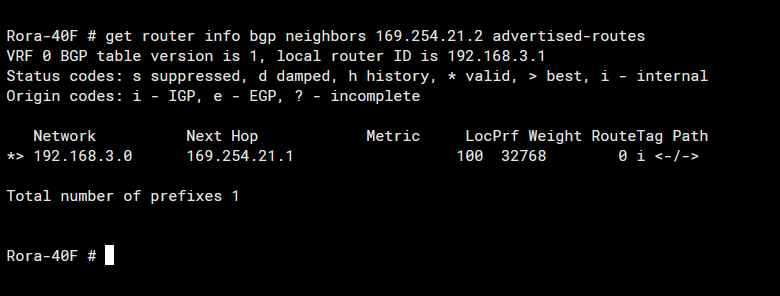](./assets/08_fortigate_advertised_onprem_routes_bgp.png) |
| *Figure 4.23: FortiGate FIB routing table showing `10.100.0.0/16` installed as dynamic BGP route (`B`) via `169.254.21.2`.* | *Figure 4.24: BGP advertised routes table verifying `192.168.3.0/24` actively transmitted to Azure neighbor `169.254.21.2`.* |

| Azure VNG BGP Peers Connected | FortiOS BGP Best Path Routing Table |
| :---: | :---: |
| [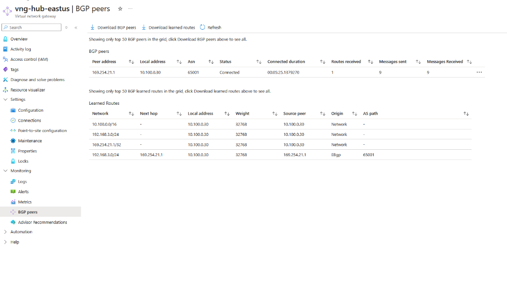](./assets/09_azure_vng_bgp_peers_connected.png) | [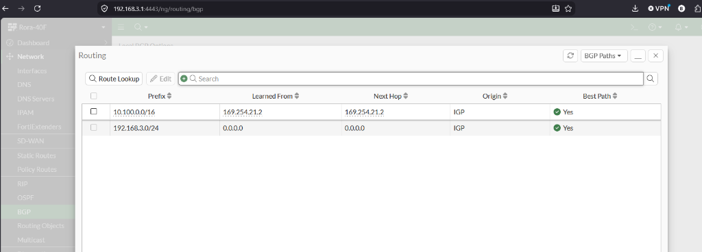](./assets/10_fortigate_bgp_paths_gui.png) |
| *Figure 4.25: Azure Virtual Network Gateway BGP peers blade confirming peer `169.254.21.1` status is 'Connected'.* | *Figure 4.26: FortiOS Routing GUI displaying both `10.100.0.0/16` and `192.168.3.0/24` marked as Best Path ('Yes').* |

#### Azure Virtual Network Gateway Resource Overview:
[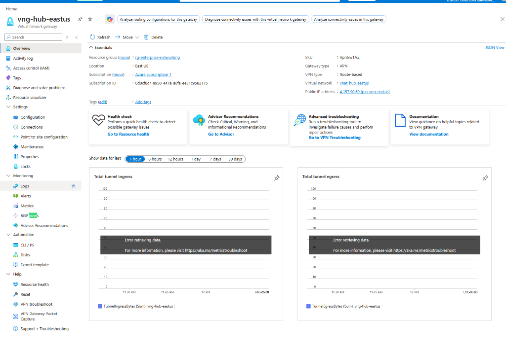](./assets/11_azure_vng_overview.png)
*Figure 4.27: Azure Virtual Network Gateway overview blade confirming `VpnGw1AZ` SKU, `East US` zone redundancy, Public IP `4.157.90.69`, and BGP ASN `65515`.*

---

### Phase 7: Azure VNet Peering Gateway Transit & Multi-Cloud Spoke Convergence

By establishing the two-way VNet peering gateway transit relationship (Hub: `Allow gateway transit`; Spokes: `Use remote gateway`), spoke CIDRs were dynamically announced across the BGP session to the on-premises FortiGate.

| Azure Hub Peering: Gateway Transit Enabled | Azure Spoke Prod Peering: Remote Gateway Enabled |
| :---: | :---: |
| [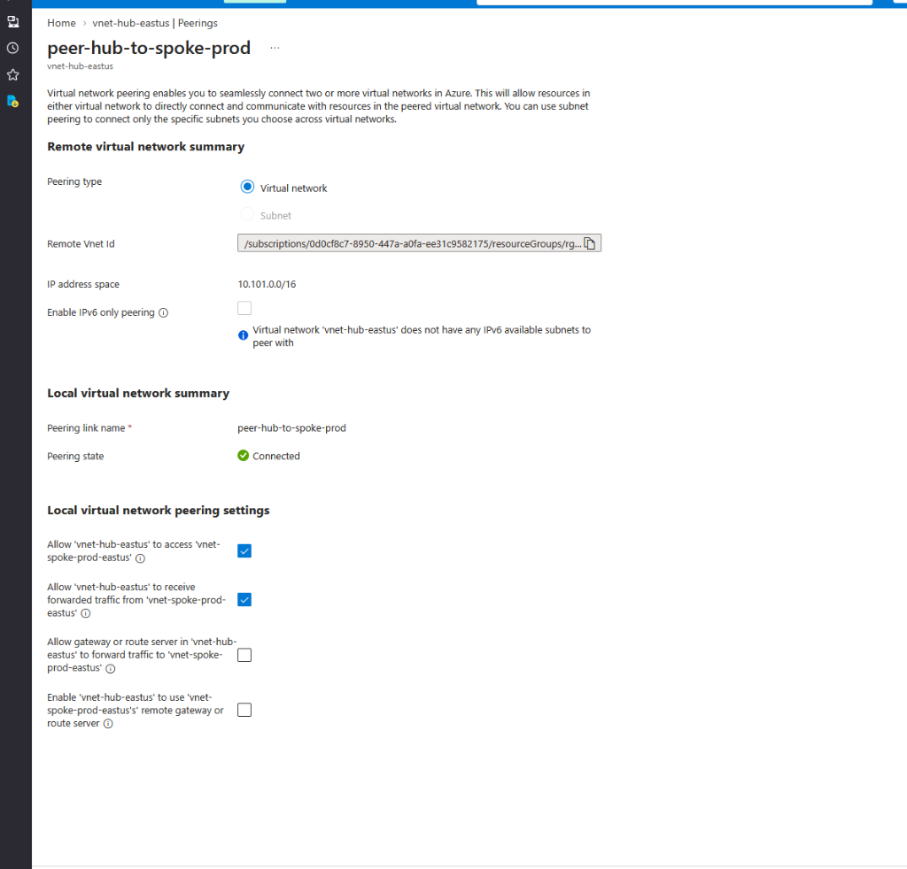](./assets/12_vnet_peering_gateway_transit_hub.png) | [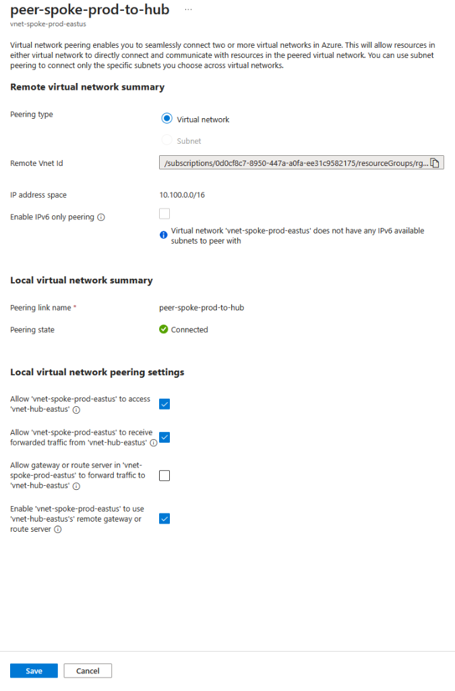](./assets/13_vnet_peering_use_remote_gateway_spoke_prod.png) |
| *Figure 4.28: Hub peering configuration enabling 'Allow gateway or route server in vnet-hub-eastus to forward traffic'.* | *Figure 4.29: Spoke Prod peering enabling 'Enable spoke to use remote virtual network's gateway or route server'.* |

| Azure Spoke Dev Peering: Remote Gateway Enabled | FortiOS FIB: All Cloud Spokes Learned via BGP |
| :---: | :---: |
| [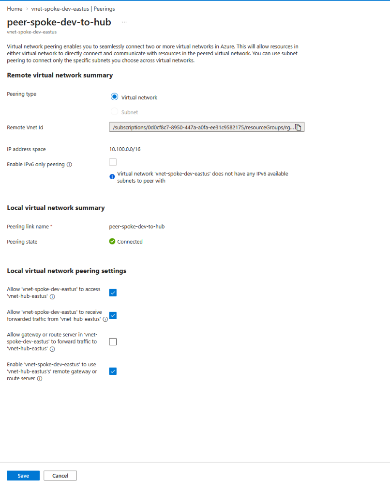](./assets/14_vnet_peering_use_remote_gateway_spoke_dev.png) | [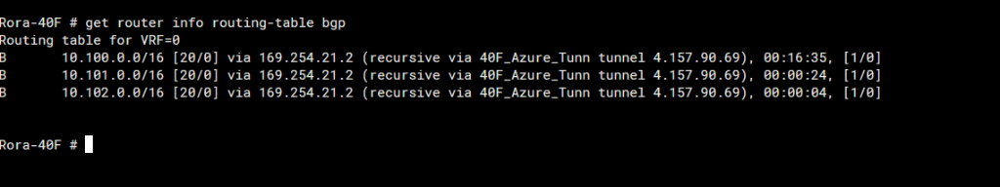](./assets/15_fortigate_all_spoke_routes_bgp.png) |
| *Figure 4.30: Spoke Dev peering enabling 'Enable spoke to use remote virtual network's gateway or route server'.* | *Figure 4.31: FortiGate FIB routing table confirming Hub (`10.100`), Prod (`10.101`), and Dev (`10.102`) dynamically installed.* |

#### Final Multi-Cloud BGP Peering Summary (3 Prefixes Active):
[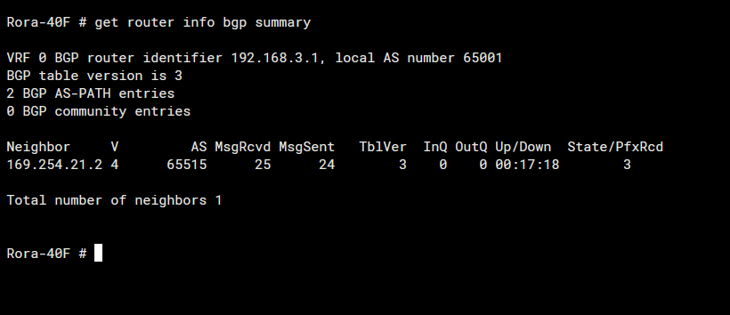](./assets/16_fortigate_bgp_summary_3_prefixes.png)
*Figure 4.32: FortiGate CLI `get router info bgp summary` verifying dynamic neighbor `169.254.21.2` active, zero message queues, and `State/PfxRcd: 3`.*

---

## 5. Production Engineering Troubleshooting Case Studies

During deployment, two major enterprise networking challenges were encountered, diagnosed, and resolved using low-level protocol analyzers and FortiOS debug logs.

### Case Study 1: The BGP "Chicken-and-the-Egg" Host Route Dependency
* **Symptom:** The IPsec tunnel negotiated, but BGP remained persistently stuck in the `Active` state (`State/PfxRcd: Active`, never establishing).
* **Root Cause Analysis:** 
  1. BGP is an application-layer routing protocol running over **TCP Port 179**. Before routes can be advertised, the FortiGate must initiate a TCP 3-way handshake to Azure's APIPA address (`169.254.21.2`).
  2. By Microsoft Azure design, when custom APIPA addresses (`169.254.x.x`) are used, **Azure never initiates the BGP session**—it acts as a passive listener.
  3. The FortiGate tunnel interface was configured with `169.254.21.1/32`. Because `/32` is a host address, FortiOS did not generate a connected subnet route for `169.254.21.2`.
  4. When the FortiGate attempted to send TCP SYN packets to `169.254.21.2`, the longest prefix match in the FIB was the default route (`0.0.0.0/0 via AT&T WAN`). The FortiGate dispatched the BGP SYN packets out the WAN to the public internet, where the upstream ISP dropped them.
* **Resolution:** Added an explicit static transport host route directing `169.254.21.2/32` into the virtual tunnel interface (`40F_Azure_Tunn`):
  ```fortios
  config router static
      edit 0
          set dst 169.254.21.2 255.255.255.255
          set device "40F_Azure_Tunn"
      next
  end
  ```
  Immediately, TCP SYN packets egressed the IPsec tunnel, and the BGP session transitioned toward synchronization.

---

### Case Study 2: Cryptographic Proposal Negotiation Failure (`NO_PROPOSAL_CHOSEN`)
* **Symptom:** During manual tunnel trigger, FortiOS debug logged an immediate negotiation abort during Phase 1:
  ```text
  ike V=root:0: comes 4.157.90.69:500->99.61.178.164:500...
  ike V=root:0: IKEv2 exchange=SA_INIT_RESPONSE
  ike V=root:0:40F_Azure_Tunn:3071: processing notify type NO_PROPOSAL_CHOSEN
  ike V=root:0:40F_Azure_Tunn:3071: received SA_INIT error notify response, abort
  ```
* **Low-Level Hex & Proposal Inspection:**
  Enabling real-time IKE debugging (`diagnose debug application ike -1`) captured the exact payload proposals exchanged:
  ```text
  ike V=root:0: incoming proposal from Azure:
  ike V=root:0:   proposal id = 1..6: type=DH_GROUP, val=MODP1024 (Group 2)
  ike V=root:0: my proposal, gw 40F_Azure_Tunn:
  ike V=root:0:   proposal id = 1:    type=DH_GROUP, val=MODP2048 (Group 14)
  ike V=root:0: Negotiate SA Error: peer SA proposal not match local policy
  ```
  * **Diagnosis:** When an Azure Connection is created with **"Default"** IPsec/IKE policy, Azure strictly offers legacy **Diffie-Hellman Group 2 (1024-bit)** and disables Phase 2 PFS. Because FortiGate enforced enterprise-grade **DH Group 14 (2048-bit)**, neither side could agree on cryptographic key derivation.
* **Resolution:** In Azure Portal (`conn-hub-to-fgt40f` $\rightarrow$ Configuration), switched **IPsec / IKE policy** to **`Custom`** and explicitly defined:
  * Phase 1: `AES256` / `SHA256` / `DHGroup14`
  * Phase 2: `AES256` / `SHA256` / `PFS2048` / Lifetime `27000s`
  Upon clicking **Save**, Azure sent `MODP2048`, FortiGate matched Proposal #1, and Phase 1/2 established in **80 milliseconds**.

---

### Case Study 3: Azure VNet Peering Two-Way Gateway Transit Handshake
* **Symptom:** BGP peering established, but only `10.100.0.0/16` (Hub) appeared on FortiGate. The spoke subnets (`10.101.0.0/16` Prod and `10.102.0.0/16` Dev) were missing (`State/PfxRcd: 1`).
* **Root Cause Analysis:** Azure VNet Peering Gateway Transit is an asynchronous, two-sided handshake. Enabling transit on the Hub only grants permission; the spokes must explicitly request to consume the gateway.
* **Resolution:**
  1. On Hub Peering (`peer-hub-to-spoke-prod` & `peer-hub-to-spoke-dev`): Checked **`Allow gateway or route server in 'vnet-hub-eastus' to forward traffic`** (Gateway Transit).
  2. On Spoke Peering (`peer-spoke-prod-to-hub` & `peer-spoke-dev-to-hub`): Checked **`Enable spoke to use remote virtual network's gateway or route server`**.
  Within 10 seconds of saving the spoke configurations, Azure automatically injected both spoke CIDRs into BGP, and FortiGate converged to **`State/PfxRcd: 3`**.

---

## 6. End-to-End Packet Walk Analysis

### Packet Walk: On-Premises Host (`192.168.3.50`) $\longrightarrow$ Azure Production Workload (`10.101.1.10`)

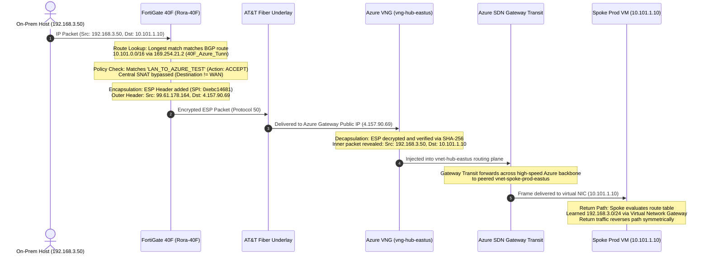
```mermaid
sequenceDiagram
    autonumber
    actor Host as On-Prem Host (192.168.3.50)
    participant FGT as FortiGate 40F (Rora-40F)
    participant ISP as AT&T Fiber Underlay
    participant VNG as Azure VNG (vng-hub-eastus)
    participant HubPeering as Azure SDN Gateway Transit
    participant SpokeVM as Spoke Prod VM (10.101.1.10)

    Host->>FGT: IP Packet (Src: 192.168.3.50, Dst: 10.101.1.10)
    Note over FGT: Route Lookup: Longest match matches BGP route<br>10.101.0.0/16 via 169.254.21.2 (40F_Azure_Tunn)
    Note over FGT: Policy Check: Matches 'LAN_TO_AZURE_TEST' (Action: ACCEPT)<br>Central SNAT bypassed (Destination != WAN)
    Note over FGT: Encapsulation: ESP Header added (SPI: 0xebc14681)<br>Outer Header: Src: 99.61.178.164, Dst: 4.157.90.69
    FGT->>ISP: Encrypted ESP Packet (Protocol 50)
    ISP->>VNG: Delivered to Azure Gateway Public IP (4.157.90.69)
    Note over VNG: Decapsulation: ESP decrypted and verified via SHA-256<br>Inner packet revealed: Src: 192.168.3.50, Dst: 10.101.1.10
    VNG->>HubPeering: Injected into vnet-hub-eastus routing plane
    Note over HubPeering: Gateway Transit forwards across high-speed Azure backbone<br>to peered vnet-spoke-prod-eastus
    HubPeering->>SpokeVM: Frame delivered to virtual NIC (10.101.1.10)
    Note over SpokeVM: Return Path: Spoke evaluates route table<br>Learned 192.168.3.0/24 via Virtual Network Gateway<br>Return traffic reverses path symmetrically
```

1. **Step 1 (Ingress & L3 Lookup):** The host on VLAN 3 dispatches an IP packet destined for Azure Prod (`10.101.1.10`). The FortiGate receives it on `vlan3_internal` and looks up the FIB. It matches the dynamic BGP route `10.101.0.0/16 [20/0] via 169.254.21.2`, recursive via interface `40F_Azure_Tunn`.
2. **Step 2 (Security Policy & Central SNAT Bypass):** The FortiGate checks firewall policy `LAN_TO_AZURE_TEST` (`vlan3_internal` $\rightarrow$ `40F_Azure_Tunn`), which permits the traffic without network address translation (Central SNAT rules only target `AT&T WAN`, preserving original RFC 1918 client addresses).
3. **Step 3 (IPsec Encapsulation):** The packet is encapsulated into an IPsec ESP packet (IP Protocol 50) with outer header `99.61.178.164` $\rightarrow$ `4.157.90.69`, encrypted with AES-256 and authenticated with SHA-256.
4. **Step 4 (Underlay Transit & Gateway Decryption):** The packet traverses the public internet and enters `vng-hub-eastus` (`4.157.90.69`). Azure's gateway decrypts the payload, validates integrity, and extracts the inner packet.
5. **Step 5 (Gateway Transit SDN Forwarding):** Because VNet peering has Gateway Transit enabled, Azure's software-defined network forwards the packet directly across Microsoft's optical backbone into `vnet-spoke-prod-eastus` without intermediate SNAT.
6. **Step 6 (Workload Ingress):** The packet arrives at `10.101.1.10`. The workload's return traffic matches the gateway route (`192.168.3.0/24` via `VirtualNetworkGateway`) and reverses the path identically.

---

## 7. Infrastructure as Code & Configuration Artifacts

All production configurations have been modularized and version-controlled inside the [`templates/`](./templates/) directory:

| Artifact | Technology | Description |
| :--- | :--- | :--- |
| **[`01_vng_template.json`](./templates/01_vng_template.json)** | Azure ARM Template | Deploys `vng-hub-eastus` (VpnGw1AZ, BGP ASN 65515, APIPA `169.254.21.2`, PIP `pip-vng-eastus`). |
| **[`02_connection_template.json`](./templates/02_connection_template.json)** | Azure ARM Template | Deploys `conn-hub-to-fgt40f` with Custom IPsec/IKE policies and custom BGP APIPA mapping. |
| **[`03_lng_template.json`](./templates/03_lng_template.json)** | Azure ARM Template | Deploys `lng-onprem-fgt40f` representing the physical FortiGate 40F (`99.61.178.164`, ASN `65001`, APIPA `169.254.21.1`). |
| **[`04_fortigate_ipsec_bgp_config.conf`](./templates/04_fortigate_ipsec_bgp_config.conf)** | Fortinet FortiOS CLI | Production CLI script configuring Phase 1/2, APIPA VTI, Static Transport Route, Firewall Policies, and BGP. |

---

## 8. Cloud FinOps & Teardown Procedures

To eliminate ongoing compute costs during non-operational periods while preserving the entire infrastructure state:

```powershell
# Stop Azure Firewall to halt billing meters
$azfw = Get-AzFirewall -Name afw-hub-eastus -ResourceGroupName rg-enterprise-networking
$azfw.Deallocate()
Set-AzFirewall -AzureFirewall $azfw

# If tearing down the VPN Gateway for long-term storage:
# Remove-AzVirtualNetworkGatewayConnection -Name conn-hub-to-fgt40f -ResourceGroupName rg-enterprise-networking -Force
# Remove-AzVirtualNetworkGateway -Name vng-hub-eastus -ResourceGroupName rg-enterprise-networking -Force
```

---

## 9. Author & Copyright

**Authored by:** Philippe Truong  
**Copyright:** © 2026 Philippe Truong. All rights reserved.  
*All architecture diagrams, technical methodologies, low-level packet walks, and configuration scripts are the original engineering property of Philippe Truong.*
