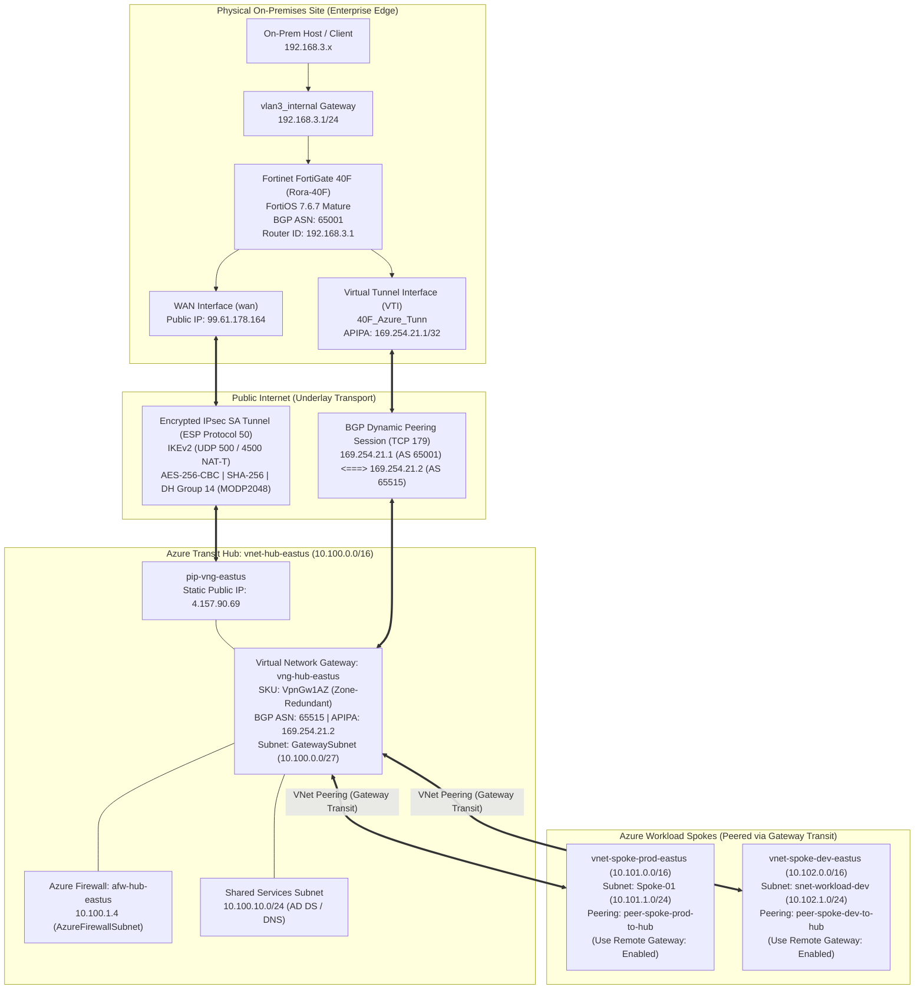
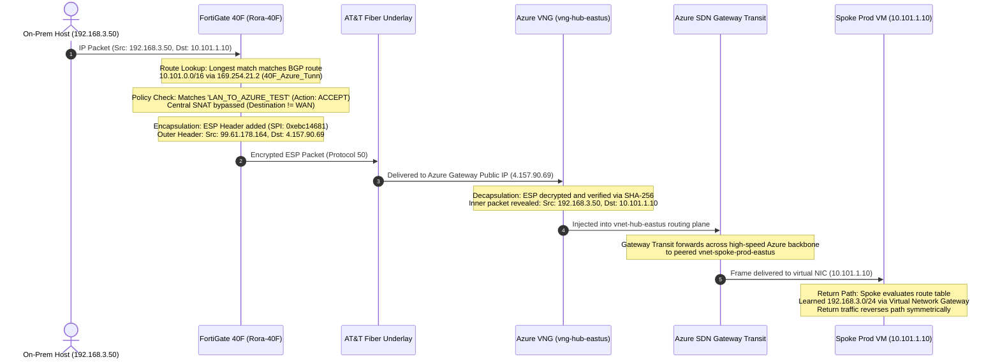

# Lab 05: Hybrid Site-to-Site IPsec VPN & BGP Peering (Fortinet FortiGate 40F ⟷ Microsoft Azure)

**Author:** Philippe Truong  
**Copyright:** © 2026 Philippe Truong. All rights reserved.  
**Domain:** Hybrid Cloud Networking, Route-Based IPsec VPN (IKEv2), Dynamic Routing (eBGP ASN 65001 ⟷ 65515), APIPA Custom Peering (RFC 3927), Azure Virtual Network Gateway (VpnGw1AZ), Azure Local Network Gateway, VNet Peering Gateway Transit, Fortinet FortiOS 7.6.7 Mature, Enterprise Cryptography (AES-256 / SHA-256 / DH Group 14).  

**Status:** 🟢 Completed & Fully Converged  

---

## 1. Executive Summary & Objective

This project engineers, deploys, and verifies an enterprise-grade **Hybrid Multi-Cloud Site-to-Site IPsec Virtual Private Network (VPN)** with **Dynamic Border Gateway Protocol (BGP)** peering. 

The architecture bridges an on-premises physical security appliance (**Fortinet FortiGate 40F** running **FortiOS 7.6.7 Mature**) across the public internet to **Microsoft Azure (`East US`)**, terminating at a zone-redundant **Virtual Network Gateway (`vng-hub-eastus`, VpnGw1AZ)**.

Dynamic routing over IPsec eliminates the operational overhead, route sprawl, and maintenance brittleness of static routes. By leveraging **Azure VNet Peering Gateway Transit**, the on-premises FortiGate automatically learns all cloud workload spoke subnets (`10.101.0.0/16` Production and `10.102.0.0/16` Development) in real time without requiring direct tunnels to each spoke virtual network.

```
+----------------------------------------------------------------------------------------------------+
|                                    PHYSICAL ON-PREMISES PERIMETER                                  |
|                                                                                                    |
|   Internal Workloads                                  Edge Firewall                                |
|   VLAN 3 (192.168.3.0/24) +-------------------------> FortiGate 40F (Rora-40F)                     |
|   Interface: vlan3_internal (192.168.3.1)             FortiOS 7.6.7 Mature                         |
|                                                       WAN IP: 99.61.178.164 (AT&T Fiber)           |
|                                                       BGP Autonomous System: 65001                 |
|                                                       APIPA Endpoint: 169.254.21.1/32              |
+------------------------------------------------------------------+---------------------------------+
                                                                   |
                                  === Route-Based IPsec Tunnel (IKEv2 / ESP AES256-SHA256 / DH14) ===
                                  === Dynamic eBGP Peering Session (TCP Port 179 over APIPA)     ===
                                                                   |
+------------------------------------------------------------------v---------------------------------+
|                                    MICROSOFT AZURE CLOUD (EAST US)                                 |
|                                                                                                    |
|   Transit Hub: vnet-hub-eastus (10.100.0.0/16)                                                     |
|   +--------------------------------------------------------------------------------------------+   |
|   |  GatewaySubnet (10.100.0.0/27)                                                             |   |
|   |  - Virtual Network Gateway: vng-hub-eastus (SKU: VpnGw1AZ, Gen 2, Route-based)             |   |
|   |  - Public IP: 4.157.90.69 (pip-vng-eastus)                                                |   |
|   |  - BGP Autonomous System: 65515                                                            |   |
|   |  - Custom APIPA BGP Peer IP: 169.254.21.2                                                 |   |
|   +----------------------------------------------+---------------------------------------------+   |
|                                                  |                                                 |
|                        +-------------------------+-------------------------+                       |
|                        | Gateway Transit (Hub)   | Gateway Transit (Hub)   |                       |
|                        | Use Remote Gateway (Spk)| Use Remote Gateway (Spk)|                       |
|                        v                         v                         |                       |
|   +------------------------------------+   +------------------------------------+                  |
|   | Spoke-01: vnet-spoke-prod-eastus   |   | Spoke-02: vnet-spoke-dev-eastus    |                  |
|   | Address Space: 10.101.0.0/16       |   | Address Space: 10.102.0.0/16       |                  |
|   | Dynamic BGP Advertisement: Yes     |   | Dynamic BGP Advertisement: Yes     |                  |
|   +------------------------------------+   +------------------------------------+                  |
+----------------------------------------------------------------------------------------------------+
```

---

## 2. Enterprise Hybrid Cloud Topology



### Azure Resource Visualizer Topology Map
[](./assets/00_azure_resource_visualizer_topology.png)
*Figure 2.1: Live Azure Resource Visualizer graph showing the Hub VNet (`vnet-hub-eastus`), Azure Firewall (`afw-hub-eastus`), Spoke VNets (`vnet-spoke-prod-eastus`, `vnet-spoke-dev-eastus`), Route Tables (`rt-spoke-to-firewall`), NSGs, and the hybrid IPsec connection (`conn-hub-to-fgt40f` ⟷ `lng-onprem-fgt40f`).*

---

## 3. Cryptographic & Protocol Architecture Specification

### 3.1 IPsec Phase 1 & Phase 2 Parameters

To ensure military-grade security while maintaining zero packet fragmentation and strict interoperability, custom cryptographic policies were enforced on both the FortiGate and Azure Virtual Network Gateway:

| Parameter | IKE Phase 1 (Main Mode / SA_INIT) | IPsec Phase 2 (Quick Mode / CHILD_SA) | Technical Rationale |
| :--- | :--- | :--- | :--- |
| **Protocol Version** | **IKEv2** | **ESP (IP Protocol 50)** | Eliminates aggressive mode vulnerabilities, native NAT-T support |
| **Encryption Algorithm** | **AES-256-CBC** | **AES-256-CBC** | 256-bit symmetric encryption meeting enterprise compliance |
| **Integrity / Hash** | **SHA-256** (SHA2_256_128) | **SHA-256** | Secure hash digest preventing replay and tampering |
| **Diffie-Hellman / PFS** | **DH Group 14 (MODP2048)** | **PFS Group 14 (`PFS2048`)** | 2048-bit modular exponentiation; prevents session compromise |
| **Traffic Selectors** | Host Endpoints (`99.61.178.164` $\leftrightarrow$ `4.157.90.69`) | **`0.0.0.0/0` $\longleftrightarrow$ `0.0.0.0/0`** | Route-based VTI tunnel; routing table directs packet flow |
| **SA Lifetime** | **28,800 seconds (8 Hours)** | **27,000 seconds (7.5 Hours)** | Staggered rekeying prevents synchronized tunnel teardown |
| **Dead Peer Detection** | **On-Idle / 10s interval / 3 retries** | **Keepalive Enabled** | Rapid detection of blackholes with automatic re-initiation |

---

### 3.2 Dynamic Routing (BGP) Architecture

| BGP Attribute | On-Premises (Fortinet FortiGate 40F) | Microsoft Azure (Virtual Network Gateway) |
| :--- | :--- | :--- |
| **Autonomous System Number (ASN)** | **`65001`** (eBGP Private Range) | **`65515`** (Azure Default BGP ASN) |
| **BGP Peering IP (Transport)** | **`169.254.21.1/32`** (APIPA RFC 3927) | **`169.254.21.2`** (Azure Custom APIPA) |
| **Router Identifier** | `192.168.3.1` | `10.100.0.30` (Gateway Instance) |
| **eBGP Multihop** | Enabled (`ebgp-enforce-multihop`) | Native |
| **Soft Reconfiguration** | Enabled (`soft-reconfiguration enable`) | Supported |
| **TCP Peering Port** | TCP Port 179 | TCP Port 179 |
| **Announced Networks** | `192.168.3.0/24` (Physical VLAN 3) | `10.100.0.0/16` (Hub), `10.101.0.0/16` (Prod), `10.102.0.0/16` (Dev) |
| **Administrative Distance** | `20` (eBGP External Route) | `30` (Azure Dynamic Gateway Route) |

---

## 4. Production Engineering Troubleshooting Case Studies

During deployment, two major enterprise networking challenges were encountered, diagnosed, and resolved using low-level protocol analyzers and FortiOS debug logs.

### Case Study 1: The BGP "Chicken-and-the-Egg" Host Route Dependency
* **Symptom:** The IPsec tunnel negotiated, but BGP remained persistently stuck in the `Active` state (`State/PfxRcd: Active`, never establishing).
* **Root Cause Analysis:** 
  1. BGP is an application-layer routing protocol running over **TCP Port 179**. Before routes can be advertised, the FortiGate must initiate a TCP 3-way handshake to Azure's APIPA address (`169.254.21.2`).
  2. By Microsoft Azure design, when custom APIPA addresses (`169.254.x.x`) are used, **Azure never initiates the BGP session**—it acts as a passive listener.
  3. The FortiGate tunnel interface was configured with `169.254.21.1/32`. Because `/32` is a host address, FortiOS did not generate a connected subnet route for `169.254.21.2`.
  4. When the FortiGate attempted to send TCP SYN packets to `169.254.21.2`, the longest prefix match in the FIB was the default route (`0.0.0.0/0 via AT&T WAN`). The FortiGate dispatched the BGP SYN packets out the WAN to the public internet, where the upstream ISP dropped them.
* **Resolution:** Added an explicit static transport host route directing `169.254.21.2/32` into the virtual tunnel interface (`40F_Azure_Tunn`):
  ```fortios
  config router static
      edit 0
          set dst 169.254.21.2 255.255.255.255
          set device "40F_Azure_Tunn"
      next
  end
  ```
  Immediately, TCP SYN packets egressed the IPsec tunnel, and the BGP session transitioned toward synchronization.

---

### Case Study 2: Cryptographic Proposal Negotiation Failure (`NO_PROPOSAL_CHOSEN`)
* **Symptom:** During manual tunnel trigger, FortiOS debug logged an immediate negotiation abort during Phase 1:
  ```text
  ike V=root:0: comes 4.157.90.69:500->99.61.178.164:500...
  ike V=root:0: IKEv2 exchange=SA_INIT_RESPONSE
  ike V=root:0:40F_Azure_Tunn:3071: processing notify type NO_PROPOSAL_CHOSEN
  ike V=root:0:40F_Azure_Tunn:3071: received SA_INIT error notify response, abort
  ```
* **Low-Level Hex & Proposal Inspection:**
  Enabling real-time IKE debugging (`diagnose debug application ike -1`) captured the exact payload proposals exchanged:
  ```text
  ike V=root:0: incoming proposal from Azure:
  ike V=root:0:   proposal id = 1..6: type=DH_GROUP, val=MODP1024 (Group 2)
  ike V=root:0: my proposal, gw 40F_Azure_Tunn:
  ike V=root:0:   proposal id = 1:    type=DH_GROUP, val=MODP2048 (Group 14)
  ike V=root:0: Negotiate SA Error: peer SA proposal not match local policy
  ```
  * **Diagnosis:** When an Azure Connection is created with **"Default"** IPsec/IKE policy, Azure strictly offers legacy **Diffie-Hellman Group 2 (1024-bit)** and disables Phase 2 PFS. Because FortiGate enforced enterprise-grade **DH Group 14 (2048-bit)**, neither side could agree on cryptographic key derivation.
* **Resolution:** In Azure Portal (`conn-hub-to-fgt40f` $\rightarrow$ Configuration), switched **IPsec / IKE policy** to **`Custom`** and explicitly defined:
  * Phase 1: `AES256` / `SHA256` / `DHGroup14`
  * Phase 2: `AES256` / `SHA256` / `PFS2048` / Lifetime `27000s`
  Upon clicking **Save**, Azure sent `MODP2048`, FortiGate matched Proposal #1, and Phase 1/2 established in **80 milliseconds**.

---

### Case Study 3: Azure VNet Peering Two-Way Gateway Transit Handshake
* **Symptom:** BGP peering established, but only `10.100.0.0/16` (Hub) appeared on FortiGate. The spoke subnets (`10.101.0.0/16` Prod and `10.102.0.0/16` Dev) were missing (`State/PfxRcd: 1`).
* **Root Cause Analysis:** Azure VNet Peering Gateway Transit is an asynchronous, two-sided handshake. Enabling transit on the Hub only grants permission; the spokes must explicitly request to consume the gateway.
* **Resolution:**
  1. On Hub Peering (`peer-hub-to-spoke-prod` & `peer-hub-to-spoke-dev`): Checked **`Allow gateway or route server in 'vnet-hub-eastus' to forward traffic`** (Gateway Transit).
  2. On Spoke Peering (`peer-spoke-prod-to-hub` & `peer-spoke-dev-to-hub`): Checked **`Enable spoke to use remote virtual network's gateway or route server`**.
  Within 10 seconds of saving the spoke configurations, Azure automatically injected both spoke CIDRs into BGP, and FortiGate converged to **`State/PfxRcd: 3`**.

---

## 5. Implementation & Verification Gallery

<details>
<summary><b>📷 Expand to View Full Sequential Verification Gallery (33 Verification Records)</b></summary>

<br>

### 1. Physical Fortinet FortiGate 40F Configuration (FortiOS 7.6.7 Mature)
| Step / Component | Physical Firewall Verification Evidence |
| :--- | :--- |
| **FGT-01. Phase 1 Gateway Settings** | [](./assets/fgt_01_phase1_config.png)<br>*Phase 1 configuration: Remote Gateway 4.157.90.69, IKEv2, AT&T WAN binding, and PSK.* |
| **FGT-02. Phase 1 Crypto Proposal** | [](./assets/fgt_02_phase1_proposal.png)<br>*Phase 1 proposal: AES256-SHA256, DH Group 14 (MODP2048), Keylife 28800s.* |
| **FGT-03. Phase 2 Selectors & PFS** | [](./assets/fgt_03_phase2_selector.png)<br>*Phase 2 selector: 0.0.0.0/0 <-> 0.0.0.0/0 (Route-based), AES256-SHA256, PFS Group 14.* |
| **FGT-04. VTI Interface & APIPA Addressing** | [](./assets/fgt_04_vti_interface_ip.png)<br>*40F_Azure_Tunn virtual interface: IP 169.254.21.1/32, Remote 169.254.21.2/30, PING enabled.* |
| **FGT-05. Firewall Policy: LAN to Azure** | [](./assets/fgt_05_policy_lan_to_azure.png)<br>*Policy 'LAN_TO_AZURE_TEST': Source vlan3_internal -> Destination 40F_Azure_Tunn (Accept).* |
| **FGT-06. Firewall Policy: Azure to LAN** | [](./assets/fgt_06_policy_azure_to_lan.png)<br>*Policy 'Azure_to_LAN': Source 40F_Azure_Tunn -> Destination vlan3_internal (Accept).* |
| **FGT-07. Firewall Policies Table View** | [](./assets/fgt_07_firewall_policies_table.png)<br>*FortiOS policy table confirming bidirectional security rules for IPsec transit.* |
| **FGT-08. Central SNAT Mapping** | [](./assets/fgt_08_central_snat_wan_only.png)<br>*Central SNAT rules strictly target WAN; tunnel traffic bypasses NAT preserving RFC 1918 IPs.* |
| **FGT-09. BGP Global AS & Router ID** | [](./assets/fgt_09_bgp_global_asn.png)<br>*BGP daemon configuration: Local Autonomous System 65001, Router ID 192.168.3.1.* |
| **FGT-10. BGP Neighbor Peering Configuration** | [](./assets/fgt_10_bgp_neighbor_config.png)<br>*Neighbor 169.254.21.2, Remote AS 65515, 40F_Azure_Tunn binding, eBGP multihop enabled.* |
| **FGT-11. BGP Network Prefix Announcement** | [](./assets/fgt_11_bgp_network_announcement.png)<br>*Network announcement for on-premises subnet 192.168.3.0/24.* |
| **FGT-12. Static Transport Route for BGP** | [](./assets/fgt_12_static_route_bgp_transport.png)<br>*Host route 169.254.21.2/32 directed into 40F_Azure_Tunn to enable BGP TCP 179 transport.* |

<br>

### 2. Azure Cloud Infrastructure & LNG Provisioning
| Step / Component | Portal & CLI Verification Evidence |
| :--- | :--- |
| **AZ-01. Local Network Gateway Basics** | [](./assets/az_lng_01_basics.png)<br>*Local Network Gateway lng-onprem-fgt40f with FQDN and address space 192.168.3.0/24.* |
| **AZ-02. Local Network Gateway BGP** | [](./assets/az_lng_02_advanced_bgp.png)<br>*Configuring on-premises BGP ASN 65001 and BGP peer IP 169.254.21.1.* |
| **AZ-03. LNG Deployment Complete** | [](./assets/az_lng_03_deployment_complete.png)<br>*Successful deployment of Local Network Gateway in rg-enterprise-networking.* |
| **AZ-04. Azure Gateway Public IP & FinOps** | [](./assets/az_pip_vng_overview.png)<br>*Static Standard Public IP 4.157.90.69 (pip-vng-eastus) and Cloud Shell script.* |
| **AZ-05. Connection Basics** | [](./assets/01_connection_basics.png)<br>*Basics blade specifying Site-to-site (IPsec) and resource group binding.* |
| **AZ-06. Connection Settings & BGP APIPA** | [](./assets/02_connection_settings.png)<br>*Binding vng-hub-eastus to lng-onprem-fgt40f with BGP APIPA 169.254.21.2.* |
| **AZ-07. ARM Validation Passed** | [](./assets/03_connection_validation_passed.png)<br>*Azure ARM engine validation passing with zero configuration errors.* |
| **AZ-08. Custom IPsec/IKE Policy Enforcement** | [](./assets/04_azure_custom_ipsec_policy.png)<br>*Custom crypto policy: AES256, SHA256, DHGroup14, and PFS2048.* |
| **AZ-09. Azure Resource Visualizer Topology** | [](./assets/00_azure_resource_visualizer_topology.png)<br>*Full resource graph linking Hub, Spokes, Firewall, Route Tables, and On-Premises.* |

<br>

### 3. Tunnel Establishment, Gateway Transit & Multi-Cloud Route Convergence
| Step / Component | Portal & CLI Verification Evidence |
| :--- | :--- |
| **CONV-01. FortiOS IPsec Tunnel Status (GUI)** | [](./assets/05_fortigate_tunnel_up_gui.png)<br>*FortiOS GUI showing 40F_Azure_Tunn with solid green 'Up' status on WAN.* |
| **CONV-02. IPsec SAs & BGP Session (CLI)** | [](./assets/06_fortigate_bgp_established_cli.png)<br>*Phase 1/2 SAs created (80ms handshake) and BGP Neighbor 169.254.21.2 established.* |
| **CONV-03. Dynamic Routes Learned via BGP** | [](./assets/07_fortigate_learned_azure_routes_bgp.png)<br>*Routing table FIB showing 10.100.0.0/16 installed as 'B' (AD 20) via 169.254.21.2.* |
| **CONV-04. On-Premises Route Advertised to Azure** | [](./assets/08_fortigate_advertised_onprem_routes_bgp.png)<br>*BGP engine announcing on-premises 192.168.3.0/24 prefix to Azure.* |
| **CONV-05. Azure VNG BGP Peers Connected** | [](./assets/09_azure_vng_bgp_peers_connected.png)<br>*Azure Virtual Network Gateway monitoring blade showing 169.254.21.1 'Connected'.* |
| **CONV-06. FortiOS BGP Best Path Routing Table** | [](./assets/10_fortigate_bgp_paths_gui.png)<br>*FortiOS Routing GUI displaying 10.100.0.0/16 and 192.168.3.0/24 Best Path 'Yes'.* |
| **CONV-07. Azure VNG Resource Overview** | [](./assets/11_azure_vng_overview.png)<br>*Resource overview showing VpnGw1AZ SKU, East US zone redundancy, and PIP 4.157.90.69.* |
| **CONV-08. Hub Gateway Transit Enabled** | [](./assets/12_vnet_peering_gateway_transit_hub.png)<br>*Hub peering configured with 'Allow gateway or route server in vnet-hub-eastus to forward traffic'.* |
| **CONV-09. Spoke Prod 'Use Remote Gateway'** | [](./assets/13_vnet_peering_use_remote_gateway_spoke_prod.png)<br>*Production spoke peering configured with 'Enable spoke to use remote gateway'.* |
| **CONV-10. Spoke Dev 'Use Remote Gateway'** | [](./assets/14_vnet_peering_use_remote_gateway_spoke_dev.png)<br>*Development spoke peering configured with 'Enable spoke to use remote gateway'.* |
| **CONV-11. All Cloud Spokes Learned via BGP** | [](./assets/15_fortigate_all_spoke_routes_bgp.png)<br>*FIB routing table showing Hub (10.100.0.0/16), Prod (10.101.0.0/16), and Dev (10.102.0.0/16).* |
| **CONV-12. Final BGP Peering Summary (3 Prefixes)** | [](./assets/16_fortigate_bgp_summary_3_prefixes.png)<br>*FortiGate BGP summary verifying 3 prefixes active, zero queues, and stable session.* |

</details>

---

## 6. End-to-End Packet Walk Analysis

### Packet Walk: On-Premises Host (`192.168.3.50`) $\longrightarrow$ Azure Production Workload (`10.101.1.10`)



1. **Step 1 (Ingress & L3 Lookup):** The host on VLAN 3 dispatches an IP packet destined for Azure Prod (`10.101.1.10`). The FortiGate receives it on `vlan3_internal` and looks up the FIB. It matches the dynamic BGP route `10.101.0.0/16 [20/0] via 169.254.21.2`, recursive via interface `40F_Azure_Tunn`.
2. **Step 2 (Security Policy & Central SNAT Bypass):** The FortiGate checks firewall policy `LAN_TO_AZURE_TEST` (`vlan3_internal` $\rightarrow$ `40F_Azure_Tunn`), which permits the traffic without network address translation (Central SNAT rules only target `AT&T WAN`, preserving original RFC 1918 client addresses).
3. **Step 3 (IPsec Encapsulation):** The packet is encapsulated into an IPsec ESP packet (IP Protocol 50) with outer header `99.61.178.164` $\rightarrow$ `4.157.90.69`, encrypted with AES-256 and authenticated with SHA-256.
4. **Step 4 (Underlay Transit & Gateway Decryption):** The packet traverses the public internet and enters `vng-hub-eastus` (`4.157.90.69`). Azure's gateway decrypts the payload, validates integrity, and extracts the inner packet.
5. **Step 5 (Gateway Transit SDN Forwarding):** Because VNet peering has Gateway Transit enabled, Azure's software-defined network forwards the packet directly across Microsoft's optical backbone into `vnet-spoke-prod-eastus` without intermediate SNAT.
6. **Step 6 (Workload Ingress):** The packet arrives at `10.101.1.10`. The workload's return traffic matches the gateway route (`192.168.3.0/24` via `VirtualNetworkGateway`) and reverses the path identically.

---

## 7. Infrastructure as Code & Configuration Artifacts

All production configurations have been modularized and version-controlled inside the [`templates/`](./templates/) directory:

| Artifact | Technology | Description |
| :--- | :--- | :--- |
| **[`01_vng_template.json`](./templates/01_vng_template.json)** | Azure ARM Template | Deploys `vng-hub-eastus` (VpnGw1AZ, BGP ASN 65515, APIPA `169.254.21.2`, PIP `pip-vng-eastus`). |
| **[`02_connection_template.json`](./templates/02_connection_template.json)** | Azure ARM Template | Deploys `conn-hub-to-fgt40f` with Custom IPsec/IKE policies and custom BGP APIPA mapping. |
| **[`03_lng_template.json`](./templates/03_lng_template.json)** | Azure ARM Template | Deploys `lng-onprem-fgt40f` representing the physical FortiGate 40F (`99.61.178.164`, ASN `65001`, APIPA `169.254.21.1`). |
| **[`04_fortigate_ipsec_bgp_config.conf`](./templates/04_fortigate_ipsec_bgp_config.conf)** | Fortinet FortiOS CLI | Production CLI script configuring Phase 1/2, APIPA VTI, Static Transport Route, Firewall Policies, and BGP. |

---

## 8. Cloud FinOps & Teardown Procedures

To eliminate ongoing compute costs during non-operational periods while preserving the entire infrastructure state:

```powershell
# Stop Azure Firewall to halt billing meters
$azfw = Get-AzFirewall -Name afw-hub-eastus -ResourceGroupName rg-enterprise-networking
$azfw.Deallocate()
Set-AzFirewall -AzureFirewall $azfw

# If tearing down the VPN Gateway for long-term storage:
# Remove-AzVirtualNetworkGatewayConnection -Name conn-hub-to-fgt40f -ResourceGroupName rg-enterprise-networking -Force
# Remove-AzVirtualNetworkGateway -Name vng-hub-eastus -ResourceGroupName rg-enterprise-networking -Force
```

---

## 9. Author & Copyright

**Authored by:** Philippe Truong  
**Copyright:** © 2026 Philippe Truong. All rights reserved.  
*All architecture diagrams, technical methodologies, low-level packet walks, and configuration scripts are the original engineering property of Philippe Truong.*
