# Lab 07: Enterprise Network Telemetry & Alerting (SolarWinds NPM, SNMP Traps & Syslog)

**Author:** Philippe Truong  
**Copyright:** © 2026 Philippe Truong. All rights reserved.  
**Domain:** Enterprise Observability, SolarWinds Network Performance Monitor (NPM) / Orion Platform, Microsoft SQL Server 2022, SNMP Polling (UDP 161), SNMP Traps (UDP 162), Syslog Daemon (UDP 514), Cisco IOS Router-on-a-Stick (ROAS), Layer 2 Catalyst Switching, NAT Exemption ACLs, EVE-NG Emulation, Proxmox VE.

**Status:** 🟢 Completed  

---

## 1. Executive Summary & Objective

This project designs, engineers, deploys, and validates an enterprise-grade **Network Management System (NMS)** and real-time event telemetry pipeline utilizing **SolarWinds Network Performance Monitor (NPM)** and **Microsoft SQL Server 2022** deployed within a hybrid **Proxmox Virtual Environment (PVE)** and **EVE-NG** routing/switching fabric.

While standard periodic SNMP polling (UDP 161) provides baseline interface health and bandwidth utilization metrics, critical network state transitions (link flaps, unauthorized configuration commits, and hardware faults) require instantaneous, event-driven alerting. This lab implements a complete end-to-end telemetry lifecycle:
1. **Full-Stack NMS Deployment:** Sizing, provisioning, and tuning Microsoft SQL Server 2022 and SolarWinds Orion Platform on Windows Server 2022.
2. **Infrastructure Telemetry Provisioning:** Configuring NTP time synchronization, SNMPv2c communities, SNMP Traps (UDP 162), and Syslog streaming (UDP 514) across Cisco IOS routers, Catalyst switches, and Linux workloads.
3. **Automated Asset Discovery:** Executing Network Sonar subnet sweeps and onboarding all infrastructure nodes.
4. **Dynamic Topology Mapping:** Constructing Orion Maps with live link throughput telemetry and Cisco CDP neighbor correlation.
5. **Empirical Fault Injection & Verification:** Simulating physical link failures to prove sub-second alert detection, visual topology state degradation (Critical Red `(!)`), and automated recovery.

```
                              [ Proxmox VE Bridge: vmbr0 / Net ]
                              (Subnet: 192.168.3.0/24 Gateway .1)
                                      |                   |
                     192.168.3.12/24 |                   | 192.168.3.13/24 (DHCP)
                +----------------------------+   +----------------------------+
                |  Windows Server 2022 VM    |   |     Cisco vIOS Router      |
                |  (SolarWinds NPM + MSSQL)  |   |           (R1)             |
                +----------------------------+   +--------------+-------------+
                                                                | Gi0/1 (Trunk)
                                                                | 802.1Q Dot1Q
                                                                |
                                                 +--------------+-------------+
                                                 |   Cisco Catalyst Switch    |
                                                 |           (SW1)            |
                                                 | SVI Vlan40: 10.10.40.2/24  |
                                                 +--------------+-------------+
                                                                | Gi0/2 (VLAN 10)
                                                                | Access Port
                                                 +--------------+-------------+
                                                 |   Linux Workload Host      |
                                                 |      (TinyCore / box)      |
                                                 |       10.10.10.21/24       |
                                                 +----------------------------+
```

---

## 2. Network Topology & Addressing Matrix

The production topology leverages a **Router-on-a-Stick (ROAS)** design isolating broadcast domains into distinct functional VLANs while maintaining full bidirectional reachability back to the native Proxmox-hosted NMS compute node:

[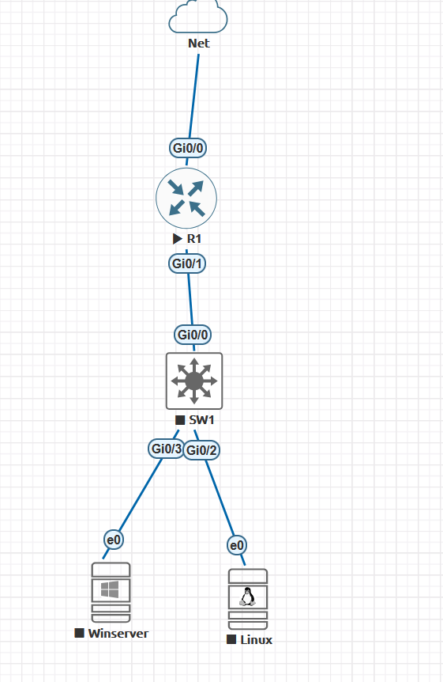](./assets/01_eve_ng_topology_final_simplified.png)  
*Figure 2.1: Converged EVE-NG topology canvas displaying R1, SW1, and Linux interconnected with Net/Cloud0.*

### IP Addressing & Subnet Allocation

| Device | Interface | IP Address | Subnet Mask | Gateway | Role / Function |
| :--- | :--- | :--- | :--- | :--- | :--- |
| **Windows Server 2022** | `Ethernet` | `192.168.3.12` | `255.255.255.0` | `192.168.3.1` | SolarWinds Orion NPM & MSSQL 2022 |
| **R1 (Edge Router)** | `Gi0/0` | `192.168.3.13` (DHCP) | `255.255.255.0` | `192.168.3.1` | External WAN / PAT & NMS Transit |
| **R1 (ROAS Gateway)** | `Gi0/1.10` | `10.10.10.1` | `255.255.255.0` | N/A | Default Gateway for Workload VLAN 10 |
| **R1 (ROAS Gateway)** | `Gi0/1.40` | `10.10.40.1` | `255.255.255.0` | N/A | Default Gateway for Mgmt VLAN 40 |
| **SW1 (Catalyst Switch)**| `Vlan40` (SVI)| `10.10.40.2` | `255.255.255.0` | `10.10.40.1` | In-Band Management & Trap Source |
| **box (Linux Host)** | `eth0` (DHCP) | `10.10.10.21` | `255.255.255.0` | `10.10.10.1` | Linux Workload & Net-SNMP Agent |

---

## 3. Step-by-Step Implementation Workflow

### Step 3.1: Database Engine Deployment (Microsoft SQL Server 2022)
SolarWinds NPM requires a high-performance relational database backend with strict collation and service configurations:
1. **Instance Provisioning:** Deployed a dedicated Microsoft SQL Server 2022 named instance (`SolarwindsSQL`) on the Windows Server 2022 VM (`192.168.3.12`).
2. **Collation Configuration:** Configured the database collation specifically to `SQL_Latin1_General_CP1_CI_AS` (Case-Insensitive, Accent-Sensitive) as mandated by SolarWinds Orion database engine requirements.
3. **Cumulative Update (CU) Patching:** Installed the latest Microsoft SQL Server 2022 Cumulative Update (CU) package to satisfy the SolarWinds installer prerequisite validation checks.
4. **Memory Resource Capping:** To prevent SQL Server from consuming all system RAM on an 8 GB host, capped the max server memory buffer pool at **5,056 MB**, preserving dedicated compute overhead for the Orion Platform services and IIS web engine.

---

### Step 3.2: SolarWinds Orion Platform & NPM Installation
With the database backend validated:
1. Executed the SolarWinds Orion Platform installer, selecting Network Performance Monitor (NPM).
2. Connected the installer to `localhost\SolarwindsSQL` using SQL Server Authentication.
3. Successfully executed the **SolarWinds Configuration Wizard**, initializing database tables, provisioning Orion services, and configuring the IIS Web Console on HTTPS port 443.
4. Performed the initial administrator login and accessed **Discovery Central**:

[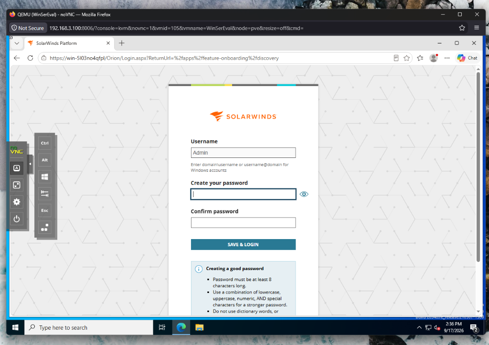](./assets/13_solarwinds_web_console_first_login.png)  
*Figure 3.1: SolarWinds Orion web console initial administrator login.*

[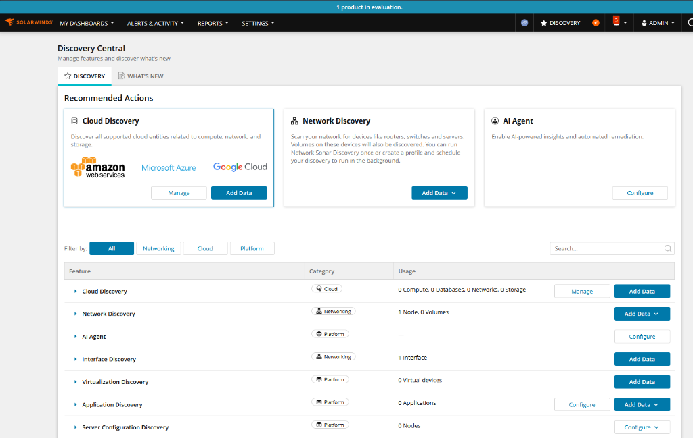](./assets/14_solarwinds_discovery_central_desktop_browser.png)  
*Figure 3.2: Accessing SolarWinds Discovery Central to begin network asset onboarding.*

---

### Step 3.3: Network Infrastructure & Telemetry Configuration

Before initiating automated network discovery, all network elements were configured with synchronized time, routing, and telemetry reporting:

#### 1. Stratum NTP Synchronization
Configured `R1` to synchronize with Google Public NTP (`time.google.com`), and pointed `SW1` to `R1` (`10.10.40.1`). This guaranteed microsecond-accurate timestamp alignment for all Syslog messages and SNMP traps:

[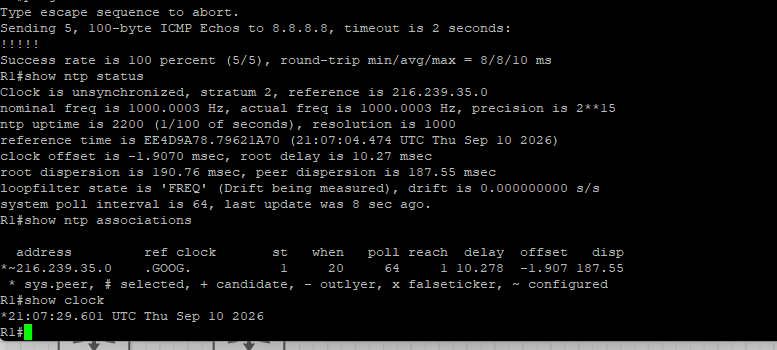](./assets/09_r1_ntp_google_association.png)  
*Figure 3.3: R1 NTP association to time.google.com (* stratum 1 / ref ID 216.239.35.0).*

#### 2. VLANs, Trunks & DHCP Leases
* `R1` configured with 802.1Q subinterfaces `Gi0/1.10` and `Gi0/1.40` running Cisco IOS DHCP pools.
* `SW1` configured with 802.1Q trunk on `Gi0/0` and SVI `Vlan40` (`10.10.40.2/24`).
* Workload host `box` dynamically acquired `10.10.10.21` from `R1`:

[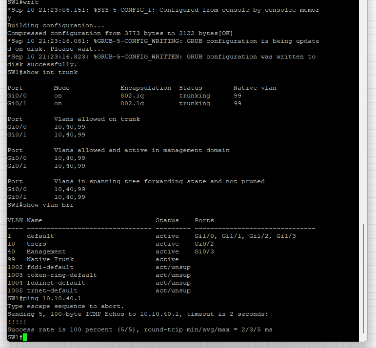](./assets/10_sw1_vlan_trunk_ping_converged.png)  
*Figure 3.4: SW1 802.1Q trunk active; ping between SW1 SVI and R1 subinterfaces 100% successful.*

[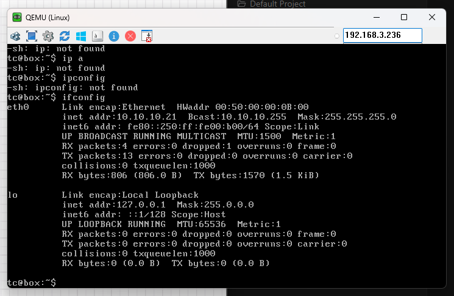](./assets/11_linux_dhcp_lease_vlan10.png)  
*Figure 3.5: TinyCore Linux host pulling 10.10.10.21 from R1 DHCP pool VLAN10_USERS.*

#### 3. SNMP Traps & Syslog Telemetry Provisioning
Configured SNMP communities, traps, and remote syslog destinations targeting SolarWinds (`192.168.3.12`):

* **Cisco R1 (Router):**
  ```cisco
  snmp-server community SolarReadOnly RO
  snmp-server enable traps snmp authentication linkdown linkup coldstart warmstart
  snmp-server enable traps config
  snmp-server trap-source GigabitEthernet0/0
  snmp-server host 192.168.3.12 version 2c SolarReadOnly
  logging host 192.168.3.12
  logging trap debugging
  ```
  [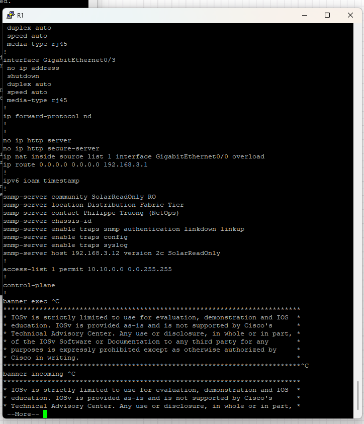](./assets/17_r1_snmp_configuration_verified.png)  
  *Figure 3.6: R1 verified running configuration showing SNMPv2c, trap destinations, and remote logging.*

* **Cisco SW1 (Switch):**
  ```cisco
  snmp-server community SolarReadOnly RO
  snmp-server enable traps snmp authentication linkdown linkup coldstart warmstart
  snmp-server trap-source Vlan40
  snmp-server host 192.168.3.12 version 2c SolarReadOnly
  logging host 192.168.3.12
  logging trap debugging
  ```
  [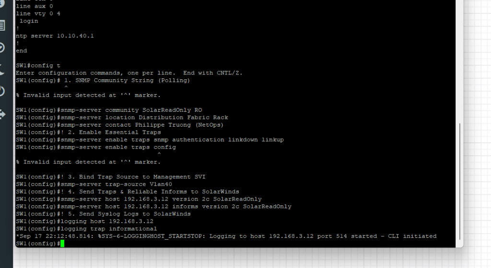](./assets/18_sw1_snmp_syslog_active.png)  
  *Figure 3.7: SW1 initializing remote syslog telemetry stream to SolarWinds.*

  [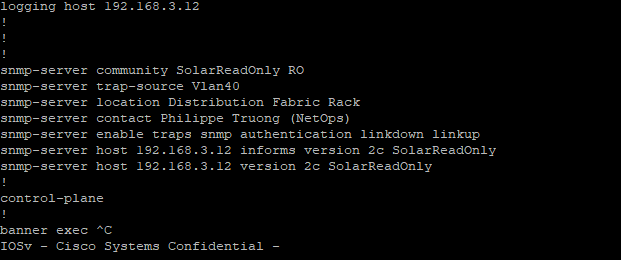](./assets/19_sw1_snmp_configuration_verified.png)  
  *Figure 3.8: SW1 verified SNMP configuration with trap-source bound to Vlan40.*

* **Linux Workload (`box`):**
  Configured Net-SNMP daemon `/usr/local/etc/snmp/snmpd.conf`:
  ```text
  syslocation Lab Workload Tier (VLAN 10)
  syscontact Philippe Truong (NetOps)
  agentAddress udp:161
  rocommunity SolarReadOnly
  trap2sink 192.168.3.12 SolarReadOnly 162
  ```
  [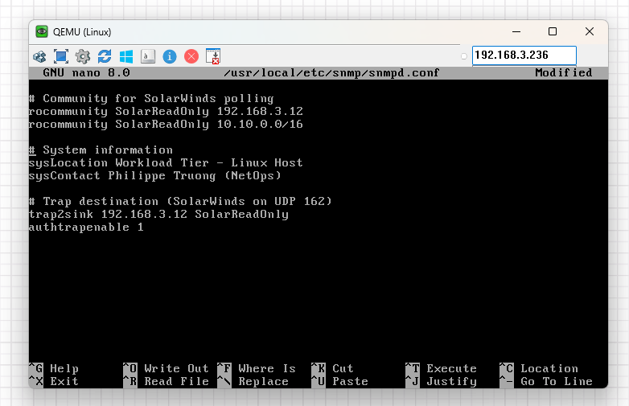](./assets/20_linux_snmpd_conf_nano.png)  
  *Figure 3.9: Linux snmpd.conf configuration viewed in nano editor.*

---

### Step 3.4: Network Sonar Discovery & Asset Onboarding
With telemetry daemons active across all devices, initiated automated discovery from SolarWinds:
1. **Subnet Scope:** Scanned subnets `192.168.3.0/24` and `10.10.40.0/24`.
2. **Credential Set:** Defined SNMPv2c community string `SolarReadOnly`.
3. **Execution & Discovery Progress:** Launched discovery scan to sweep all targets:

[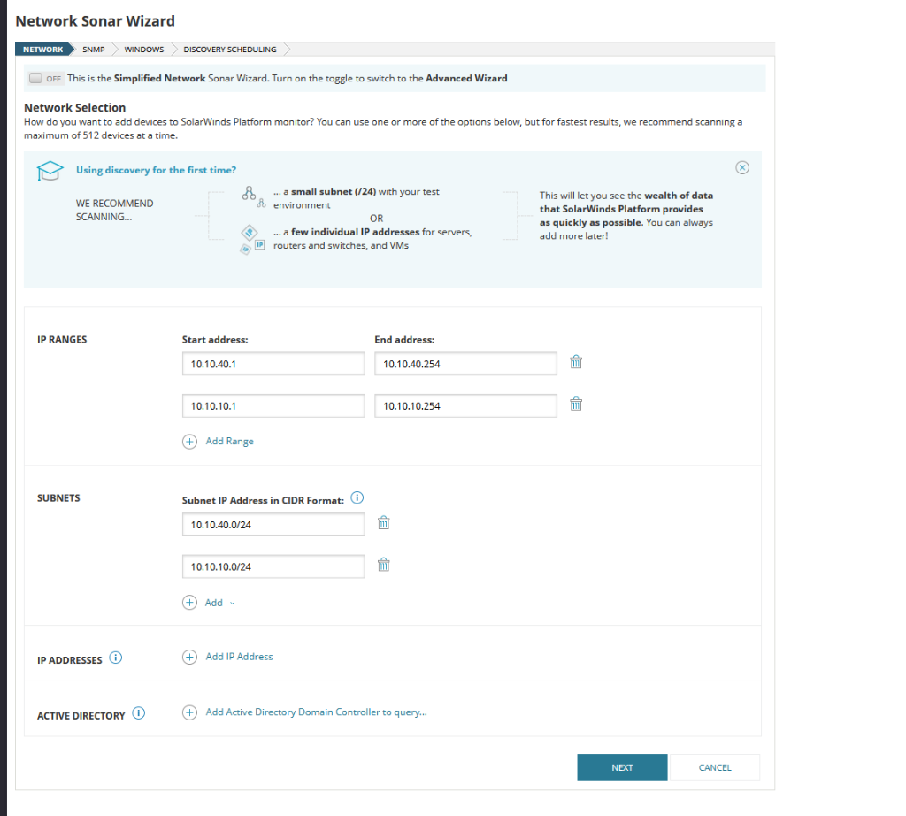](./assets/15_solarwinds_network_sonar_wizard_subnets.png)  
*Figure 3.10: Defining target subnets in SolarWinds Network Sonar Wizard.*

[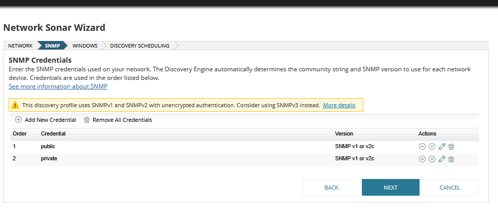](./assets/16_solarwinds_snmp_credentials_wizard.png)  
*Figure 3.11: Configuring SolarReadOnly SNMPv2c credential string.*

[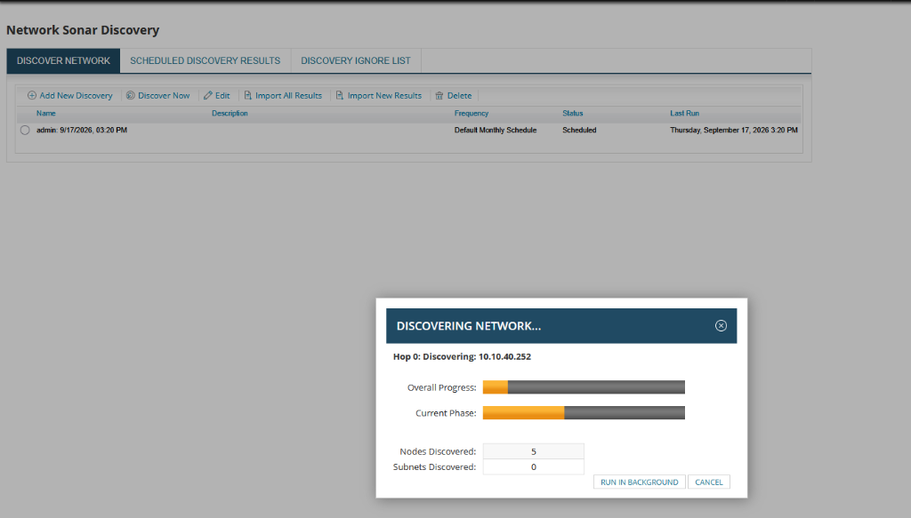](./assets/24_solarwinds_discovering_network_progress.png)  
*Figure 3.12: SolarWinds discovery engine scanning subnets and polling MIB-II system tables.*

4. **Node Import Verification:** All four infrastructure nodes were successfully discovered, imported, and marked **100% Up** on the Orion Home Summary:
   * `box` (Linux host, `10.10.10.21`, Polling: SNMP)
   * `R1` (Cisco 3945K9, `192.168.3.13`, Polling: SNMP)
   * `SW1` (Cisco Catalyst 3560X, `10.10.40.2`, Polling: SNMP)
   * `WIN-5L03NO4QFPL` (Windows Server 2022, `192.168.3.12`, Polling: Agent)

[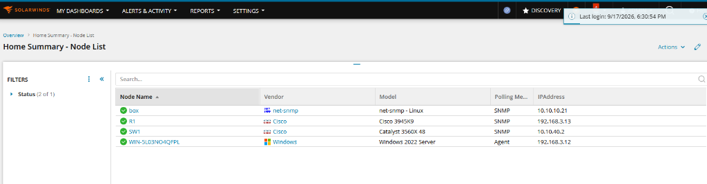](./assets/26_all_nodes_up_node_list.png)  
*Figure 3.13: SolarWinds Node List showing all 4 nodes fully imported and 100% Up.*

---

### Step 3.5: Dynamic Topology Modeling (Orion Maps)
1. Navigated to **MY DASHBOARDS** $\rightarrow$ **HOME** $\rightarrow$ **Maps** $\rightarrow$ **New Map**.
2. Placed the nodes into an enterprise architectural layout.
3. SolarWinds automatically correlated the link between `R1` and `SW1` via Cisco CDP MIB polling, rendering real-time bidirectional bandwidth throughput (`528 bps` $\downarrow$ / `1.04 kbps` $\uparrow$).
4. Connected endpoint interfaces (`SW1 Gi0/2` $\leftrightarrow$ `box eth0` and `R1 Gi0/0` $\leftrightarrow$ `Windows Server`):

[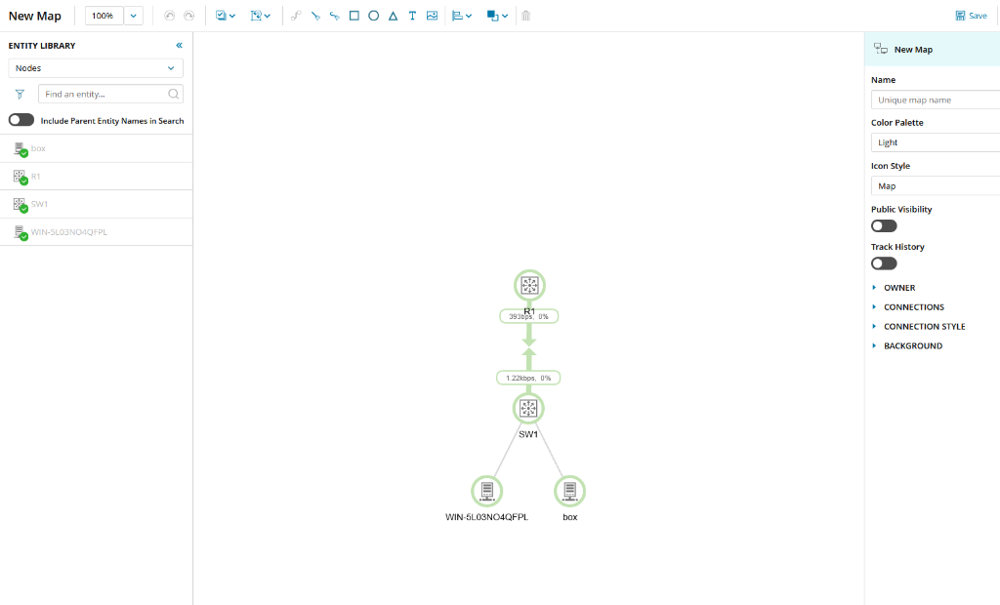](./assets/27_orion_maps_topology_fabric.png)  
*Figure 3.14: Live Orion Map displaying topology interconnects and real-time bandwidth utilization between R1 and SW1.*

---

### Step 3.6: Fault Injection & Real-Time Alert Lifecycle Verification

To prove that SolarWinds detects network state changes in sub-second time via event-driven telemetry rather than waiting for 2–5 minute SNMP polling intervals:

#### 1. Fault Injection on `SW1`
Administratively disabled access port `Gi0/2` connected to `box`:
```cisco
SW1#config t
SW1(config)#int gi0/2
SW1(config-if)#shut
Sep 18 01:45:50.424: %LINK-5-CHANGED: Interface GigabitEthernet0/2, changed state to administratively down
Sep 18 01:45:51.424: %LINEPROTO-5-UPDOWN: Line protocol on Interface GigabitEthernet0/2, changed state to down
```
[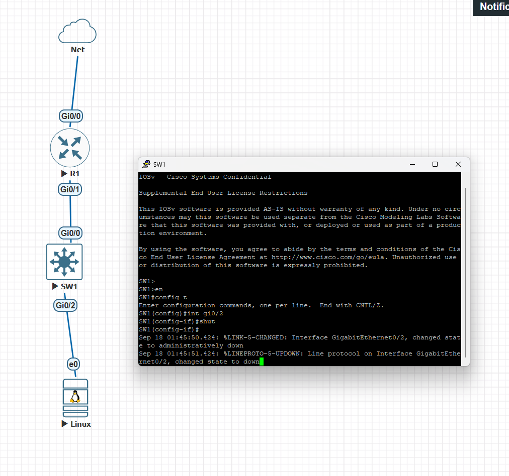](./assets/28_sw1_interface_gi02_shutdown.png)  
*Figure 3.15: Cisco console execution of interface shutdown triggering immediate `%LINK-5-CHANGED` syslog generation.*

#### 2. Sub-Second Alert Propagation in SolarWinds
Within seconds of the interface flap, SolarWinds ingested the state change:
* The live **Orion Map** transitioned `box` into a **Critical Red `(!)` Alert State**.
* The **Map Summary** pane explicitly flagged `box` with a red critical indicator.

[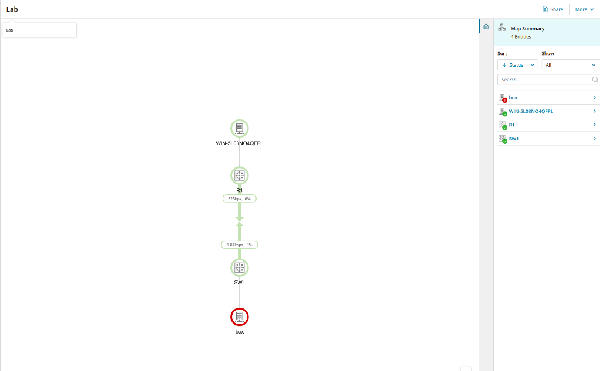](./assets/31_orion_maps_live_fault_box_down.png)  
*Figure 3.16: Live Orion Map displaying immediate alert propagation with node 'box' transitioning to Critical Red.*

#### 3. Automated Fault Recovery
Restored the interface on `SW1`:
```cisco
SW1(config)#int gi0/2
SW1(config-if)#no shut
Sep 18 01:47:43.998: %LINK-3-UPDOWN: Interface GigabitEthernet0/2, changed state to up
Sep 18 01:47:44.999: %LINEPROTO-5-UPDOWN: Line protocol on Interface GigabitEthernet0/2, changed state to up
```
[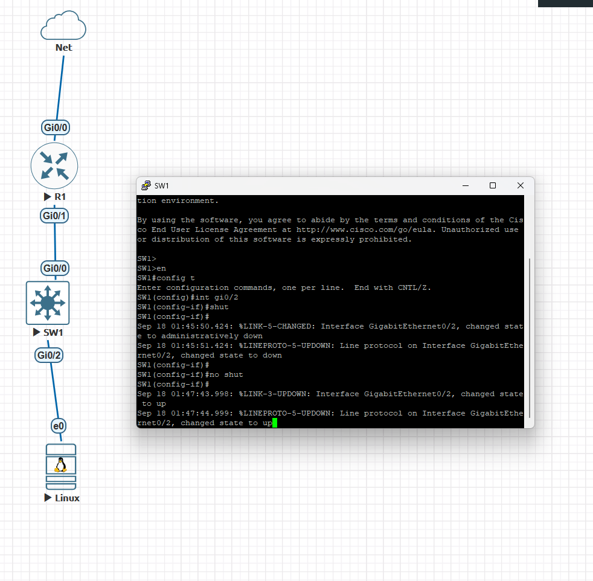](./assets/30_sw1_interface_gi02_recovery_noshut.png)  
*Figure 3.17: Cisco console output verifying interface protocol recovery to up.*

Upon interface recovery, SolarWinds cleared the alert and restored the entire topology fabric to an all-green healthy state:

[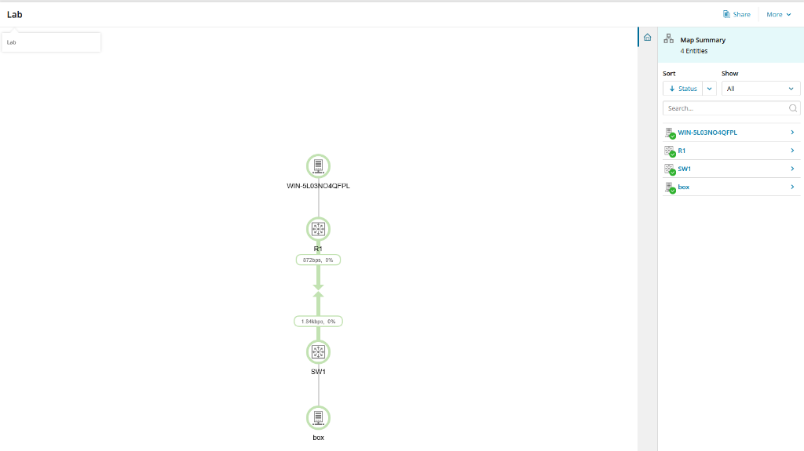](./assets/32_orion_maps_recovered_all_green.png)  
*Figure 3.18: Orion Map demonstrating automated alert clearance and 100% green operational status across all nodes.*

---

## 4. Key Engineering Challenges & Solutions

### 4.1 Bidirectional Routing & Perimeter Firewall Bypass
* **Challenge:** The physical perimeter firewall (FortiGate) did not have a static route pointing `10.10.0.0/16` back to `R1` (`192.168.3.13`). Consequently, return packets from SolarWinds (`192.168.3.12`) to `SW1` (`10.10.40.2`) were sent to the default gateway (`192.168.3.1`) and dropped.
* **Solution:** A persistent host static route was injected directly on the Windows Server 2022 OS:
  ```powershell
  route -p add 10.10.0.0 mask 255.255.0.0 192.168.3.13
  ```
  This forced all lab-destined telemetry and discovery packets directly across `vmbr0` to `R1`, bypassing the FortiGate entirely.

[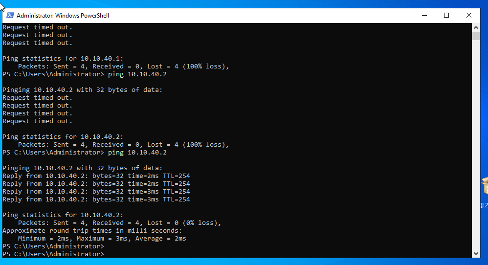](./assets/23_windows_server_ping_sw1_success.png)  
*Figure 4.1: Windows Server 2022 successfully pinging SW1 SVI (10.10.40.2) via the persistent host route.*

### 4.2 Cisco IOS NAT Exemption for Telemetry Return Traffic
* **Challenge:** By default, standard Cisco PAT translates all traffic exiting `Gi0/0` to the router's WAN IP (`192.168.3.13`). When SolarWinds polled `10.10.40.2` (SW1), SW1 replied back to `192.168.3.12`. As this traffic traversed R1 out `Gi0/0`, PAT translated the source IP from `10.10.40.2` to `192.168.3.13`. SolarWinds received an SNMP response from an unexpected IP address and dropped the packet, failing discovery.
* **Solution:** Engineered a **NAT Exemption Access Control List** (`NAT_EXEMPT_ACL`) on R1 that explicitly denies NAT translation for traffic destined to the local NMS management subnet (`192.168.3.0/24`):
  ```cisco
  ip access-list extended NAT_EXEMPT_ACL
   deny ip 10.10.0.0 0.0.255.255 192.168.3.0 0.0.0.255
   permit ip 10.10.0.0 0.0.255.255 any
   exit
  ip nat inside source list NAT_EXEMPT_ACL interface GigabitEthernet0/0 overload
  ```
  This preserved the original Layer 3 source IP headers (`10.10.40.2` and `10.10.10.21`), enabling flawless bidirectional SNMP polling.

### 4.3 Trap-Source Binding: Router Subinterfaces vs. Switch SVIs
* **Challenge:** Cisco IOS default behavior transmits SNMP traps and Syslog using the egress physical interface IP. On `SW1`, outbound packets originated from unnumbered physical ports or random source sockets.
* **Solution:** Bound trap generation explicitly to the management SVI on `SW1` (`snmp-server trap-source Vlan40`) and the WAN interface on `R1` (`snmp-server trap-source GigabitEthernet0/0`).

### 4.4 Resource Optimization on Constrained Compute (8 GB RAM)
* **Challenge:** Running Windows Server 2022, Microsoft SQL Server 2022, IIS, and multiple SolarWinds Orion background microservices on an 8 GB VM caused memory contention and excessive disk paging to `pagefile.sys`.
* **Solution:** Capped SQL Server buffer memory pool at 5,056 MB via SQL Server Management Studio (SSMS), prioritized core polling services, and optimized Orion poller intervals to maintain responsive web console navigation.

---

## 5. Version-Controlled Device Configurations

All modular, production-ready configuration scripts matching this exact deployment are version-controlled in the [`configs/`](./configs/) directory:

* [`configs/R1.txt`](./configs/R1.txt) - Edge Router (ROAS Subinterfaces, DHCP Pools, NAT Exemption ACL, NTP, SNMP Traps, Syslog)
* [`configs/SW1.txt`](./configs/SW1.txt) - Catalyst Switch (802.1Q Trunk, Access Ports, Management SVI, NTP, SNMP Traps, Syslog)
* [`configs/linux_snmpd_and_traps.sh`](./configs/linux_snmpd_and_traps.sh) - Linux Net-SNMP Daemon (`snmpd.conf`) & Trap Simulation

---

## 6. Author & Copyright

**Authored by:** Philippe Truong  
**Copyright:** © 2026 Philippe Truong. All rights reserved.  
*All architecture topologies, design documentation, and configuration templates are the intellectual property of Philippe Truong.*
